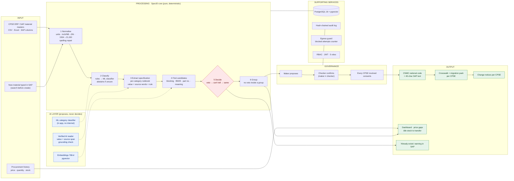
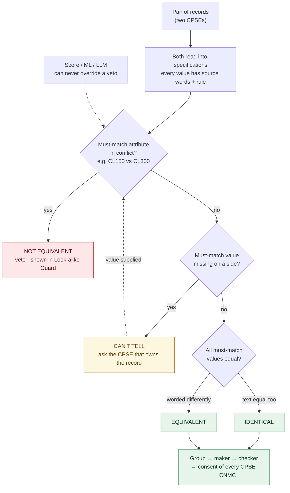
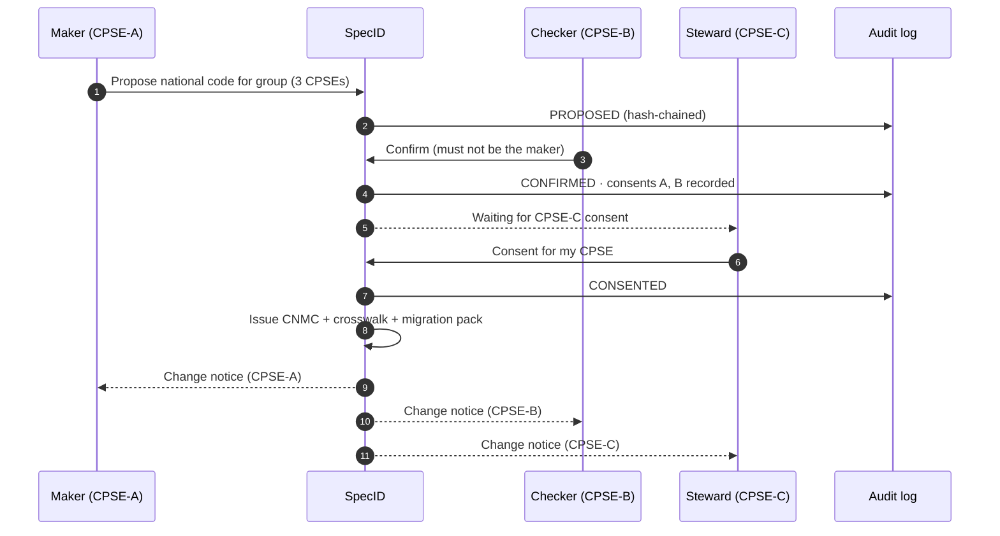
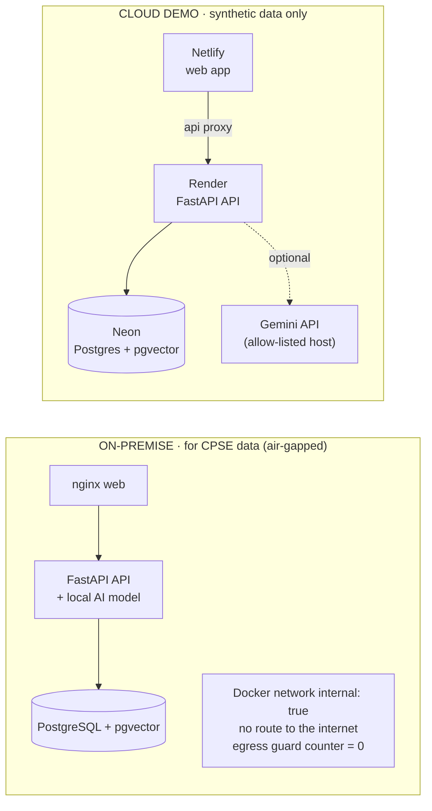

# SpecID: PPT master context (SIH 2026 · PS SIH26099)

This is the one file the PPT team needs. **Part 1** is the full project context: what we built,
how it works, why it is different and how it compares. **Part 2** maps it onto the official SIH
6-slide idea template, with paste-ready bullets, visuals, screenshots and tips.

State: 5 Oct 2026, branch `v2-go1`. Everything in Part 1 marked **Built** runs today on the local
stack (`http://127.0.0.1:8080`) and is covered by tests.

> **Three rules for every slide**
> 1. Numbers come only from §1.10 *Evidence*. Each has a source. Synthetic numbers are labelled
>    "synthetic data".
> 2. Never write "first", "only", "best", "beats", "guaranteed", "100% accurate". Use
>    "differentiated" and "not seen in the 41 public SIH26099 repos we inspected (3 Oct 2026)".
> 3. Never name another team on a slide.

---

# PART 1 · FULL PROJECT CONTEXT

## 1.1 Problem statement facts

| Field | Value |
|---|---|
| Problem Statement ID | **SIH26099** |
| Title | **AI-Driven Standardization and Harmonization of Material Codes Across CPSEs** |
| Organisation | Ministry of Petroleum & Natural Gas (MoPNG) · Chennai Petroleum Corporation Limited (CPCL) |
| Theme | **Smart Automation** |
| PS Category | **Software** |
| Sectors named | Oil & Gas, Power, Steel, Mining, Heavy Engineering |
| PS slogan | *One Nation – One Material Code* |
| 8 key capabilities asked | AI matching & recommendation · standardisation & classification · duplicate / near-duplicate detection · Common National Material Code · CPSE code mapping & migration · dashboard & analytics · audit trail & governance · SAP / ERP integration |

*Check the title and theme once more on the SIH portal before submission.*

## 1.2 The problem in 15 seconds (one valve)

| CPSE | Its code | How its ERP describes the item |
|---|---|---|
| CPSE-A | 10004521 | `GATE VLV 4" CL150 WCB FLGD RF` |
| CPSE-B | MAT-77812 | `Valve, Gate, 100 NB, 150#, Cast Steel A216 WCB, Flanged RF` |
| CPSE-C | V/GT/0093 | `GATE VALVE DN100 CLASS 150 WCB RAISED FACE` |

The table shows three codes and three texts for **one valve**. Because they look different:
- each CPSE buys separately, at different prices;
- one CPSE holds idle stock that another is buying;
- there is no national view of what is held where.

*(Illustrative example; see `docs/STORY.md`.)*

**Why plain text matching fails, both ways:**
- **Same item, different words.** `4"` = `4 IN` = `100 NB` = `DN100`, and `150#` = `CL150` = `CLASS 150`. Text similarity misses these matches.
- **Different items, almost the same words.** `GATE VLV 4" CL150 …` vs `GATE VLV 4" CL300 …` differ by one character but have a different pressure rating. Text similarity merges them, and a wrong merge here is a **safety risk** (a CL150 valve fitted where CL300 is needed).

## 1.3 What we built (one paragraph)

**SpecID** is a governed national material registry for CPSEs. It works in five steps:
1. It reads each CPSE's ERP material master (SAP columns supported).
2. It turns every record into a **verified specification**: typed attributes, each with the words it came from and the rule that read it.
3. It compares specifications with four answers: **Identical · Equivalent · Not equivalent (veto) · Can't tell (ask)**.
4. It groups same items across CPSEs.
5. It issues **one Common National Material Code (CNMC)** per specification. That happens only after a maker proposes, a different checker confirms, and **every CPSE whose codes are absorbed consents**.

Each CNMC comes with:
- a crosswalk to every legacy code;
- a migration pack per CPSE;
- change notices.

It also stops new duplicates in SAP's create screen, and shows price gaps and idle stock that could be shared across CPSEs.

**One line:** *AI reads, engineering rules decide, people approve, and every CPSE involved agrees.*

## 1.4 Who uses it (roles are built and enforced)

| Role | Who in a CPSE | What they do in SpecID |
|---|---|---|
| Maker | Materials / stores engineer | Uploads masters, reviews groups, proposes national codes |
| Checker (CPSE steward) | Senior materials officer of a CPSE | Confirms proposals (must differ from the maker); gives or declines **consent for their CPSE** |
| Admin | Central registry team | Runs matching, manages users |
| Auditor | Internal audit / vigilance | Read-only; verifies the tamper-evident audit chain |
| Integrator (ERP) | SAP / ERP system | Search-before-create API, crosswalk and change notices |

## 1.5 User journey (what happens to one valve)

```
Upload 3 CPSE files ─► Quality report (health score per CPSE)
   ─► Matching run (rules + AI) ─► Groups of same items
   ─► Maker proposes code ─► Checker confirms ─► CPSE-C steward consents
   ─► CNMC issued ─► crosswalk + migration pack + change notice to each CPSE
   ─► Next time anyone types this valve in SAP ─► "already exists: NMC-…"
```

## 1.6 Feature inventory: built vs not built (be exact on slides)

### Built and working (26 screens, 50 API endpoints, 26 database tables)

| # | Capability | Screen(s) | Notes |
|---|---|---|---|
| 1 | Upload any CPSE master (CSV/Excel), **SAP column preset**, column mapping wizard | S2 Upload | 40-char SAP short text checked |
| 2 | **Data-quality report + health score (0–100) per CPSE** | S3 Quality | completeness, parse rate, UoM issues, duplicate codes |
| 3 | Normalisation: abbreviations, units, inch/NB → DN, `150#` → CL150, **spelling repair** (`VALEV` → `VALVE`) | engine | every conversion is shown on the evidence card |
| 4 | **Category classification**: rules first, then an in-app ML classifier that **abstains below 0.8 confidence** | engine, run console | char n-gram logistic regression, no internet needed |
| 5 | Attribute extraction per category rulebook (valves, pipes, flanges, gaskets, fasteners, motors) | engine | YAML templates, versioned |
| 6 | Candidate search: blocking + BM25 keywords + part number + meaning search (embeddings) | run console | 97.7% of true pairs reached while comparing 2.39% of all pairs (synthetic) |
| 7 | **Decision with attribute veto**: 4 verdicts, deterministic, symmetric | engine | no score or AI can override a veto (tested) |
| 8 | **Ask, don't guess**: "Can't tell" when a key value is missing | review | a person supplies it |
| 9 | Constrained grouping: no group may contain a vetoed pair | engine | tested |
| 10 | Matching runs as background jobs: progress, stage timings, cancel | S4 Runs, Run console | 3,023 records in 11.2 s on a laptop |
| 11 | **Review**: priority queue, cluster review with side-by-side specs, **evidence card per pair** (value, source words, conversion, rule cited) | S5, S6, S7 | |
| 12 | **Maker ≠ checker** | S6 | enforced in the service and by a database constraint |
| 13 | **Multi-CPSE consent**: a code is issued only after every CPSE involved consents; declines are recorded | S6, S18 Consents | differentiator (§1.8) |
| 14 | **CNMC with check digit (Luhn)**: canonical spec, 40-char SAP text, long text, class path, base UoM | S8b National code | |
| 15 | **Crosswalk** legacy → CNMC with UoM factor; **migration pack per CPSE** (retain / phase-out recommendations, stock, value) | S8b, S8c Exports | SAP-ready CSV |
| 16 | **Change notices per CPSE** with acknowledgement | S19 | differentiator (§1.8) |
| 17 | **Hash-chained audit log** with chain verification | S12 Audit | every state change audited in the same transaction |
| 18 | **Look-alike Guard**: pairs text calls the same that the spec blocks, with the deciding attribute; "hidden twins" (the reverse) | S13 | |
| 19 | **Search before create** (API + screen) | S9 | |
| 20 | **SAP "Create material" simulation**: a duplicate is flagged while the user types | S14 | |
| 21 | **Savings & stock sharing**: same item, different prices across CPSEs; idle stock to transfer before buying | S15, Home | from procurement history and stock |
| 22 | **Dashboard**: per-CPSE health, groups by category, price gaps, transfers, review backlog, top groups | S0 Home | |
| 23 | **Seeded evaluation with a statistical bound** and two baselines; honesty panel; Markdown report | S11 | differentiator (§1.8) |
| 24 | **Rulebook** (read-only): what must match per category, allowed values, short forms | S10 | |
| 25 | Roles and permissions (5 roles), JWT sign-in, rate limit | all | permission matrix tested for every endpoint |
| 26 | **Egress guard**: blocks and counts any outbound connection; footer shows "Air-gapped · blocked attempts: 0" | footer | the on-prem build has no internet route |
| 27 | **Verified AI reader**: an LLM proposes missing values **with the source words**; a value is used only if those words are in the text, the value is allowed by the rulebook, and the rule parser agrees | run console ("What AI did") | code and tests done; live with Gemini **after the API key is added** |
| 28 | Cloud demo mode: one-click demo roles, demo data preloaded; footer says "Cloud demo", never "Air-gapped" | Login | deploy files ready (Neon + Render + Netlify); not yet deployed |
| 29 | Light and dark theme, synthetic-data badge on every data screen | all | |

### Not built (do **not** show as built)

| Item | How to present it |
|---|---|
| **Rulebook impact preview** (what a rule change would affect) | "Next step". The research dossier lists it as a differentiator, but it is **not** in the prototype |
| On-prem local LLM (open-weight model via Ollama) | "Same AI interface; on-prem runs a local open-weight model". Designed, not run in this build |
| Live SAP connection (OData/RFC) | "SAP-ready files + REST API today; live connector in the pilot" |
| One-way substitutes, unmerge | Next step |
| SSO (OIDC) | Next step |
| Real CPSE data results | Pilot (needs CPSE data) |

## 1.7 PS coverage (all 8 key capabilities)

| PS key capability | What SpecID does (built) | Screen |
|---|---|---|
| AI material matching & recommendation | Candidate search (blocking, BM25, part number, embeddings) + verified AI reader + rule-based decision with veto | S4, S6 |
| Standardisation & classification | Canonical spec, 40-char SAP text, long text, class path, ML classifier with abstention, UoM harmonised | S3, S6, S8 |
| Duplicate / near-duplicate detection | Within-CPSE and cross-CPSE runs; 4 verdicts; Look-alike Guard | S4, S5, S13 |
| Common National Material Code | CNMC with Luhn check digit, issued after maker–checker + consent | S8 |
| CPSE code mapping & migration | Crosswalk with UoM factor; migration pack per CPSE; change notices | S8, S19 |
| Dashboard & analytics | Health score, duplicates, price gaps, idle-stock transfers, backlog | S0, S15 |
| Audit trail & governance | Hash-chained audit with verify; maker ≠ checker; multi-CPSE consent; versioned rulebook | S12, S18, S10 |
| SAP / ERP integration | SAP column preset; search-before-create API; SAP create-screen check; SAP-ready exports | S2, S9, S14 |

## 1.8 What makes us different, and where we stand

### What the public field looks like (measured, not guessed)

On 3 Oct 2026 we found **45 public SIH26099 repositories**, cloned **41** (about 535,000 lines), and scanned their code and docs (`impdocs/SIH26099_SpecID_Competitive_Review.md`). Several are large, serious builds. How common each matching-safety feature is:

| Capability (in code) | Repos of 41 |
|---|---|
| Embeddings / vector search | 33 |
| Attribute veto / safety gates | 30 |
| SAP fields or SAP-style export | 25 |
| Offline / air-gap | 24 |
| Legacy-code crosswalk | 23 |
| "Unknown / insufficient" verdict | 21 |
| Baselines | 20 |
| Hash-chained audit | 12 |

**Honest reading:** matching safety (veto, unknown verdict, look-alikes, offline) is **expected**. Strong teams have it. We have it too, built carefully and tested. That is parity, not our pitch.

### Our differentiators (built, and not seen in the 41 repos inspected)

A national registry is a **multi-organisation system**. Matching correctly is necessary but not enough. The registry must also decide **who agrees** to a merge, **who is told** what changed, and **how safe** the result is, with proof.

| # | Differentiator | Why it matters to MoPNG / CPSEs | In the prototype |
|---|---|---|---|
| D1 | **Multi-CPSE consent** | No CPSE's master data is changed by another organisation without its steward's consent. That is what makes national adoption politically workable | Consent strip "CPSE-A consented · CPSE-B consented · CPSE-C waiting"; Consent / Decline buttons; code issued only when all agree |
| D2 | **Per-CPSE change notices** | Each CPSE is told exactly what changed for it (with the delta) and acknowledges it | S19 Change notices |
| D3 | **Safety number with a statistical bound** | "0 wrong merges" is reported as "0 of 321 look-alike pairs, 95% upper bound 0.93%", never as "never". Next to two baselines on the same data, plus an honesty panel | S11 Evaluation |

### Also strong in SpecID (stated as quality, not as unique)

- **Verified AI**: AI values need their source words, an allowed value and parser agreement. Rejected values are counted on screen.
- **Evidence card per pair**: value, source words, conversion (`20 IN = DN500`), rule cited.
- **Ask, don't guess**: 177 of 181 "can't tell" pairs really miss a key value in the text (synthetic data).
- **Duplicate firewall in SAP**: create-screen check while typing.
- **Savings view**: price gaps and transfer-before-buying from procurement history.
- **Engineering quality**:
  - 915 backend + 141 frontend automated tests: golden cases, property-based tests, a permission matrix for every endpoint, and a conformance test against the spec's reference engine.
  - Typed end to end.
  - One-command Docker deployment.

### Versus commercial tools and standards

| Existing | Strength | Gap for this PS | SpecID |
|---|---|---|---|
| SAP MDG duplicate check | In-ERP, mature | One SAP landscape; text scores; no neutral cross-CPSE registry | Neutral registry across CPSEs, spec-level decision |
| Verdantis, Sievo, SPARETECH, Palantir AIP | Mature cleansing and classification | Enterprise-scoped, vendor-hosted, licensed; no multi-organisation consent | Open-source, on-prem, consent built in |
| UNSPSC, eCl@ss, Shell MESC, CFIHOS | Classification / property libraries | They classify; they don't identify one item across organisations | Uses class paths; identifies by spec |

## 1.9 Technical architecture

### Stack (all open source; cloud demo services on free tiers)

| Layer | Technology |
|---|---|
| Frontend | React 18, TypeScript (strict), Vite, Tailwind, TanStack Query, React Router, Radix UI, Recharts, lucide icons; fonts bundled (no CDN) |
| API | Python 3.11, FastAPI, Pydantic v2, JWT (PyJWT), bcrypt, structlog |
| Decision engine (`core/`) | Pure Python, no I/O: normalise → classify → extract → decide → cluster → CNMC; rapidfuzz, rank-bm25 |
| AI / ML | scikit-learn classifier (char n-grams + logistic regression, abstains < 0.8); verified LLM reader; 768-d embeddings for meaning search. Cloud demo: Google Gemini API (synthetic data only). On-prem: same interface with a local open-weight model |
| Database | PostgreSQL 16 + **pgvector**; SQLAlchemy 2, Alembic migrations, psycopg 3; 26 tables; hash-chained audit |
| Jobs | Background worker process (or one thread on small servers) with progress, cancel and restart recovery |
| Deployment | Docker Compose: `web` (nginx), `api`, `db` on an **internal-only network** (on-prem, air-gapped). Cloud demo: Netlify (web) + Render (API) + Neon (Postgres + pgvector) |
| Quality | pytest + hypothesis (property tests), vitest, ruff, black, mypy, eslint, prettier; local CI script |

### Diagram A: System architecture (Input → Processing → Tools → Output)

Paste into https://mermaid.live and export SVG/PNG.



### Diagram B: Decision policy (why no wrong merge slips through)



### Diagram C: Governance sequence (multi-CPSE consent)



### Diagram D: Two deployments, same code



### Data model highlights (26 tables)

| Area | Tables |
|---|---|
| Organisations and people | `cpse`, `app_user` (role check constraint) |
| Inputs | `upload_batch`, `material_record`, procurement lines, stock on hand |
| Engine output | `spec_record` (+ 768-d embedding), `run`, `candidate_pair` + evidence, `cluster` |
| Governance | `review_task` (maker ≠ checker constraint), consents, `cnmc` (+ HSN, embedding), `crosswalk`, `change_notice` |
| Trust | `audit_event` (hash chain), `eval_run`, `template`, `dictionary` (versioned rulebook) |

### AI guardrails (the answer to "where is the AI and can it go wrong?")

| AI part | What it does | Guardrail |
|---|---|---|
| ML classifier | Picks a category when no rule word is present | Abstains below 0.8; rules always win |
| Verified AI reader | Proposes a missing attribute value with its source words | Used only if the words are in the record, the value is allowed by the rulebook, and the parser reads it the same way; accepted / rejected counts shown per run |
| Meaning search | Finds candidate pairs worded very differently | Only proposes pairs; the decision is still made by the rules |
| All AI | | **Cannot produce a verdict or override a veto** (hard rule, tested) |

## 1.10 Evidence (the only numbers allowed on slides)

Synthetic data note for every results number: *written by the team that wrote the rules;
optimistic by construction; not a measure of performance on real CPSE data.*

| Number | Value | Source / reproduce |
|---|---|---|
| Records in the demo run | 3,023 (CPSE-A 993 · B 1,019 · C 1,011), health score 99 each | Home dashboard; seed-7 synthetic files |
| Run time | 3,023 records in **11.2 s** on a laptop | `docs/evidence/v2-go1/chunk2_run_seed7.md` |
| Candidate pairs / verdicts | 78,201 pairs: IDENTICAL 157 · EQUIVALENT 1,019 · NOT_EQUIVALENT 70,932 · CAN'T TELL 6,093 | same |
| Same-item groups across CPSEs | 689 (170 held by all 3 CPSEs) | Home dashboard |
| Price gap (synthetic prices) | ₹5,22,03,067 over 398 items bought by ≥ 2 CPSEs | Home dashboard |
| Idle stock to share (synthetic) | ₹7,14,52,487 in 195 transfer suggestions | Home dashboard |
| Look-alikes blocked | 6,938 pairs at ≥ 85% text similarity blocked by the spec | Look-alike Guard |
| **Wrong merges, seed 7** | **SpecID 0 of 321** look-alike pairs (95% upper bound **0.93%**) · text-only baseline **18 of 321** · text + numbers baseline **56 of 321** | Evaluation `eac2510c`; `make eval SEED=7` |
| Precision | SpecID 100.00% · B1 35.25% · B2 41.40% | same |
| Same items found (strict) | SpecID 61.2% · B1 29.0% · B2 36.7% | same |
| "Can't tell" | 38.8% of true pairs (181); 177 of them really miss a key value in the text | same |
| Blocking | reaches 97.7% of true pairs while comparing 2.39% of all pairs | same |
| Baseline errors | all 248 of B1's wrong merges were "can't tell" for SpecID (sent to a person) | same |
| Free-tier cloud rehearsal | API up in 33 s, demo data ready in 222 s, peak 219 MB of 512 MB | `docs/evidence/v2-go1/chunk5_final.md` |
| Engineering | 915 backend + 141 frontend tests passing; 26 screens; 50 API endpoints; 26 tables | CI |

**Why "found 61%" is a strength, not a weakness:** SpecID decides fewer pairs on purpose. When a key value is missing it says "can't tell" and asks, instead of guessing. The baselines decide everything and pay for it in wrong merges.

## 1.11 Limitations (say them before a judge does)

- All results are on **synthetic data**. Real accuracy needs a pilot with CPSE data and labelled pairs.
- Rulebooks exist for **6 categories**. Each new category is a reviewed YAML template, and the rules must be validated by a materials engineer.
- The live Gemini path needs an API key (pending). The on-prem local model is designed, not run in this build.
- No live SAP connector yet: SAP-ready files and a REST API today.
- Known engine gap: motor type `AC` vs `AC-IND` still counts as a conflict.

---

# PART 2 · THE SIH IDEA PPT (official 6-slide template)

## 2.0 Template rules → how we comply

| Rule (from the template JSON) | Do this |
|---|---|
| Max 6 slides including the title | Exactly 6. **Delete slide 7 (instructions)** before export |
| Use the official template; don't change idea-detail pointers | Keep every pointer heading **word for word** as printed in the template file. Fill only under them |
| Avoid paragraphs | Bullets ≤ 12 words, tables, 1 diagram per slide, cropped screenshots |
| Unique and novel | Slide 2 leads with D1–D3 (§1.8), worded "not seen in 41 public SIH26099 repos inspected" |
| No invented statistics | Use only §1.10 numbers, each with "synthetic data" where it applies |
| PDF only | Export to PDF, check fonts and diagram sharpness in the PDF |

**Story flow across the 6 slides:** Problem (slide 2 top) → Solution → Innovation → Architecture
(slide 3) → Feasibility (slide 4) → Impact (slide 5) → Research (slide 6).

**Judge test** (each must be answerable in seconds):

| Judge question | Where it is answered |
|---|---|
| Problem in 15 seconds? | Slide 2 top strip: 3 texts → 1 valve, and CL150 vs CL300 |
| The solution? | Slide 2: one-line + 4 verdicts + CNMC |
| What is innovative? | Slide 2 right: D1 consent · D2 change notices · D3 bounded safety number |
| The architecture? | Slide 3: Diagram A |
| Can they build it? | Slide 4: **it is already built**: screenshot + tests + run time |
| Practical impact? | Slide 5: per-audience cards + dashboard screenshot |
| Evidence for claims? | Slides 4–6: evaluation scoreboard + references |

## 2.1 The 3 screenshots to feature (and where)

All in `docs/evidence/v2-go1/screens/`. Crop tightly. A screenshot on a slide should show one idea.

| Rank | Screenshot | Slide | Crop | Why this one |
|---|---|---|---|---|
| **1** | `cluster-steward.png` (cluster review as CPSE-C steward) | **2** | Top half: the 3 CPSE texts → identical spec table + the strip "CPSE-A consented · CPSE-B consented · CPSE-C waiting" + "Critical item: two people must agree". Optionally the bottom bar "Consent for my CPSE" | Shows the problem solved (3 different texts → 1 spec) **and** our main differentiator (consent) in one picture |
| **2** | `evaluation.png` | **4** | The green safety headline + the scoreboard table (SpecID 0 of 321 vs 18 / 56) | Proves feasibility and safety with a bounded number next to baselines |
| **3** | `home.png` (dashboard) | **5** | Stat tiles row + "Same item, different prices" + "Transfer before buying" | Turns the product into impact: price gaps and idle stock across CPSEs (label "synthetic data") |

Optional small thumbnails, if space allows:
- `erp-sim.png` (SAP create screen with the "already exists" warning) on slide 3 next to the Output box, which proves the SAP integration path.
- `lookalikes.png` (bar chart + "Pressure class 600 vs 300") on slide 3. Crop to the "What stopped the merges" card.
- `cnmc-detail.png` (one national code, 3 legacy codes mapped, history) on slide 5 as "the deliverable".

## 2.2 Slide-by-slide content (paste-ready)

### Slide 1 · TITLE PAGE

- Problem Statement ID – **SIH26099**
- Problem Statement Title – **AI-Driven Standardization and Harmonization of Material Codes Across CPSEs**
- Theme – **Smart Automation**
- PS Category – **Software**
- Team ID – *[from portal]*
- Team Name (Registered on portal) – *[exact registered name]*

Nothing else. Keep the SIH logo and layout.

### Slide 2 · IDEA TITLE: Proposed Solution

**Idea title:** **SpecID: One Nation, One Material Code, decided by verified specification**

**Top strip (problem in 15 s), as a small visual:**
`GATE VLV 4" CL150 WCB FLGD RF` · `Valve, Gate, 100 NB, 150#, WCB, Flanged RF` · `GATE VALVE DN100 CLASS 150 WCB RF` → **one valve, three codes**.
Below it: `CL150` vs `CL300`: *one character apart, a different and unsafe item.*

*Detailed explanation of the proposed solution*
- A **national material registry** that identifies items by **verified specification**, not by text
- **AI reads, rules decide, people approve, every CPSE involved agrees**
- 4 answers per pair: **Identical · Equivalent · Not equivalent (veto) · Can't tell (ask)**
- Output: one **CNMC** per item + crosswalk to every legacy code + migration pack
- **Working prototype**: 26 screens, 5 roles (maker, checker / CPSE steward, admin, auditor, ERP)

*How it addresses the problem*: compact table (shorten §1.7 to 3–5 words per cell):

| PS asks | SpecID |
|---|---|
| AI matching | Spec-level match + AI reader + meaning search |
| Standardisation | Canonical spec, 40-char SAP text, classes, UoM |
| Duplicates | Within- and cross-CPSE, look-alike veto |
| National code | CNMC after approval + consent |
| Mapping & migration | Crosswalk, migration pack, change notices |
| Dashboard | Health score, price gaps, idle stock |
| Audit & governance | Hash-chained audit, maker ≠ checker |
| SAP / ERP | SAP preset, create-screen check, API |

*Innovation and uniqueness of the solution*: 3 cards (the visual focus):
- **Multi-CPSE consent**: no CPSE's codes are absorbed without its steward's OK
- **Change notices per CPSE**: each CPSE is told what changed for it
- **Bounded safety number**: "0 of 321 wrong merges, 95% bound 0.93%", next to baselines
- Footnote (9 pt): *Not seen in 41 public SIH26099 repos inspected (3 Oct 2026). Veto, offline mode and crosswalk are common; we build them carefully but don't claim them.*

**Visual:** screenshot #1 (`cluster-steward.png` crop) on the right half.
**Cut list:** shorten the capability table to 6 rows (merge Standardisation + Duplicates) → drop the roles bullet. **Never cut** the 3 innovation cards or the footnote.

### Slide 3 · TECHNICAL APPROACH

*Technologies to be used* (one compact table or icon row):

| Layer | Tech |
|---|---|
| Web | React 18 · TypeScript · Tailwind · Recharts |
| API & engine | Python 3.11 · FastAPI · pure rule engine (rapidfuzz, BM25) |
| AI / ML | scikit-learn classifier · verified LLM reader · 768-d embeddings |
| Data | PostgreSQL 16 + pgvector · hash-chained audit |
| Deploy | Docker · on-prem air-gapped · cloud demo (Netlify, Render, Neon) |

*Methodology and process for implementation*
- **Diagram A** (Input → Processing → AI → Output) as the main visual, about 60% of the slide
- Pipeline: normalise → classify → extract spec → candidates → **veto / can't tell / same** → group → maker → checker → consent → CNMC
- AI **proposes only**: values need their source words + rulebook check; can never override a veto
- Rulebook per category (YAML, versioned): valves, pipes, flanges, gaskets, fasteners, motors
- Optional thumbnail: `erp-sim.png` next to the Output box ("duplicate flagged in SAP while typing")

**Cut list:** drop the Deploy row (Diagram D goes to slide 4) → drop the rulebook bullet.

### Slide 4 · FEASIBILITY AND VIABILITY

*Analysis of the feasibility of the idea*
- **Already built and running**: 26 screens, 50 APIs, 915 + 141 automated tests
- 3,023 records matched in **11.2 s on one laptop**; blocking compares **2.39%** of pairs, reaching **97.7%** of true ones
- Runs on a **free 512 MB cloud tier** (219 MB peak) and **air-gapped on-prem** (Docker)
- Open-source stack: no licence cost, CPSE data stays on premises
- Scales by **rulebook, not code**: a new category = one reviewed YAML template
- **Evidence box**: screenshot #2 (evaluation scoreboard crop), labelled *synthetic data, seed 7*

*Potential challenges and risks → Strategies for overcoming these challenges* (challenge → mitigation table):

| Challenge | Mitigation |
|---|---|
| Wrong merge = safety risk | Attribute veto; AI can't override; critical items need 2 people |
| Missing / dirty attributes | Spelling repair; "can't tell" → ask the owning CPSE |
| AI hallucination | Values need source words + rulebook + parser agreement |
| CPSEs fear losing control | **Consent per CPSE**; change notices; full audit |
| Real data not yet available | Seeded synthetic benchmark + SAP-preset upload; pilot next |
| Data security / sovereignty | Air-gapped on-prem; egress guard; RBAC; hash-chained audit |
| ERP integration | SAP-ready files + REST API now; live connector in pilot |
| Rule errors | Versioned rulebook; materials-engineer review; golden tests |

Optional: roadmap strip **Prototype (done) → Pilot 2–3 CPSEs, 1–2 categories → more categories + SAP connector → national registry**.

### Slide 5 · IMPACT AND BENEFITS

*Potential impact on the target audience* (4 audience cards):
- **Stores / materials engineers**: find any item once; spec + evidence instead of guesswork
- **Procurement**: same item across CPSEs → pooled demand, visible price gaps
- **CPSE leadership / MoPNG**: one national view; each CPSE keeps control (consent)
- **Auditors / vigilance**: every decision cites its rule; tamper-evident audit

*Benefits of the solution* (benefit tiles):
- **Economic**: fewer duplicate codes; price gaps and idle stock made visible → transfer before buying
- **Operational**: SAP create-screen check stops new duplicates at the source
- **Safety**: look-alike veto prevents wrong-rating substitutions
- **Data quality**: standard 40-char text, class, UoM; health score per CPSE
- **Strategic / sovereignty**: national registry on open source; data stays on premises
- **Environmental**: less over-stocking and dead inventory via inter-CPSE transfers

Visual: screenshot #3 (dashboard crop) with the caption *"What the dashboard computes per run (synthetic data)"*.

**Impact formula box (no invented savings):** *Releasable working capital ≈ S × d × a*
(S = stores & spares value, d = duplicate share, a = share actually pooled; d and a are measured in the pilot).

**Pilot KPIs:** duplicate rate · wrong merges *k of n* with bound · cross-CPSE equivalents · reviewer time per group · time to create a material.

**Never** write a rupee savings claim as achieved. The ₹ numbers on the dashboard are synthetic and must be labelled.

### Slide 6 · RESEARCH AND REFERENCES

Use the template's recommended structure: **Topic → Source → How it shaped SpecID**. Two columns, 9–10 pt. *Open every link once before submission.*

| Topic | Source | Influence on SpecID |
|---|---|---|
| SAP 40-char short text | SAP KBA 1630702 (field MAKT-MAKTX) | 40-char SAP description generator |
| ERP duplicate checks | SAP MDG duplicate check – blog.sap-press.com/performing-master-data-duplicate-checks-with-sap-mdg | Search-before-create in the create screen |
| Product matching benchmarks | Peeters, Der, Bizer – WDC Products, arxiv.org/abs/2301.09521 | Hard near-miss negatives in our benchmark |
| LLMs for entity matching | Peeters, Steiner, Bizer – arxiv.org/abs/2310.11244 | AI proposes; rules decide |
| LLM attribute extraction | Brinkmann et al. – ExtractGPT, arxiv.org/abs/2310.12537 | Verified AI reader with source span |
| Industrial material dedup | SBERT for industrial material records, doi.org/10.33395/sinkron.v10i3.16220 | Hybrid text + attribute channels |
| Spare-parts pooling | PhRAG, arxiv.org/abs/2606.03367 | Stock-sharing / pooling view |
| Record linkage & blocking | Fellegi & Sunter (1969), doi.org/10.1080/01621459.1969.10501049 | Blocking + candidate generation |
| Keyword retrieval | Robertson & Zaragoza, BM25 (2009), doi.org/10.1561/1500000019 | BM25 candidate channel |
| Bounds on zero failures | Hanley & Lippman-Hand, "rule of three" (1983), doi.org/10.1001/jama.1983.03330370053031 · Wilson interval (1927), doi.org/10.1080/01621459.1927.10502953 | "0 of n, 95% upper bound" reporting |
| Vector search in Postgres | pgvector – github.com/pgvector/pgvector | Embeddings stored next to the registry |
| Material classification standards | UNSPSC; Shell MESC; IOGP CFIHOS | Class path; spec-first identity |
| Engineering attributes | ASME B16.5 (flanges, pressure classes), ASME B16.34 (valves), ASME B36.10M (pipe schedules) | Must-match attributes in the rulebook |
| Master data quality | ISO 8000 (data quality / master data) | Health score, canonical descriptions |
| Public SIH26099 landscape | 41 public repositories inspected, 3 Oct 2026 (our scan) | Positioning: governance differentiators |

## 2.3 Design tips that win the 15-second test

1. **One hero per slide.** Slide 2 = cluster review screenshot, slide 3 = Diagram A, slide 4 = scoreboard, slide 5 = dashboard.
2. **Colour code, consistently:**
   - red = veto / not equivalent;
   - amber = can't tell / waiting;
   - green = equivalent / consented / issued;
   - blue = AI.

   These match the app and the Mermaid `classDef`s.
3. **Bold the 3 differentiator names** (Multi-CPSE consent · Change notices · Bounded safety number) and repeat them nowhere else, so they stick.
4. **Diagrams:**
   - export Mermaid as **SVG**, set the theme to "neutral", and keep labels ≥ 10 pt in the final PDF;
   - for a cleaner look, redraw Diagram A in PowerPoint shapes using the same boxes.
5. **Screenshots:** crop to one card or region, add a 1-line caption, keep the SYNTHETIC DATA badge visible (it signals honesty).
6. **Text budget:** about 60–90 words on slides 3–5, up to about 120 on slide 2. Body 11–12 pt, tables 10 pt, footnotes 9 pt.
7. **Prototype link:** once deployed, put the demo URL (and a small QR code) in the footer of slide 2 or 4: *"Live prototype: … (one-click demo roles)"*. Use it only after the link has been tested.
8. **Evidence legend**, small, at the bottom of slides 4–5: *"Synthetic data, seed 7; reproducible; not a measure on real CPSE data."*
9. **Words to avoid:** first, only, best, beats, guaranteed, 100% accurate, "eliminates all duplicates". Use instead: differentiated, bounded, measured, designed for.
10. **Consistency:** same name everywhere (SpecID, CNMC, "can't tell"); same CPSE-A/B/C labels as in the screenshots.

## 2.4 Likely judge questions (short answers)

| Question | Answer |
|---|---|
| Where is the AI? | Classifier for categories, verified AI reader for missing values, embeddings for meaning search. AI proposes; engineering rules decide |
| What if the AI is wrong? | A value is used only if its source words are in the text, it is allowed, and the parser agrees. AI can't produce a verdict or override a veto |
| Your recall is 61%: isn't that low? | On purpose. Missing key values → "can't tell" → a person decides. Baselines decide everything and make 18–56 wrong merges on look-alikes (synthetic) |
| Isn't 0 wrong merges too good? | We report "0 of 321, 95% upper bound 0.93%" on synthetic data and say what it doesn't mean. Real numbers come from a pilot |
| Why would CPSEs adopt it? | Nobody changes their master without their consent; they get change notices and a migration pack; it runs on their premises |
| How does it reach SAP? | SAP column preset, SAP-ready crosswalk / migration files, search-before-create API, create-screen check. Live connector in the pilot |
| Data security? | Air-gapped Docker network, egress guard with counter, RBAC, hash-chained audit; the cloud demo uses synthetic data only |
| Others also have a veto. Why you? | Matching safety is table stakes (30 of 41 repos). A national registry also needs consent, change notices and a bounded safety claim. We built those |
| Can it scale nationally? | Blocking compares about 2% of pairs; new categories are YAML rulebooks; Postgres + pgvector; stateless API behind nginx |

## 2.5 Pre-submit checklist

- [ ] Official 2026 template used; idea-detail pointer headings unchanged
- [ ] Exactly 6 slides; instruction slide deleted
- [ ] Team ID and Team Name exactly as on the portal (also in the header oval on slides 2–6 if the template has one)
- [ ] Every number appears in §1.10 and synthetic ones are labelled
- [ ] No "first / only / best / beats"; no other team named
- [ ] Rulebook impact preview **not** shown as built
- [ ] Diagrams sharp in the PDF; screenshots cropped and captioned
- [ ] References' links open
- [ ] Demo link and QR tested (only if deployed)
- [ ] Exported as **PDF**; file opens on another machine

---

*Sources inside the repo: `docs/SOLUTION.md` (pillars, demo script), `docs/STORY.md` (plain story),
`impdocs/SIH26099_SpecID_Competitive_Review.md` (41-repo scan),
`impdocs/SIH26099_Research_Solution_PPT_Content.md` (research dossier; written before the build,
so where it differs from this file, this file reflects what is built),
`docs/evidence/v2-go1/` (run, governance, final evidence and screenshots).*
