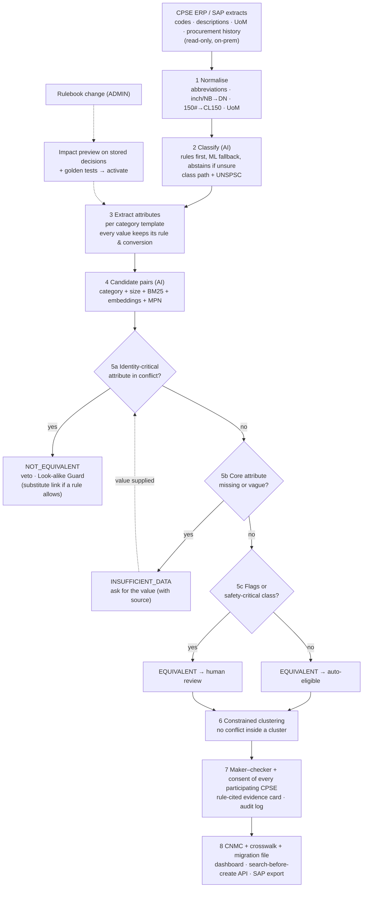

# SIH 2026 · PS SIH26099

**AI-Driven Standardization & Harmonization of Material Codes Across CPSEs**

SIH idea PPT (official 6-slide template) + the research and design behind it. Working title: **SpecID** (rename freely; check GitHub for name clashes).

| Field | Value |
|---|---|
| Version | **v0.5** · 3 Oct 2026 (v0.3, v0.4 same day; v0.2 was 2 Oct 2026, converted from PDF) |
| What changed in v0.5 | **Uniqueness re-measured:** 45 public SIH26099 repos found, 41 cloned and inspected (companion `SIH26099_SpecID_Competitive_Review.md`). Most v0.2–v0.4 "signature features" already exist in strong public repos, so Slide 2 now leads with what none of the 41 showed: **multi-CPSE consent, rulebook impact preview, bounded false-merge number, per-CPSE change notices**; the rest is presented as parity built carefully. A2.5, A3, B2.1, Appendix A (Q11, new Q17) and Appendix E (now 45 repos) updated |
| What changed in v0.4 | **Checked against the official SIH26099 text** (supplied 3 Oct). Slide 2 now proves coverage of all 8 PS key capabilities and uses the PS slogan *One Nation – One Material Code* · new signature feature for the PS's "functionally equivalent": substitutes linked one-way, never merged · Slide 3 shows where AI is used (ML classification, semantic search) and the SAP integration path · Slide 5 follows the PS's expected-impact list · PS facts table adds CPCL and the five sectors · judge Q&A adds "where is the AI?" and "functionally equivalent?" |
| What changed in v0.3 | Part S rewritten as clean Markdown and **synced with the PRD v0.3 signature features** (Look-alike Guard, baseline scoreboard, cited decisions, ask-don't-guess, air-gap proof) so the uniqueness is visible on Slides 2–3 · Slide 3 stack split into *prototype* vs *at scale* to match PRD 6.2 · flowchart matches the P0 decision policy (veto → unknown-state → route) · B3 decision flow updated to PRD decision D-01 (core vs extended attributes) · B13 demo now points to the PRD 5-minute script · list items mangled into `##` headings by the PDF conversion restored as numbered lists |
| Companion file | `SIH26099_SpecID_Prototype_PRD.md` (prototype requirements, v0.3). IDs such as *SF-1* or *FR-1401* point into it |
| Known leftover | Some tables in Parts A, B and the appendices are still in PDF-extracted layout (wrapped columns). Their content is correct; reformat before sharing them outside the team |

| Item | Detail |
|---|---|
| PS ID | SIH26099 |
| Organisation | Ministry of Petroleum & Natural Gas (MoPNG) · Department: **Chennai Petroleum Corporation Limited (CPCL)** |
| Sectors named in PS | Oil & Gas, Power, Steel, Mining, Heavy Engineering |
| PS key capabilities | 1 AI material matching & recommendation · 2 standardisation & classification · 3 duplicate / near-duplicate detection · 4 Common National Material Code · 5 CPSE code mapping & migration · 6 dashboard & analytics · 7 audit trail & governance · 8 SAP / ERP integration. Coverage: Slide 2 and PRD 1.12 |
| Category / Theme | Software / Smart Automation |
| Dataset named in PS | CPSE material-master data, to be provided by participating CPSEs → not public. The design works without it |
| File language | English, so slide text can be pasted directly |
| Start here | **Part S** is the 6-slide content for the SIH template. Everything after it is the evidence behind it |

---

## 0. Read this first: integrity rules (no fake results)

1. **No performance result for our own system exists yet.** What exists is a specification with a reference decision engine that passes its own unit tests (PRD Appendix D: 12 golden pairs, 13 edge cases, a 1,500-pair property smoke test). Those are **spec self-checks, not evaluation results**.
2. Every number carries a tag:
   - **[L]** independent source (paper, standard, official page); link in Appendix D
   - **[V]** vendor or consultancy claim (marketing; treat as optimistic)
   - **[M]** measured by us on public data or hand-built examples (code in Appendix B, reproducible)
   - **[T]** target / hypothesis to be validated during the build or pilot. **Not a result**
3. "Not found" means "not found in the public documentation I could reach", not "does not exist".
4. The official PS text was supplied on 3 Oct 2026 and both files were checked against it (v0.4). Re-read it once more on the portal before you submit in case it was edited.
5. Deadline: you said it was extended to 5 Oct; this could not be confirmed on an official page. Confirm with your college SPOC.
6. Other teams' public GitHub repos are used only to map the landscape (Appendix E). Reference them, do not copy.
7. Domain rules (identity-critical attributes, STD/XS limits, material families) come from general engineering knowledge and **must be validated by a materials engineer**. Treat them as templates.
8. "Unique" in this file means a **differentiated combination**, not "first" or "new algorithm". The building blocks are known (cited) and some public SIH26099 repos already have vetoes or safety gates. B2.1 spells out what is and is not unique.

**Evidence ladder** (what a judge can trust, in order): L0 published evidence → L1 measured by us on public proxies → L2 measured on our synthetic near-miss benchmark during the build → L3 measured on CPSE pilot data. **Today we are at L0 plus a little L1. The slides say so.**

How this file is organised: Part S the 6-slide idea PPT, paste-ready · Part A research (A1–A5) · Part B solution design (B1–B13) · Appendices (A judge Q&A, B reproducible code, C glossary, D references, E public repos, F extended 15-slide plan for later rounds).

---

# PART S: THE SIH IDEA PPT (6 slides, follows the official template)

## S0. Template rules and how this part complies

The uploaded file (`SIH2025-IDEA-Presentation-Format.pptx`) has 6 content slides plus 1 instruction slide. It is the 2025 template; check the portal for a 2026 version.

| Template rule | How Part S complies |
|---|---|
| Maximum 6 slides, including the title slide | Exactly 6 slides |
| Avoid paragraphs; use points, diagrams, infographics, pictures | Short bullets, tables, one flowchart, one screen mock |
| Precise and easy to understand | Word budget per slide (below) and a cut list per slide |
| Idea should be unique and novel | Slide 2 shows **five signature features a judge can see**, worded "differentiated", not "first" |
| Do not change the idea-detail pointers | Pointer headings copied word for word |
| Save as PDF and upload | Export to PDF; delete the "Important Instructions" slide first |

You must fill in: **Team ID** and **Team Name** (also in the oval at the top-left of slides 2–6).

**Where your requested flow lands:** problem + gap + solution + uniqueness = Slide 2 · technical approach + prototype = Slide 3 · feasibility + literature anchors = Slide 4 · impact = Slide 5 · references = Slide 6.

| Slide | Template heading | On-slide words (approx., full content) | Built from |
|---|---|---|---|
| 1 | TITLE PAGE | ≈ 50 | PS facts |
| 2 | IDEA TITLE (Proposed Solution) | ≈ 330 (densest; use the cut list) | A1–A3, A4.3, B2.1, PRD 1.8 |
| 3 | TECHNICAL APPROACH | ≈ 290 | B3–B7, PRD 6, 9.5, 11.3 |
| 4 | FEASIBILITY AND VIABILITY | ≈ 250 | A2.3, B9–B10 |
| 5 | IMPACT AND BENEFITS | ≈ 180 | B11 |
| 6 | RESEARCH AND REFERENCES | ≈ 170 | A4, Appendix D |

Slides 2–4 are dense. Each has a cut list; apply cuts until body text fits at 11–12 pt.

**Evidence legend** (small text at the bottom of slides 2, 3, 4, 5): `[L] literature · [M] measured by us on public data or hand-built pairs · [T] target, not a result`.

---

## Slide 1: TITLE PAGE

**On-slide content (paste):**

- Problem Statement ID – SIH26099
- Problem Statement Title – AI-Driven Standardization and Harmonization of Material Codes Across CPSEs
- Theme – Smart Automation
- PS Category – Software
- Team ID – [your Team ID from the portal]
- Team Name (Registered on portal) – [exact registered team name]

**Visual:** none; keep the template's SIH logo and graphic. Use the 2026 template header if the portal provides one.

---

## Slide 2: IDEA TITLE

**Idea title (replaces the "IDEA TITLE" placeholder):**
**SpecID: One Nation – One Material Code, decided by verified specification**

**On-slide content (paste):**

**Proposed Solution (Describe your Idea/Solution/Prototype)**

*Detailed explanation of the proposed solution*
- An AI-powered **National Unified Material Master** that identifies a material by its **verified specification**, not by how it was typed
- **AI proposes, engineering rules and people decide:** AI for classification, attribute extraction and semantic search; a hard veto where a wrong merge is a safety risk
- 4 verdicts: **IDENTICAL · EQUIVALENT · NOT_EQUIVALENT · INSUFFICIENT_DATA** (we ask, never guess)
- Output: one **Common National Material Code (CNMC)** per specification, with standard description, class and a mapping to every CPSE legacy code

*How it addresses the problem: all 8 PS key capabilities*

| PS key capability | SpecID |
|---|---|
| AI matching & recommendation | NLP extraction + semantic and keyword search + attribute-level decision |
| Standardisation & classification | canonical spec, 40-char SAP text, ML class + UNSPSC mapping, UoM harmonised |
| Duplicate / near-duplicate detection | within-CPSE and cross-CPSE runs |
| Common National Material Code | CNMC issued after approval |
| CPSE code mapping & migration | crosswalk + per-CPSE migration file (retain / block / phase out) |
| Dashboard & analytics | duplicate rate, data quality, demand across CPSEs |
| Audit trail & governance | maker–checker, tamper-evident log, versioned rules |
| SAP / ERP integration | SAP-field import, search-before-create API, SAP-style export |

*Innovation and uniqueness of the solution: governance for a national registry*

| What strong public prototypes already do | What SpecID adds (not found in the 41 public SIH26099 repos inspected) |
|---|---|
| A cross-CPSE match is approved by one review team | **Multi-CPSE consent:** a national code absorbs a CPSE's codes only after **that CPSE's steward consents**; declines are recorded, nobody overwrites another CPSE's master |
| Matching rules change in code or config | **Rulebook impact preview:** before a rule changes, see which past decisions, national codes and CPSEs it would affect; golden tests gate activation |
| Precision / recall on synthetic data | **Bounded safety number:** false merges *k of n* with a 95% upper bound, plus an honesty panel on what it does not mean |
| Results exported to ERP files | **Change notices per CPSE** (next phase): each CPSE is told what changed for it, with a delta migration file |

- Built carefully, at par with the strongest teams: attribute veto (CL150 vs CL300 score 0.95 text similarity, true equivalents 0.65 [M]), look-alike list, rule-cited evidence, ask-don't-guess, one-way substitutes, air-gapped deployment
- **Not a new algorithm: a governed national registry.** *(Comparison: 41 public SIH26099 GitHub repos, code + docs scanned, 3 Oct 2026; "not found" ≠ "does not exist")*

**Visual:** left column = solution bullets + capability table; right column = uniqueness table. Optional strip: three spellings of one valve → one CNMC box.
**Layout:** body 11–12 pt, tables 10–11 pt, the four differentiator names in bold; the comparison footnote at 9–10 pt.
**Cut list if crowded (in order):** drop the "Change notices" row → shorten the parity bullet to "veto, look-alike list, cited evidence, air-gapped: at par with strong teams" → shorten the capability table's right column to 3–4 words. **Never cut** the consent and impact-preview rows or the comparison footnote.
**Why this layout:** the capability table proves the PS is fully covered (judges check this against the PS's 8 key capabilities); the uniqueness table shows *what you can watch on screen* and is based on a measured scan of 41 public repos, not on READMEs alone. Never name another team on the slide.
**Details live in:** PRD 1.8 (signature features), 1.12 (PS compliance), 1.13 (PS terms → verdicts); dossier A1, A2.1, A4.3, B2.1.

---

## Slide 3: TECHNICAL APPROACH

**On-slide content (paste):**

**Technologies to be used (e.g. programming languages, frameworks, hardware)**

| Layer | Prototype (36 h build) | At scale (pilot onward) |
|---|---|---|
| Core / API | Python 3.11, FastAPI, REST + OpenAPI | + Celery / Prefect workers |
| Data | PostgreSQL 16 | + pgvector / OpenSearch |
| NLP | normaliser, regex grammars, unit and UoM tables, versioned YAML templates, BM25 | + spaCy NER |
| AI / ML | MiniLM embeddings + FAISS (semantic search); ML category classifier with abstention | + LightGBM calibrated ranking; on-prem open-weight LLM (advisor only) |
| Integration | SAP-field import preset, search-before-create API, SAP-style crosswalk and migration files | + OData / RFC extracts; call from the material-creation workflow |
| UI / security | React + TypeScript; JWT, RBAC, hash-chained audit | + OIDC SSO |
| Hardware / deploy | one laptop, Docker Compose, **air-gapped network** | on-prem CPU server, Kubernetes; one 24 GB GPU only for the optional LLM |

**Methodology and process for implementation (Flow Charts/Images/working prototype)**
- Flowchart: see diagram (main visual of this slide)
- Safety rules: a veto is never overridden by a score or an LLM · no cluster may contain a conflict · safety-critical classes always go to maker–checker
- Validate in 3 steps: synthetic near-miss benchmark → public benchmarks → CPSE pilot; report **false merges *k* of *n* with a bound**, pair completeness, abstentions
- Prototype status: decision engine specified and unit-tested (25 golden cases, 1,500-pair property test) [M, spec self-check, not a result]; full prototype planned

**Visual (flowchart).** Paste into https://mermaid.live, export PNG/SVG. Colours: red = veto, amber = human review, green = auto path, blue = AI steps.



**Optional second visual:** a small mock of the **Look-alike Guard** screen (PRD 11.3, S13), three rows: `0.97 SCH40 vs SCH80 ✖ schedule`, `0.95 CL150 vs CL300 ✖ class`, `0.73 BOLT … ✔ hidden twin`. Label it "planned screen"; replace with a real screenshot once the prototype runs.
**Layout:** table left (≈ 40%), flowchart right (≈ 60%), bullets under the table. Table 10 pt, flowchart labels ≥ 10 pt.
**Cut list if crowded:** drop the UI / security row → drop the "At scale" column (one footnote: "scales to Celery, pgvector, Kubernetes, SSO") → drop the Safety-rules bullet (the flowchart shows it).
**Details live in:** dossier B3, B5, B7, B8; PRD 6.1–6.2, 9.5, 9.13, FR-402, FR-503, FR-1005.

---

## Slide 4: FEASIBILITY AND VIABILITY

**On-slide content (paste):**

**Analysis of the feasibility of the idea**
- Open-source stack, no vendor licence, runs on-prem on one laptop for the demo
- Scale: blocking cut ≈ 4×10¹⁰ pairs to ≈ 7×10⁶ on 291k real plant records [L]
- Open-weight LLM ≈ 3% below GPT-4 on attribute extraction [L] → sovereign AI is realistic
- Data: CPSE sample promised → any-CSV mapping wizard; meanwhile seeded synthetic data + public benchmarks
- Roadmap: MVP → pilot (2–3 CPSEs, 3–5 categories) → prevention API + ERP adapters → national registry
- Targets to validate [T, not results]: 0 false merges on ≥ 1,000 hard negatives (bound ≈ 0.3%) · pair completeness ≥ 0.98 · core-attribute F1 ≥ 0.90

*Published anchors (not our results)*

| Study | Reported |
|---|---|
| WDC Products, text-only matchers | F1 0.64–0.89; precision drops on near-miss negatives [L] |
| LLM attribute extraction | ≈ 85–86% F1; Llama-3-70B ≈ 3% lower [L] |
| Power-plant material dedup (2026) | Jaro–Winkler F1 0.925 vs SBERT 0.875 [L] |

→ hybrid design: string + attribute channels, with the veto deciding

**Potential challenges and risks → Strategies for overcoming these challenges**

| Challenge / risk | Strategy |
|---|---|
| CPSE data delayed | seeded synthetic benchmark + public sets; any-CSV mapping wizard |
| Sparse or missing attributes | INSUFFICIENT_DATA + ask-don't-guess loop with source notes |
| False merges (safety) | attribute veto; critical classes always maker–checker; reversible merges; rule-change impact preview |
| Synthetic results look too good | label every number; holdout style written blind; two baselines on the same data; honesty panel |
| LLM hallucination | off by default; advisor only; cannot override a veto |
| Template errors | materials-engineer review; versioned YAML; golden tests gate every change |
| ERP integration | read-only first; SAP-ready 40-char text; write-back only after approval |

**Visual:** left = feasibility bullets + anchors table; right = challenge → strategy table; optional roadmap arrow strip (MVP → Pilot → Scale → Registry).
**Cut list if crowded:** remove the roadmap bullet → the third anchor row → the "ERP integration" row → the "LLM hallucination" row.
**Details live in:** A2.3, B8, B9, B10; PRD 10 and 16.

---

## Slide 5: IMPACT AND BENEFITS

**On-slide content (paste):**

**Potential impact on the target audience**
- Stores and materials engineers: identify any item once; fewer wrong-spec issues
- Procurement teams: demand per specification aggregated across CPSEs → joint buying and faster specification finalisation
- CPSE and MoPNG leadership: one view of materials and surplus stock across Oil & Gas, Power, Steel, Mining and Heavy Engineering CPSEs; **each CPSE keeps control: no national code absorbs its codes without its steward's consent**
- Auditors: one auditable identity per item; every decision cites its rule

**Benefits of the solution (social, economic, environmental, etc.)**
- **One Nation – One Common Material Code**, with traceability to every CPSE code
- Economic: fewer duplicate codes → working capital released; lower procurement cost through demand aggregation
  - **Releasable ≈ S × d × a** (S = stores & spares value, d = duplicate share, a = share actually pooled)
  - Planning range d = 3–20% [L/V]: per ₹100 crore of stores and spares, ₹3–20 crore sits in duplicate lines; *a* is measured in the pilot
- Data quality: standard descriptions, classes and UoM; data-quality score per CPSE
- Safety (social): attribute-level veto prevents wrong-rating merges
- Sovereignty: CPSE data never leaves the premises; open-source, no per-seat licence
- Strategic: foundation for common procurement and strategic sourcing across CPSEs
- Pilot KPIs: duplicate rate · false merges *k* of *n* · cross-CPSE equivalents · reviewer seconds per cluster · time to create a material

**Visual:** four audience icons → benefit tiles (Economic, Data quality, Safety, Sovereignty, Strategic) → KPI strip. Formula in a highlighted box. **No rupee savings figure; none is measured.**
**Cut list if crowded:** drop the Sovereignty bullet (keep the tile) → shorten KPIs to three → drop the Auditors bullet.
**Details live in:** B11, A2.4, A4.4; PRD 1.12 (expected impact → where it is measured).

---

## Slide 6: RESEARCH AND REFERENCES

**On-slide content (paste), two columns at 10–11 pt:**

**Details / Links of the reference and research work**

*Problem and existing solutions*
- SAP KBA 1630702: material short text is 40 characters
- SAP MDG duplicate check: blog.sap-press.com/performing-master-data-duplicate-checks-with-sap-mdg
- Verdantis Harmonize: techjockey.com/detail/harmonize
- Palantir AIP Material Harmonization: platform.softwareone.com/product/aip-for-material-harmonization/PCP-3909-5693
- Sievo: sievo.com/products/procurement-ai · SPARETECH: sparetech.io/en/blog/how-sparetech-uses-ai
- Shell MESC: en.wikipedia.org/wiki/MESC · CFIHOS: iogp.org/blog/standards/new-initiative-will-ease-information-handover

*Research*
- WDC Products: arxiv.org/abs/2301.09521
- LLM entity matching: arxiv.org/abs/2310.11244
- ExtractGPT: arxiv.org/abs/2310.12537
- SBERT dedup of power-plant material records (2026): doi.org/10.33395/sinkron.v10i3.16220
- Material-name NER (2026): doi.org/10.46991/BYSU.G.2026.17.1.083
- PhRAG spare-parts pooling (2026): arxiv.org/abs/2606.03367

*Datasets examined*
- WDC Products · Abt-Buy / Amazon-Google / Walmart-Amazon (github.com/megagonlabs/ditto) · WDC-PAVE · FabNER
- CPSE material master (to be provided) → seeded synthetic near-miss benchmark

*Our own checks [M]*
- String-similarity baseline F1 0.46–0.54 on 3 public benchmarks
- Near-miss pairs 0.95 vs true equivalents 0.65 text similarity (12 hand-built pairs, illustrative)

**Layout:** URLs as plain text; 10 pt minimum.
**Cut list:** remove SPARETECH, CFIHOS and Shell MESC, then FabNER.

---

## S7. Pre-submit checklist (PDF upload)

1. Six slides or fewer, including the title slide. Delete the "Important Instructions" slide.
2. Pointer headings unchanged; Team ID and Team Name on slide 1 and in the oval on slides 2–6.
3. No paragraphs: every block is a bullet, table or diagram.
4. Every number carries its tag ([L], [M], [T], [V]); **no SpecID accuracy or savings figure appears**.
5. Text search the PDF: no "first", "only", "best", "novel algorithm", "beats" (PRD NFR-14).
6. Slide 2's uniqueness rows match PRD 1.8 and 1.10 (SF-11 consent, SF-6 impact preview, SF-5 bound, SF-12 notices) and the comparison footnote is present. Re-run the repo scan the week before any later round.
7. Export to PDF and open it once on a phone-sized screen (body ≥ 12 pt; tables and references ≥ 10 pt).
8. Slide 2's capability table lists all 8 PS key capabilities, in the PS's own words.
9. Confirm the deadline with your college SPOC.

# PART A: RESEARCH

---

<!-- Page 11 -->

## A1. The problem

Each CPSE keeps its own material master, mostly in ERP/SAP. The same physical item
ends up with different codes and descriptions across (and inside) CPSEs. The PS asks
for an AI system that (1) recognises when records from different CPSEs refer to the
same or equivalent material, (2) proposes one common code, and (3) keeps a mapping
back to every legacy code.

Why the codes diverge (evidence):

   SAP's material short text (MAKT-MAKTX) is 40 characters [S1], so engineers
   compress everything into abbreviations, e.g. the SAP-community style MOTOR AC SQ
   100KW 1500 RPM ... [S2].

   Free text typed by many people over many years; plant teams name parts for speed
   and local context, not enterprise consistency [S8].
   Four recurring failure modes in a real power-plant catalogue study: paraphrase
   (word order), abbreviation, cross-language terms, and unit mismatch such as DN50
   vs 2 INCH [S16].
   Catalogues like Shell MESC exist, but they are proprietary and licensed [S10].

The two errors are not equal:


  Error                      What happens                            Type of cost


  Missed duplicate           duplicate stock, split demand, missed   money (working
  (false negative)           pooling                                 capital)

  False merge (false         wrong rating or grade ordered/issued    safety, quality,
  positive)                  (e.g. CL150 vs CL300)                   downtime


→ The system must be precision-first: a wrong merge costs far more than a missed
one.


## A2. What exists today

A2.1 Commercial and ERP-native tools

---

<!-- Page 12 -->

                                                              Limitation relative to
Tool              What it does (source)        Evidence       this PS (my inference
                                                              from public positioning)


                                                              Score/threshold on
                  Returns candidate                           descriptions.
                  records with similarity                     Practitioners report
                  scores, using                               false-positive pop-ups
SAP MDG,                                       [L] vendor
                  configurable                                and recommend
material                                       docs +
                  lower/upper thresholds                      combining description
duplicate check                                community
                  and search providers                        with other attributes
                  (HANA / Enterprise                          [S3]. Scope is one SAP
                  Search) [S3]                                landscape; no cross-
                                                              CPSE registry

                  AI MDM for asset-
                  intensive industries incl.                  Commercial, enterprise-
                  Oil & Gas: cleanses,                        scoped. Public pages
                  dedups, normalises,                         do not document an
Verdantis
                  enriches material                           engineering-attribute
(Harmonize /                                   [V] + patent
                  master; maps to                             veto, calibrated
MDM Suite)
                  UNSPSC / eCl@ss; has                        precision targets or a
                  a patent on automated                       neutral cross-company
                  material-master                             registry (not found)
                  harmonization [S4]

                  AI entity extraction of
                  material properties from                    Recommendation-
                  spec documents;                             oriented (a human
Palantir AIP,     surfaces                                    decides); platform
Material          recommendations of           [V]            licence; no documented
Harmonization     similar materials;                          national-registry or
                  framed around BOM                           legacy-code crosswalk
                  and supplier resilience                     workflow
                  [S5]

                  Add-on to spend
                  analytics: pulls material
                                                              Built for spend analysis,
                  data from all ERPs,
                                                              not for issuing a
Sievo, Material   harmonizes
                                               [V]            common code.
Harmonization     codes/languages,
                                                              Subscription; pricing not
                  clusters materials;
                                                              published [S6]
                  claims 6–23% de-
                  duplication [S6]

SPARETECH,        Spare-parts MRO              [V] +          Centred on OEM-
Standardize /     software: rules + AI-        customer       catalogue spare parts

---

<!-- Page 13 -->

                                                                      Limitation relative to
  Tool                   What it does (source)     Evidence           this PS (my inference
                                                                      from public positioning)

  Digital                generated multilingual    case               (inference: bulk items
  Workflow               short descriptions,       studies            like pipe, flange,
                         expert review, ECLASS-                       fasteners are not the
                         based classification,                        documented focus);
                         matching to an OEM-                          per-customer
                         verified catalogue, SAP                      deployment
                         API exchange [S7]

                         Match parts by meaning                       Vendor-hosted SaaS;
  Verusen /
                         rather than exact text                       claims not
  Automa (MRO
                         and surface duplicate     [V]                independently validated;
  duplicate
                         and near-duplicate                           data residency for PSU
  intelligence)
                         items across ERPs [S8]                       data unknown


Common limitations across these tools (from public material only):

1. Enterprise-scoped and vendor-hosted; none is documented as a neutral cross-PSU
    identity registry.

2. The decision basis is described as similarity or "AI recommendation". An
    engineering-attribute veto, an explicit "insufficient data" outcome, calibrated
    precision targets and false-merge-rate reporting are not described in what I found.
3. Closed evaluation: no public benchmark or protocol for engineering-material
    matching.
4. Licence cost for a PSU-wide rollout is unknown (Sievo does not publish pricing
    [S6]).


A2.2 Standards and taxonomies


  Standard          What it gives                        Limit for this PS


                                                         Category, not identity: two valves of
                                                         different rating share a commodity
                    4-level, 8-digit hierarchy:          code. ML classification is reliable at
  UNSPSC            Segment / Family / Class /           coarse levels (Amazon Business
                    Commodity [S12]                      reports 91.6% at the family level, 3rd
                                                         of 4 tiers [S12]) and harder at
                                                         commodity level

                                                         Same: a category/property
                    Classification standard that
  eCl@ss                                                 framework. Licence terms not
                    vendors map to [S4, S7]
                                                         verified

---

<!-- Page 14 -->

 Standard           What it gives                        Limit for this PS


                    10-digit, manufacturer-
                    independent catalogue: 2-digit
                                                         Great precedent for spec-based,
                    groups / sub-groups / sub-sub-
                                                         brand-independent identity, but
 Shell MESC         groups + 3-digit buying
                                                         proprietary and Shell-governed →
                    description + last digit central
                                                         use only as an optional crosswalk
                    or local. Created 1932, licensed
                    to anyone who pays [S10]

                    Reference Data Library of            Built for capital-project handover
                    equipment/tag classes,               (equipment, tags), not bulk
 CFIHOS
                    properties and pick-lists; free      consumables → use to seed
 (IOGP)
                    RDL browser and Excel                attribute schemas for equipment
                    templates [S11]                      items

                    Generic scheme taught in
                    Indian materials-management
 Manual                                                  Manual, per-organisation, does not
                    material: major group, sub-
 codification                                            cross organisation boundaries
                    group, then dimensions, then
                    variant [S21]


A2.3 Research and methods


 Work                    Finding relevant to us


                         Real product-offer benchmark with controllable corner-cases
                         (negatives that differ in a single feature) and unseen entities. Best
 WDC Products
                         pairwise F1 is 0.64–0.89 depending on variant; at 80% corner-
 (EDBT 2024)
                         cases the top systems score 72–80 F1 (medium dev set). Corner-
 [S13]
                         cases hurt precision more than recall; all matchers degrade on
                         unseen entities (R-SupCon drops about 25%) [L]

                         Zero-shot GPT-4: 95.78 F1 on Abt-Buy, 89.61 on WDC Products
                         (80% corner-case, seen); few-shot 85.21 on Amazon-Google (as
 LLM entity
                         listed on the paper's results page). LLMs generalise better to
 matching [S14]
                         unseen entities and can explain errors. But these are hosted APIs,
                         which is a data-sovereignty problem for PSU data [L]

                         LLM attribute-value extraction: GPT-4 ≈ 85–86% average F1; open-
 ExtractGPT
                         weight Llama-3-70B only ≈ 3% lower; fine-tuning GPT-3.5 matches
 (iiWAS 2024 best
                         GPT-4 but hurts generalisation. On WDC-PAVE, GPT-4 ≈ 91% F1 →
 paper) [S15]
                         on-prem open-weight extraction is feasible [L]

 SBERT dedup on          291,586 records from two plants (Maximo-family EAM,
 real power-plant        anonymised). On 100 engineer-annotated pairs: Jaro–Winkler F1
 material masters        0.925 (P 1.00, R 0.86); SBERT F1 0.875 (P 0.913, R 0.84);

---

<!-- Page 15 -->

  Work                   Finding relevant to us

  (Sinkron, Jul          Levenshtein 0.529; TF-IDF 0.00 (descriptions too short). SBERT's 4
  2026) [S16]            false positives were same-category non-matches sharing technical
                         vocabulary. Authors conclude embeddings complement string
                         similarity, and that union-find closure propagates errors, so
                         uncertain edges should go to humans. Hybrid blocking cut ≈
                         4.25×10¹⁰ candidate pairs to ≈ 7×10⁶ [L]

  Material-name          17,258 manually annotated names; spaCy NER; hold-out P 0.75 / R
  NER + weighted         0.64 / F1 0.69, which the authors treat as acceptable for an initial
  matching (YSU,         model. Numeric-unit mismatches are penalised strongly; non-
  Jun 2026) [S17]        transitive clusters go to manual review [L]

                         Spare-part NER on FabNER-simple: supervised spaCy 0.82,
                         BiLSTM-CRF 0.88; few-shot LLM alone 0.36 → 0.59 with retrieval-
  PhRAG (Jun
                         augmented prompting. Hybrid (BM25 + embeddings) retrieval A@1
  2026) [S18]
                         0.78 vs 0.736 lexical vs 0.693 semantic; searching by reference ID
                         alone finds the right part in the top-20 less than 21% of the time [L]


A2.4 Indian context

    Material codification in Indian PSUs is traditionally manual and committee-based
    (generic scheme in [S21]). I found no public national or cross-CPSE material
    registry in my searches (absence of evidence only).

    Inventory of spares has been an audit theme: CAG's 2009 review of the oil sector
    (2008-09 data) noted, for example, ONGC holding 13.03 months of stores and 26.59
    months of spares consumption against norms [S20]. Dated, but it shows the cost
    side matters to auditors.


A2.5 Public SIH26099 prototypes (v0.5: 45 found, 41 cloned and inspected on 3 Oct 2026)

Method: every repository was cloned and its code and documents searched for each capability; the strongest were then read by hand. Full tables are in the companion *Competitive Review*. Counts below are repositories whose **code** matches the capability keywords (an upper bound: a keyword is not proof of a working feature).

| Capability | Repos (of 41) | Meaning for us |
|---|---|---|
| Attribute veto / hard constraints | 30 | table stakes |
| Embeddings or vector search | 33 | table stakes |
| Explicit unknown / insufficient-evidence verdict | 21 | table stakes in strong repos |
| Baselines | 20 | common; the strongest compare several baselines on the same candidates |
| Offline / air-gapped claims or controls | 24 | common; one repo has an egress guard |
| Legacy-code crosswalk | 23 | table stakes |
| SAP fields or SAP-style export | 25 | table stakes |
| Hash-chained / tamper-evident audit | 12 | common in strong repos |
| Hosted LLM APIs (OpenAI, Gemini, …) | 6 | a data-sovereignty weakness for those repos |
| **Consent from every CPSE whose code joins a national code** | **0** | **open: SpecID SF-11** |
| **Preview of a rule change's effect on stored decisions** | **0** (1 shows rules-vs-model difference per pair) | **open: SpecID SF-6** |
| **Statistical bound (Wilson / rule of three) on false merges** | **0** | **open: SpecID SF-5** |
| Per-CPSE change notices | 0 in code (mentioned in a few docs) | open: SpecID SF-12 |

Maturity: 14 repos have ≥ 10,000 lines of code, 22 have test files; the strongest (SAMAN, Tulya, SamePart, MaretialIQ, NUMM, OneCode-AI, mkhanamm) already show measured results on synthetic data. **Conclusion:** do not compete on breadth or on matching safety alone; compete on governance across CPSEs and on rigour.

## A3. What does not exist (gap statement)

> **v0.5 update.** Against commercial tools these gaps still hold. Against the 41 public SIH26099 repos, G2–G7 are now widely addressed (A2.5). The open space is **G8: governance of a shared registry across CPSEs** — consent of each participating CPSE, previewed rule changes, per-CPSE change notices — plus statistically bounded safety reporting.

Phrased as "not found in public documentation I reached", not as proof of absence.


  #      Gap                                                       Evidence


         Neutral cross-CPSE material-identity registry with
         legacy-code crosswalk. Public tools are enterprise-
  G1                                                               [S4–S8, S10]
         scoped; MESC is a licensed single-company
         catalogue

         Engineering-attribute hard constraints plus an
         explicit "insufficient data" outcome. Documented
  G2     decision logic is score/threshold or AI                   [S3, S16]
         recommendation; practitioners report false positives
         when only descriptions are used

         Precision-first operating point with a reported false-
         merge rate. Papers report F1; corner-cases collapse
  G3                                                               [S13, S16]
         precision; embeddings produce same-category false
         positives

         Per-decision evidence (attribute-level diff plus          partial in [S5, S7]
  G4     rule/standard reference) that a stores engineer can       (recommendations,
         audit in seconds                                          expert review)

         Cross-CPSE prevention at the point of creation
  G5     (search-before-create) tied to code issuance. Single-     partial
         enterprise workflows exist in [S3, S7]

  G6     Sovereign, on-prem, open-weight AI stack                  [S15]
         documented for PSU data. Open-weight models are

---

<!-- Page 17 -->

 No     Gap                                                      Evidence

       close to hosted ones on extraction (Llama-3-70B
       within ≈ 3% of GPT-4)

       Open evaluation protocol for engineering-material
 G7    matching. Public benchmarks are consumer                 [S13, S16, S17]
       products; industrial datasets are private


## A4. Datasets examined

A4.1 What exists and what we do with it


 No    Dataset                            Access                    Facts             Use in our p


                                                                   11,715 offers ·
                                                                   2,162
                                                                   products ·
                                                                   3,259 shops ·     Stress-test
                                                                   27 variants       matcher co
                                         public download
 1    WDC Products [S13]                                           (corner-case      copy its cor
                                         (webdatacommons.org)
                                                                   20/50/80% ×       unseen prot
                                                                   unseen            own benchm
                                                                   0/50/100% ×
                                                                   dev size
                                                                   S/M/L)

                                                                   Abt-Buy
                                                                   1,081/1,092
                                                                   records, 1,095
                                                                   matches;
      Abt-Buy / Amazon-Google /                                    Amazon-
      Walmart-Amazon                                               Google            Sanity-chec
 2                                       public (GitHub)
      (Magellan/DeepMatcher/Ditto                                  1,363/3,226,      (profiled be
      format) [S13, S19]                                           1,298;
                                                                   Walmart-
                                                                   Amazon
                                                                   2,554/22,074,
                                                                   1,154

 3    WDC-PAVE [S15]                     public                    Manually          Evaluate att
                                                                   verified          extraction/n
                                                                   attribute-value   prompts
                                                                   pairs,

---

<!-- Page 18 -->

  #    Dataset                          Access                     Facts                Use in our p

                                                                   extracted and
                                                                   normalised

                                                                   > 350,000
                                                                   words of
                                                                   manufacturing
                                                                                        Pre-train or
  4    FabNER [S18]                     public                     text; FabNER-
                                                                                        NER on tech
                                                                   simple 9,435
                                                                   train / 2,064
                                                                   test

                                        listed as CSV metadata     Possible
       IEEE DataPort: QTE industrial
  5                                     of industrial MRO          realistic MRO        Candidate o
       MRO metadata [S22]
                                        supplies                   vocabulary

                                                                   52,983 +
                                                                   238,603
       Indonesian power-plant           anonymised; availability   records; 10.1%
  6                                                                                     Evidence on
       material masters [S16]           not stated                 exact
                                                                   duplicates in
                                                                   Plant A

                                                                   17,258
       Armenian group material
  7                                     not public                 annotated            Evidence on
       names [S17]
                                                                   names

                                                                                        Plug in thro
       CPSE-provided sample
  8                                     not yet available          Per PS               mapping wi
       master data
                                                                                        evidence lev

                                        standards are licensed,
       Standards tables (ASME
                                        but small enumerations     Value                Build catego
       B36.10M / B16.5, API valve
  9                                     (NPS↔DN, class             domains for          templates a
       standards, ASTM grades,
                                        ratings, grade names)      templates            synthetic ge
       IS/IEC, ISO)
                                        are widely published


Decision: no public dataset matches CPSE material descriptions. We therefore (a) build
a synthetic near-miss benchmark from standards-based value domains and realistic
ERP noise, (b) cross-check generic components on public product-matching
benchmarks, and (c) design a plug-in path for CPSE pilot data. Results on (a) will be
optimistic by construction and must be labelled so.


A4.2 Profile of three public benchmarks [M]

Test splits from the Ditto repository (Abt-Buy, Walmart-Amazon, Amazon-Google).
Baseline = best single-threshold token_set_ratio (rapidfuzz) on the name/title field

---

<!-- Page 19 -->

only, threshold tuned on the test set itself (so it flatters the baseline).


                                      Median                   Matches
                                                   Non-
                                      token-                   below the
                                                   matches                     String            Best
               Test       %           Jaccard                  90th-
  Dataset                                          ≥                           baseline          published
               pairs      positive    (match                   percentile
                                                   median                      F1                F1 [S13]
                                      / non-                   non-
                                                   match
                                      match)                   match


                                                                               0.455
                                      0.39 /
  Abt-Buy      1,916      10.8%                    9.9%        48.1%           (P .436,          94.29
                                      0.24
                                                                               R .476)

  Walmart-                            0.56 /
               2,049      9.4%                     11.4%       49.2%           0.470             88.20
  Amazon                              0.41

  Amazon-                             0.50 /
               2,293      10.2%                    8.9%        36.3%           0.544             79.28
  Google                              0.25


Reading: similarity distributions of matches and non-matches overlap heavily, so a
single text-similarity threshold is a weak decision rule even on friendly consumer data
(about 45–54 F1 against 79–94 for the best published systems).


A4.3 Engineering near-miss illustration [M, hand-built, not a benchmark]

I wrote 12 ERP-style descriptions to isolate the failure mode: six pairs that are not
interchangeable (exactly one identity-critical attribute differs) and six pairs that are
equivalent (same specification, different wording/units). Scores computed with
rapidfuzz and a character-n-gram TF-IDF cosine.


                                                               token-                     char-
  Type           Pair (A ‖ B)                Difference                     WRatio
                                                               set                        TFIDF


                 VALVE GATE 4IN
                 CL150 A216 WCB
                                             class 150 vs
  NOT equiv      FLGD RF ‖ VALVE                               0.95         0.95          0.87
                                             300
                 GATE 4IN CL300
                 A216 WCB FLGD RF


                 PIPE SMLS 6IN
                 SCH40 A106 GR.B ‖           schedule 40 vs
  NOT equiv                                                    0.97         0.97          0.83
                 PIPE SMLS 6IN               80
                 SCH80 A106 GR.B


  NOT equiv      BOLT HEX M16X80             length 80 vs      0.96         0.96          0.80
                 GR8.8 ZN ‖ BOLT             90 mm

---

<!-- Page 20 -->

                                                token-            char-
Type         Pair (A ‖ B)        Difference              WRatio
                                                set               TFIDF

             HEX M16X90 GR8.8
             ZN


             FLANGE WN 4IN
             CL150 RF A105 ‖
NOT equiv    FLANGE WN 4IN       material       0.90     0.85     0.66
             CL150 RF A182
             F316


             MOTOR AC SQ 100KW
             1500RPM 4P ‖        power 100 vs
NOT equiv                                       0.96     0.96     0.86
             MOTOR AC SQ 110KW   110 kW
             1500RPM 4P


             GASKET SPIRAL WND
             4IN CL150
             SS316/GRAF ‖        class 150 vs
NOT equiv                                       0.95     0.95     0.89
             GASKET SPIRAL WND   300
             4IN CL300
             SS316/GRAF


             VALVE GATE 4IN
             CL150 A216 WCB
                                 4in = DN100,
Equivalent   FLGD RF ‖ GV                       0.62     0.58     0.22
                                 CL150 = 150#
             100NB 150# WCB RF
             FLANGED


             PIPE SMLS 6IN
             SCH40 A106 GR.B ‖
                                 6in = DN150,
Equivalent   PIPE 150NB SCH 40                  0.68     0.64     0.37
                                 word order
             A106 GRADE B
             SEAMLESS


             BOLT HEX M16X80
             GR8.8 ZN ‖ BOLT,    punctuation,
Equivalent                                      0.60     0.77     0.32
             HEX HD, M16 X 80,   ZN = ZINC
             8.8, ZINC


             FLANGE WN 4IN
             CL150 RF A105 ‖
Equivalent   WELD NECK FLANGE    WN, DN/NPS     0.68     0.65     0.42
             100NB 150# RF
             ASTM A105

---

<!-- Page 21 -->

                                                                  token-                char-
  Type            Pair (A ‖ B)              Difference                       WRatio
                                                                  set                   TFIDF


                   MOTOR AC SQ 100KW
                  1500RPM 4P ‖ AC
  Equivalent      INDUCTION MOTOR           abbreviations         0.60       0.85       0.46
                  SQ CAGE 100 KW 4
                  POLE 1500 RPM


                   GASKET SPIRAL WND
                  4IN CL150
                  SS316/GRAF ‖              abbreviations,
  Equivalent                                                      0.72       0.69       0.40
                   SPIRAL WOUND             units
                  GASKET 100NB 150#
                  316SS GRAPHITE


Summary [M]: mean similarity of the not-equivalent pairs is 0.95 / 0.94 / 0.82 (token-set
/ WRatio / char-TFIDF) versus 0.65 / 0.70 / 0.37 for the equivalent pairs. The ordering is
inverted, so no similarity threshold separates the classes (best single-threshold
accuracy = 6/12, chance level).

Caveat: pairs were hand-built to expose the failure mode (minimal-edit negatives,
heavy-rewrite positives). This shows why text similarity cannot be the decision rule. It is
not an estimate of how often this happens in real CPSE data. Measuring that is a pilot
task.


A4.4 What real industrial material-master evidence says

      Plant A (structured text): 10.1% exact duplicates after normalisation. Plant B (free
      text): only 0.7% exact, yet 2,573 engineer annotations of the form "duplicate, use
      item …" reveal a larger near-duplicate population. Authors' conservative estimate for
      the combined catalogue: 10–20% de-duplication opportunity [S16]. (Exact-match
      counting under-reports duplicates, which is why identity must come from
      specifications.)
      A real-data NER attempt reached F1 0.69 with 17,258 labelled names [S17]. Long-
      tail attributes are the weak point, so budget for annotation and keep rules for high-
      frequency attributes.


## A5. From evidence to design decisions

  #         Evidence                                Decision in SpecID


  E1        40-char SAP short text forces           Deterministic normaliser with a versioned
            abbreviations [S1, S2]                  domain dictionary and unit canonicalisation

---

<!-- Page 22 -->

No     Evidence                             Decision in SpecID

                                           (DN↔NPS↔inch, 150# ↔ CL150 ) before
                                           anything else

      Similarity is inverted on near-
                                           Never threshold on text similarity alone.
      miss pairs [M]; plain string
E2                                         Compare attributes one by one; text
      baseline F1 0.46–0.54 on public
                                           similarity becomes just one feature
      sets [M]

      Corner-cases hurt precision;
                                           Precision-first policy; hard negatives in
E3    unseen entities hurt all matchers
                                           training; evaluate on unseen categories
      [S13]

      SBERT false positives on same-
      category non-matches; Jaro–          Ensemble of lexical + semantic + attribute
E4
      Winkler competitive on               channels; no single channel decides
      abbreviations [S16]

      Union-find propagates errors         Constrained clustering: a cluster may never
E5    [S16]; non-transitive clusters       contain a pair with an identity-critical
      need review [S17]                    conflict; split or send to review

      Hybrid retrieval beats either
                                           Hybrid blocking: category + BM25 + dense
E6    channel; reference-ID-only search
                                           ANN + exact MPN
      is weak [S18]

      LLM matching is strong (GPT-4
                                           LLM only as local, open-weight
      89.6–95.8 F1) but hosted [S14];
E7                                         advisor/extractor with constrained output;
      open-weight is within ≈ 3% on
                                           it can never override a veto
      extraction [S15]

      Supervised NER 0.82–0.88 where       Rules + supervised NER for frequent
E8    labels exist; few-shot LLM 0.36–     attributes; LLM for the long tail; plan an
      0.59 on FabNER [S18]                 annotation budget

      UNSPSC classification reliable at
                                           Use taxonomy for blocking and browsing,
E9    family level (91.6%), harder at
                                           not as the identity key
      commodity [S12]

                                           CNMC = non-significant ID + canonical
      MESC is licensed and Shell-
                                           spec + crosswalks (UNSPSC, eCl@ss,
E10   governed [S10]; CFIHOS RDL is
                                           MESC if licensed). Seed equipment
      free to browse [S11]
                                           schemas from CFIHOS

      Duplicates keep returning; clean-    Search-before-create API so new
E11
      up as a one-off project fails [S8]   duplicates are stopped at the source

---

<!-- Page 23 -->

 No      Evidence                                Decision in SpecID


        Real datasets are private [S16,         Synthetic near-miss generator + public
 E12
        S17]                                    benchmark cross-check + pilot plug-in


# PART B: SOLUTION DESIGN: SpecID

## B1. Concept in one line

  Identify a material by what it is (a verified, standards-grounded specification), not by
  how it was typed. Propose a common code only when the evidence supports it;
  otherwise show a human exactly which attribute is missing or in conflict.


## B2. What makes it different (mapped to the gaps)

 No     Pillar              What it means                                                 Gap


                           Every record is converted to a canonical specification
                           under a category template that separates identity-
       Spec-first
 D1                        critical (IC) attributes (size, rating, grade, …) from        G2
       identity
                           tolerant ones (colour, packing) and make-specific
                           ones (brand, MPN)

                           IDENTICAL (same spec and same make/MPN) ·
       Four verdicts,      EQUIVALENT (same spec, different make) ·
 D2                                                                                      G2
       not a score         NOT_EQUIVALENT · INSUFFICIENT_DATA (an IC
                           attribute is missing, so we do not guess)

                           A hard IC conflict ends the decision. Only then a
       Veto → score                                                                      G2,
 D3                        calibrated scorer runs. A local LLM may advise on the
       → advisor                                                                         G3
                           uncertain band and can never overturn a veto

                           The auto-approve threshold is calibrated on validation
       Precision-first     data to hit a target precision; false-merge rate is a
 D4                                                                                      G3
       autopilot           headline metric; criticality-aware policy sends safety-
                           critical classes to maker–checker

       Evidence card       Attribute-by-attribute table (value A, value B, status,
 D5                                                                                      G4
       per decision        rule/standard reference)

       Registry +
                           Non-significant CNMC, crosswalk of every legacy               G1,
 D6    crosswalk +
                           code, search-before-create API across CPSEs                   G5
       prevention

---

<!-- Page 24 -->

  #     Pillar                What it means                                           Gap


        Sovereign and         On-prem, open-weight models, open standards; no
  D7                                                                                  G6
        open                  CPSE data leaves the premises

                              Open evaluation harness: synthetic near-miss
  D8    Measurable            benchmark + public benchmarks + pilot protocol;         G7
                              reports false-merge rate with confidence bounds


B2.1 Limitation → SpecID answer → how we prove it

Limitations come from the public documentation I reviewed (A2.1–A2.3, A3). They are
inferences from positioning, not tests of those products.


        Limitation of
                                                           How we prove it
  #     existing solutions       SpecID's answer                                     Status
                                                           (planned test)
        (source)


        Duplicate check =
        similarity score +
        threshold on                                       False-merge rate on
                                 Compare attribute by
        descriptions; false                                near-miss negatives
                                 attribute; text
        positives when                                     (synthetic                Design;
                                 similarity is only one
  1     only descriptions                                  benchmark); property-     anchors [S13,
                                 feature; hard veto on
        are compared                                       based tests that no       S16]
                                 any identity-critical
        (SAP MDG) [S3].                                    auto-proposed cluster
                                 conflict (D1, D3)
        Text similarity is                                 contains an IC conflict
        inverted on near-
        miss pairs [M]

        Enterprise-scoped,
        vendor-hosted
        tools; no neutral                                  Pilot with 2–3 CPSEs:
                                 CNMC registry +
        cross-organisation                                 cross-CPSE clusters
                                 crosswalk of every
  2     registry                                           found, crosswalk          Design
                                 CPSE legacy code,
        documented                                         coverage, reviewer
                                 governed jointly (D6)
        (Verdantis, Sievo,                                 acceptance
        SPARETECH,
        Palantir) [S4–S8]

  3     Decisions are            Four verdicts incl.       Missingness stress        Design
        scores or                INSUFFICIENT_DATA         test: remove attributes
        recommendations;         + enrichment queue;       and check decisions
        no explicit "we          no silent defaults (D2)   move to
        don't know"                                           INSUFFICIENT_DATA
        outcome                                            instead of wrong
        documented in                                      merges

---

<!-- Page 25 -->

    Limitation of
                                                    How we prove it
No   existing solutions    SpecID's answer                                     Status
                                                    (planned test)
    (source)

    what I reviewed
    [S5, S7]

                          Precision-first
    Papers and
                          operating point: τ_auto
    products headline
                          calibrated to a target
    F1/accuracy;                                    Auto-proposed
                          precision, false-merge
    corner-cases                                    precision ≥ 0.99 with     Target, not a
4                         rate reported with a
    collapse precision                              CI lower bound [T];       result
                          rule-of-three bound;
    [S13]; same-                                    calibration curve
                          critical classes always
    category false
                          go to maker–checker
    positives [S16]
                          (D4)

    Opaque outputs:
                          Evidence card per
    recommendations
                          decision: attribute       Reviewer seconds per
    or scores without
5                         values, status,           decision; audit           Design
    an audit-friendly
                          rule/standard             sampling in the pilot
    explanation [S5,
                          reference (D5)
    S7]

    Hosted/cloud AI;
                                                    Open-weight
    strong hosted
                                                    extraction F1 vs
    LLMs cannot           On-prem, open-weight
                                                    published anchors
    receive PSU data      advisor/extractor, no                               Plausible; to
6                                                   (Llama-3-70B ≈ 3%
    [S14]; data           external API; open                                  measure
                                                    below GPT-4 on a
    residency of          standards (D7)
                                                    generic benchmark
    vendor SaaS
                                                    [S15])
    unknown [S8]

    Clean-up treated      Search-before-create
                                                    Duplicate re-
    as a one-off          API across CPSEs, tied
7                                                   introduction rate after   Design
    project; duplicates   to CNMC issuance
                                                    go-live (pilot KPI)
    return [S8]           (D6)

8   No public             Open evaluation           Publish generator,        Design;
    evaluation            harness: synthetic        seeds and metric          generator
    protocol for          near-miss generator +     scripts; label every      sketch in
    engineering           public benchmarks +       result with its           Appendix B
    materials; public     pilot protocol +          evidence level
    benchmarks are        evidence ladder (D8)
    consumer
    products,
    industrial datasets

---

<!-- Page 26 -->

          Limitation of
                                                          How we prove it
  #       existing solutions     SpecID's answer                                     Status
                                                          (planned test)
          (source)

          are private [S13,
          S16, S17]

          Taxonomies
          classify but do not    Non-significant CNMC
          identify (UNSPSC);     + canonical spec +       Crosswalk
  9       MESC is licensed       crosswalk to UNSPSC      completeness; no loss      Design
          and Shell-             / eCl@ss (MESC if        of legacy mapping
          governed [S10,         licensed) (D1, D6)
          S12]

                                 Same building blocks
          Public SIH26099
                                 plus governed per-
          prototypes:
                                 category templates,
          pipeline + (some)
                                 INSUFFICIENT_DATA ,      Side-by-side ablation      Differentiation
          veto/safety gates
  10                             calibrated precision     on our benchmark:          by
          + maker–checker;
                                 policy, cross-CPSE       veto-only vs full policy   combination
          results mostly on
                                 registry/prevention,
          self-generated
                                 open evaluation with
          data (A2.5)
                                 false-merge rate


> **v0.5 update (measured).** Several public SIH26099 prototypes already ship vetoes, insufficient-evidence verdicts, baselines, egress guards, hash-chained ledgers, substitutes and migration with rollback. SpecID's differentiators are now the governance features in PRD 1.8: multi-CPSE consent, rulebook impact preview, bounded false-merge number and per-CPSE change notices.

What is not unique (say it before a judge does):

      Normalisation, attribute extraction, hybrid blocking, embeddings, calibrated scorers,
      human review, maker–checker and hard vetoes are established, or already appear in
      public SIH26099 repos (A2.5).
      No new matching algorithm is claimed.

What is differentiated (and defensible):

1. A decision policy: four verdicts with an explicit unknown state, veto → calibrated
      score → advisor, criticality-aware routing.
2. A cross-CPSE registry design: non-significant CNMC, crosswalk, search-before-
      create.
3. Measured rigour: open near-miss benchmark, false-merge rate with a confidence
      bound, evidence ladder.
4. Sovereign deployment by design.

Wording for the PPT: "Differentiated, not first." For example: "We do not claim a new
matching algorithm. We claim a safer decision policy, a neutral registry design and a
measurable evaluation protocol for this PS." These claims hold only against public
documentation I could reach; if a judge names a product that already does one of them,
answer with the rows above that still differ.

---

<!-- Page 27 -->

## B3. Architecture

  CPSE-A ERP          CPSE-B ERP         CPSE-C ERP    ...   (SAP / Oracle /
 legacy)
         │                   │                 │
         └──── read-only connector: CSV / OData / DB extract (on-prem)
 ────┐


 ▼
 ┌────────────────────────────────────────────────────────────
 ───────────────────┐
 │ L1     INGEST & PROFILE       mapping wizard · schema validation · data-
 quality     │
 │                               score · sensitive-field filter
 │
 ├────────────────────────────────────────────────────────────
 ───────────────────┤
 │ L2     NORMALISE & EXTRACT    abbreviation dictionary · unit/standard
 resolver ·      │
 │                               Tier1 regex grammar → Tier2 NER → Tier3
 local LLM       │
 │                               (constrained JSON). Each attribute: value,
 unit,       │
 │                               source span, tier, confidence
 │
 ├────────────────────────────────────────────────────────────
 ───────────────────┤
 │ L3     CLASSIFY & TEMPLATE    category (taxonomy ↔ UNSPSC) → category
 template        │
 │                               (IC / tolerant / make-specific attributes)
 │
 ├────────────────────────────────────────────────────────────
 ───────────────────┤
 │ L4     CANDIDATE GENERATION   category + size bucket · BM25 · dense ANN
 (HNSW) ·    │
 │                               exact MPN   → candidate pairs
 │
 ├────────────────────────────────────────────────────────────
 ───────────────────┤
 │ L5     EQUIVALENCE ENGINE     veto rules → calibrated scorer → local LLM
 advisor     │
 │                               → verdict + evidence card
 │
 ├────────────────────────────────────────────────────────────
 ───────────────────┤
 │ L6     CLUSTER & CONSISTENCY constrained clustering; conflict splitting
 │
 ├────────────────────────────────────────────────────────────
 ───────────────────┤
 │ L7     GOVERNANCE & REGISTRY review queue · maker–checker · CNMC issuance

---

<!-- Page 28 -->

 ·        │
 │                                 crosswalk · append-only audit log ·
 versioning         │
 ├────────────────────────────────────────────────────────────
 ───────────────────┤
 │ L8     SERVICES & UI            REST API (search-before-create, bulk match,
 │
 │                                 crosswalk export) · reviewer UI · dashboards
 ·        │
 │                                 ERP write-back adapters (after approval)
 │
 └────────────────────────────────────────────────────────────
 ───────────────────┘
     Cross-cutting: RBAC/SSO · encryption · audit · metrics & drift
 monitoring ·
                    model/rule/template versioning · evaluation harness (CI)


Decision flow for one candidate pair (A, B). *Updated in v0.3 to PRD decision D-01: identity-critical attributes are split into **core** (must be known and equal) and **extended** (veto if both sides state different values, flag if only one side states them). The earlier rule "any IC attribute missing on either side → INSUFFICIENT_DATA" made almost every real pair undecidable, because descriptions routinely omit trim, design standard or voltage.*

```
 same category template? ──no──► NOT_EQUIVALENT
        │yes
        ▼
 any core OR extended attribute in CONFLICT? ──yes──► NOT_EQUIVALENT   (hard veto, no override)
        │no
        ▼
 any CORE attribute missing or vague (e.g. SS316 vs A182-F316, FLANGED vs FLANGED-RF)?
        ──yes──► INSUFFICIENT_DATA → ask for the value, with a source note (ask-don't-guess)
        │no
        ▼
 flags? (extended attribute stated on one side only, unexplained technical tokens such as NACE)
 or safety-critical class?          ──yes──► EQUIVALENT / IDENTICAL → human review (maker–checker)
        │no
        ▼
 EQUIVALENT / IDENTICAL → AUTO_ELIGIBLE (non-critical classes; sampled audit)
 same make + MPN → IDENTICAL, else EQUIVALENT
```

Prototype (P0) shows a *heuristic* confidence; the calibrated scorer (LightGBM + isotonic) arrives in P1 and only **ranks** pairs and sets auto-eligibility among pairs that already passed the rules. Neither the scorer nor an optional local LLM advisor can override a veto or the unknown state.

Safety-critical classes (pressure-containing items, rotating equipment, instrumentation) always go to maker–checker. Stock-reduction decisions stay with engineers: SpecID proposes identity, not what to scrap.


## B4. Data model (compact)

 MaterialRecord     rec_id, cpse_id, plant, legacy_code, short_text(≤40),
 long_text, uom, mat_group,
                    mpn, manufacturer, class_chars(JSON), price,
 annual_consumption, source_hash

---

<!-- Page 29 -->

  SpecRecord         rec_id, template_id, category_path,
  attrs[{name,value,unit,span,tier,conf}],
                     ic_status, norm_text, embedding_id
  Template           template_id, version, ic_attrs[], tolerant_attrs[],
  make_attrs[], alias_dict,
                     unit_rules, compat_rules, owner, approved_on
  PairDecision       pair_id, rec_a, rec_b, verdict, p_equiv, features[],
  veto_reason, evidence_json,
                     model_version, template_version
  Cluster            cluster_id, members[], cohesion,
  status{PROPOSED|APPROVED|REJECTED|SPLIT}
  CNMC               cnmc, template_id, canonical_spec(JSON), short_desc_40,
  long_desc,
                     status{ACTIVE|MERGED|DEPRECATED}, version, issued_by,
  issued_on
  Crosswalk          cnmc, cpse_id, plant, legacy_code,
  relation{IDENTICAL|EQUIVALENT},
                     evidence_id, approver, approved_on
  AuditEvent         event_id, actor, action, object, before, after, ts,
  hash_prev       (append-only)


## B5. Methodology (step by step)

**S1.** Ingest and profile. Needed fields: legacy code, short text (≤ 40 chars), long text,
UoM, material group, class/characteristics if present, manufacturer and MPN,
plant/CPSE. Optional but valuable: price and annual consumption (to prioritise review).
Output: data-quality score per record (completeness, parseability).

**S2.** Normalise. Case/unicode, split glued tokens ( 4IN → 4 IN ), expand abbreviations
from a versioned, expert-curated dictionary (seeded by frequent-token mining),
canonicalise units (inch, mm, DN, NPS; 150# = CL150 = Class 150 ; SCH 40 =
SCH40 ), normalise standards ( ASTM A216 WCB = A216-WCB ). Rationale: E1.

**S3.** Extract attributes (three tiers).

    Tier 1: regex/grammar for high-precision formats (size, rating, schedule, standard,
    grade, voltage, kW, RPM, thread).
    Tier 2: supervised NER (spaCy or a small transformer) trained on silver labels from
    Tier 1, corrected by experts. Literature anchors: 0.69–0.88 F1 depending on data
    [S17, S18].
    Tier 3: local open-weight LLM, few-shot, JSON-schema constrained decoding
    (invalid outputs masked), only for fields Tiers 1–2 could not resolve. Anchors: [S15,
    S18].
    Every attribute stores value, unit, source span, tier and confidence. Contradictions
    between tiers are flagged, never silently resolved.

---

<!-- Page 30 -->

**S4.** Classify and select template. Hierarchical classifier into the internal taxonomy
(mapped to UNSPSC); abstain below a confidence threshold. Taxonomy is used for
blocking and browsing only (E9).

**S5.** Category templates (governed, versioned). Example rows (SME validation
required):


  Category              Identity-critical (IC)             Tolerant       Make-specific


                        type, size (DN/NPS), pressure
  Gate/globe/check      class, body material/grade,        paint,         manufacturer,
  valve                 trim, end connection               packaging      model, MPN
                        (face/type), design standard

                        size, schedule or wall
                        thickness, material spec +                        manufacturer,
  Pipe                                                     marking
                        grade, process                                    heat/lot
                        (seamless/welded), end finish

                        type, thread, length, strength
  Bolt / stud / nut     class or grade, coating,           packaging      manufacturer
                        standard


Seeds: CFIHOS RDL for equipment classes/properties [S11]; standards enumerations
for commodity items.

**S6.** Candidate generation (blocking). Union of (a) same category and size bucket, (b)
BM25 top-k, (c) dense ANN top-k (HNSW), (d) exact MPN. Target pair completeness ≥
0.98 [T]. Anchor: hybrid blocking reduced ≈ 4.25×10¹⁰ pairs to ≈ 7×10⁶ with full recall on
152 annotated pairs (small sample) [S16].

**S7.** Pair features. Per attribute: EXACT , CONVERTED_EXACT (e.g. 4 IN ↔ DN100),
TOLERANT_MATCH , MISSING_ONE , MISSING_BOTH , CONFLICT . Plus Jaro–Winkler, token-
set, BM25, embedding cosine, MPN agreement, UoM compatibility.

**S8.** Decide (flow in B3). Scorer: gradient-boosted trees with isotonic calibration, trained
on synthetic pairs plus reviewer decisions. Choose τ_auto on a validation set to meet
target precision P* [T: P* = 0.99 for non-critical classes]; report the realised precision
with a confidence interval.

**S9.** Cluster safely. Build the equivalence graph, then correlation clustering or connected
components with a consistency check: a cluster may not contain a pair with an IC
conflict (E5). Offending clusters are split or queued.

**S10.** Golden record and CNMC. Generate canonical spec, a ≤ 40-char SAP-ready short
description and a long description from the template; issue a CNMC; write crosswalk
rows.

---

<!-- Page 31 -->

**S11.** Human-in-the-loop. Review queue ordered by (annual value or consumption) ×
uncertainty. Approvals become training labels; rejections become cannot-link
constraints for future runs; template changes go through a governance board and are
versioned. Active learning reduces labelling effort [T].

**S12.** Integration. Read-only extract first. Write-back (e.g. CNMC in a custom field or via
the CPSE's master-data change process) only after approval; exact SAP interfaces to be
confirmed with each CPSE's SAP team. Provide the search-before-create API so new
materials are checked against the registry before a code is created.


## B6. CNMC design

    Format (proposal): NMC- + 10-digit sequence + check digit. Non-significant on
    purpose: meaning lives in the canonical spec JSON and crosswalks, so correcting a
    spec never changes the ID. (MESC embeds meaning in its 10 digits [S10]; we keep
    the brand-independence idea but not the digit semantics.)
    Two levels: CNMC identifies the specification; variants (make/MPN) hang beneath
    it. Procurement can buy any approved make for one CNMC; stores can still track
    make-specific stock.
    Crosswalk for every legacy code: (CNMC, CPSE, plant, legacy code, relation,
    evidence id, approver, date). External standards (UNSPSC, eCl@ss, MESC if
    licensed) are stored as attributes, not as the ID.
    Lifecycle: ACTIVE → MERGED (points to survivor) → DEPRECATED ; never
    delete.


## B7. Tech stack

  Layer            Choice                   Why               Alternatives


                   Python 3.11, FastAPI,    Fast to build;
  API /
                   Celery/RQ (or            NLP               Spring Boot for API
  pipelines
                   Prefect)                 ecosystem

                                            One system
                                                              OpenSearch/Elasticsearch
                   PostgreSQL 16 +          for relational,
  Storage                                                     for BM25 at scale (used in
                   pgvector                 audit and
                                                              [S18])
                                            vectors

                   rapidfuzz, spaCy,
                   regex grammars, unit     Cheap,
  Lexical/NLP
                   tables (pint-style +     explainable
                   DN/NPS tables)

  Embeddings       Multilingual MiniLM-     Choose after
                   class (384-d, used in    our own

---

<!-- Page 32 -->

  Layer           Choice                   Why              Alternatives

                  [S16]) or bge-m3         evaluation
                  (best avg A@k in
                  [S18])

                  LightGBM/XGBoost +       Tabular
                  isotonic calibration;    features,        Cross-encoder (Ditto-style)
  Scorer
                  SHAP for feature         calibrated,      as an ablation
                  attribution              fast

                  Open-weight instruct     Open-weight
  LLM             model served with        is competitive
                                                            Smaller 7–8B models for
  (optional,      vLLM/Ollama; JSON-       on extraction
                                                            single-GPU demo
  on-prem)        schema constrained       [S15]; no data
                  decoding                 leaves

                  networkx / custom        Needs custom
  Clustering
                  correlation clustering   constraints

                  React + TypeScript,
                                           Reviewer
  UI              Tailwind; side-by-side
                                           speed
                  evidence cards

                  OIDC SSO (e.g.
                  Keycloak), RBAC,         Governance
  Auth / audit
                  append-only audit        requirement
                  table (hash-chained)

                  Docker Compose
                  (MVP) → Kubernetes
                                           Data
  Deploy          (prod); on-prem or
                                           sovereignty
                  government-
                  approved cloud

                                           Reproducible
                  MLflow, DVC, pytest +
  MLOps /                                  evaluation;
                  property-based tests
  eval                                     veto rules
                  (hypothesis)
                                           unit-tested


## B8. Evaluation plan (how we will earn results)

Three evaluation sets

1. Synthetic near-miss benchmark (L2). Generated from standards-based value
    domains, with ground truth by construction.

---

<!-- Page 33 -->

2. Public benchmarks (L1). Abt-Buy, Amazon-Google, Walmart-Amazon, and WDC
   Products corner-case / unseen variants, to sanity-check the generic components
   (blocking, embeddings, scorer) against published numbers [S13].
3. CPSE pilot sample (L3). 500–1,000 expert-labelled pairs, stratified by category and
   difficulty; report inter-annotator agreement (Cohen's κ).

Synthetic generator spec

1. Define category templates and value domains (sizes, ratings, grades, standards)
   from standards enumerations; SME review.
2. Sample canonical entities (millions of combinations are possible; sample
   thousands).
3. Render 2–5 CPSE-style descriptions per entity with different templates and noise:
   abbreviation sets, word-order permutations, unit variants (inch/DN/mm),
   punctuation, typos, 40-character truncation, dropped non-critical attributes.
4. Hard negatives: perturb exactly one IC attribute (150# → 300#, SS304 → SS316, 4"
   → 6", SCH40 → SCH80).
5. Equivalent positives: same spec, different wording and make.
6. Unseen split: hold out entire categories or attribute combinations (the WDC "unseen
   entities" idea [S13]).
7. Publish the generator and seeds so anyone can reproduce results.

Metrics


  Layer          Metric


  Extraction     attribute-level precision/recall/F1 per IC attribute and tier

  Blocking       pair completeness (recall of true pairs), reduction ratio

                 pairwise P/R/F1; false-merge rate = FP / (FP + TN) on near-miss
  Matching
                 negatives; calibration (reliability curve, ECE)

  Clustering     B-cubed P/R; share of clusters split by the consistency check

                 % auto-proposed at target precision; reviewer seconds per decision;
  Workflow
                 queue size

                 performance on unseen categories; effect of removing attributes
  Robustness
                 (missingness stress test)


Ablations: text-only → + attributes → + veto → + calibrated scorer → + LLM advisor;
with/without normaliser; blocking variants; threshold policies.

Statistics: Wilson 95% intervals for precision/recall. If zero false merges are observed
on n near-miss negatives, report the rule-of-three bound ≈ 3/n (e.g. n = 1,000 → upper

---

<!-- Page 34 -->

bound ≈ 0.3%), not "0%".

Acceptance targets, written down before building [T], not results:

   Auto-proposed pairs (non-critical classes): precision ≥ 0.99 with the lower
   confidence bound reported.
   Zero IC-conflict pairs inside any auto-proposed cluster (verified by property-based
   tests).
   Pair completeness ≥ 0.98.
   IC-attribute extraction F1 ≥ 0.90 for the top categories after rules + NER.
   Generic components within about 5 F1 points of published numbers for the same
   model class on public benchmarks.


## B9. Expected results (literature-anchored; not our results)

                                                       What it
  Anchor         Setting             Reported          implies for      Our target [T]
                                                       SpecID


                                                                        Veto removes
                                                       Text-only
                                     F1 0.64–0.89;                      single-attribute
                                                       matching
  WDC            Text-only neural    72–80 at 80%                       false positives;
                                                       saturates in
  Products       matchers,           corner-cases;                      report false-
                                                       the 70s–80s
  [S13]          pairwise            precision                          merge rate on
                                                       on hard
                                     suffers most                       near-miss
                                                       negatives
                                                                        negatives

                                     Abt-Buy 94.29
                                     / Amazon-         Wide gap
  Public                             Google 79.28      between          Generic
                 Best published
  product                            / Walmart-        plain            components
                 F1 vs plain
  sets [S13,                         Amazon 88.20      similarity       within ~5 points
                 string baseline
  M]                                 vs baseline       and learned      of published
                                     0.455 / 0.544     matchers
                                     / 0.470

                                     95.78 (Abt-
                                     Buy), 89.61       An LLM           Test an open-
                                     (WDC 80%cc),      advisor can      weight model;
  LLM EM         Hosted GPT-4,
                                     85.21             add value on     expect lower
  [S14]          zero/few-shot
                                     (Amazon-          uncertain        than hosted;
                                     Google few-       pairs            measure
                                     shot)

---

<!-- Page 35 -->

                                                What it
Anchor       Setting           Reported         implies for     Our target [T]
                                                SpecID


                               ≈ 85–86% avg     On-prem
                                                                Rules cover the
ExtractGPT                     F1; Llama-3-     extraction is
             LLM attribute                                      stable formats
/ WDC-                         70B ≈ 3%         plausible for
             extraction                                         (≥ 0.95 on rule-
PAVE [S15]                     lower; ≈ 91%     generic
                                                                covered fields)
                               on WDC-PAVE      attributes

                                                Supervised
                               supervised
FabNER /                                        wins when       IC attributes F1
                               0.82–0.88;
PhRAG        Technical NER                      labels exist;   ≥ 0.90 on top
                               few-shot LLM
[S18]                                           LLM only for    categories
                               0.36 → 0.59
                                                the long tail

                                                Long-tail
Material-                                       attributes      Active learning
             17,258 labelled   P 0.75 / R
name NER                                        are hard;       to cut labelling
             names             0.64 / F1 0.69
[S17]                                           budget          effort
                                                annotation

                                                Ensemble ≥
                               JW F1 0.925;     best single
Real dedup                     SBERT 0.875;     channel;        Ensemble +
             100 engineer-
diagnostic                     Levenshtein      SBERT false     veto; no channel
             annotated pairs
[S16]                          0.529; TF-IDF    positives are   decides alone
                               0                same-
                                                category

                               ≈ 6,000×
                               fewer pairs,                     Pair
                                                Blocking at
Blocking                       full recall on                   completeness ≥
             291,586 records                    CPSE scale
[S16]                          152 pairs                        0.98, reduction ≥
                                                is cheap
                               (small                           1,000×
                               sample)

                               91.6% with a >   Use             ≥ 90% at family
Taxonomy     UNSPSC family     95%              taxonomy        level on top
ML [S12]     level             confidence       for blocking    categories, with
                               threshold        only            abstention

Duplicate    3–8% exact        Planning         Defines         Measure on
prevalence   [S8]; 5–15% per   range 3–20%      review          pilot data
[V/L]        site, up to 25%   depending on     volume and
             cross-site        definition       impact
             commonality
             [S9]; 10–20%

---

<!-- Page 36 -->

                                                        What it
  Anchor         Setting                Reported        implies for       Our target [T]
                                                        SpecID

                 near-duplicates
                 [S8, S16]; 6–
                 23% [S6]


What we claim in the PPT: design targets, a validation plan and published anchors.
What we do not claim: any accuracy or savings figure for SpecID before it is measured.


## B10. Feasibility

Technical. Everything in the stack is open source. A 384-d MiniLM-class embedder is
lightweight; blocking leaves ≈ 7×10⁶ candidate pairs for ≈ 3×10⁵ records [S16], cheap for
a tree-based scorer. A GPU is needed only for the optional LLM advisor (typically one 24
GB GPU for 7–8B models; 70B-class needs multi-GPU or quantisation). Benchmark on
target hardware [T].

Data. CPSE data is promised but not yet available. Fallbacks: synthetic benchmark +
public benchmarks. Minimum viable input is a CSV with legacy code + description +
UoM. Data stays on-prem.

Organisation. Needs a small governance board (CPSE material stewards + central
council), versioned category templates, and maker–checker roles.

Indicative roadmap [T]:


  Phase     Scope                                      Outcome


                                                       Working MVP on synthetic + public
  0         SIH build (36 h)
                                                       data, honest evidence ladder

            Pilot with 2–3 CPSEs, 3–5 categories       First L3 results, false-merge rate on
  1
            (pipe, flange, fasteners, valves, cable)   real data

            More categories, prevention API,
  2                                                    Continuous operation
            SAP/ERP adapters

            National registry operations,
  3                                                    One CNMC per specification
            governance council


Risks and mitigations

---

<!-- Page 37 -->

  Risk                       Mitigation


  CPSE data delayed or       Synthetic + public benchmarks; mapping wizard so any CSV
  restricted                 works

  Sparse or missing              INSUFFICIENT_DATA state, enrichment queue, optional
  attributes                 OEM catalogue lookup

                             IC veto, precision-first thresholds, maker–checker for critical
  False merges
                             classes, audit trail, reversible merges

                             Constrained decoding, advisor-only role, never overrides veto
  LLM hallucination
                             [S18 notes hallucination risk]

  Template coverage          Start with high-volume categories; SME board; rule unit tests

  ERP integration limits     Read-only first; write-back after pilot

                             Reviewer UI built for speed; training; KPIs shared with stores
  Change management
                             teams

  Licence constraints
                             Treated as optional crosswalk targets only
  (MESC, eCl@ss)

  Drift                      Monitoring of override rates, recalibration schedule


## B11. Impact (formula, not invented numbers)

Benefit streams

1. Working capital: duplicate lines identified and consolidated (one-off release) and
    prevented (ongoing).
2. Procurement: demand for the same specification aggregated across CPSEs → joint
    buying and price benchmarking.
3. Availability: cross-CPSE visibility of surplus stock before buying new.
4. Productivity: faster material creation and search; fewer emergency purchases.
5. Governance: one auditable identity per specification; traceable crosswalk.
6. Safety/quality: fewer wrong-spec issues through attribute-level checks.

Formula (fill with CPSE data):
One-off stock in duplicate lines ≈ S × d · Releasable ≈ S × d × a · Annual
carrying benefit ≈ S × d × a × c

    S = stores & spares value (from each CPSE's annual-report inventories note; the
    total "Inventories" line also includes crude/products, so use the stores-and-spares

---

<!-- Page 38 -->

    sub-line)
    d = duplicate/near-duplicate share (measure in pilot; planning range 3–20% from
    [S6, S8, S9, S16], vendor-heavy)
    a = share of duplicate stock actually pooled or reduced (assumption [T])

    c = annual carrying-cost rate (CPSE's own figure)

Arithmetic example, not a claim: per ₹100 crore of stores & spares, a 3–20% duplicate
share means ₹3–20 crore of stock sits in duplicate lines; only the fraction a of it is
realistically releasable.

Pilot KPIs: duplicate/near-duplicate rate found · cross-CPSE clusters · % auto-proposed
at target precision · false-merge rate (with bound) · reviewer seconds per cluster ·
materials with aggregated demand · time to create a new material · search success
rate.


## B12. Comparison

Legend: ✔ documented in sources I reviewed · ◐ partial or vendor claim · ? not found in
public docs I reviewed (not a statement of absence) · D by design in SpecID (planned,
unproven)


                            SAP MDG                         Palantir
  Capability                                Verdantis                       Sievo         SPARE
                            dup-check                       AIP


  Duplicate /               ✔ score-
                                            ◐ [S4]          ◐ recs [S5]     ◐ [S6]        ◐ [S7]
  equivalence detection     based [S3]

  Multi-ERP
  consolidation (one        ?               ◐ [S4]          ◐               ✔ [S6]        ◐ [S7]
  owner)

  Neutral cross-
                            ?               ?               ?               ?             ?
  organisation registry

  Engineering-attribute
                            ?               ?               ?               ?             ?
  hard veto

  Explicit
   INSUFFICIENT_DATA        ?               ?               ?               ?             ?
  verdict

  Calibrated precision
  target + false-merge-     ?               ?               ?               ?             ?
  rate reporting

---

<!-- Page 39 -->

                             SAP MDG                         Palantir
  Capability                                 Verdantis                        Sievo           SPARE
                             dup-check                       AIP


  Human review /
                             ◐ [S3]          ◐ [S4]          ◐ [S5]           ?               ✔ [S7]
  maker–checker


  Search-before-create
                             ✔ [S3]          ?               ?                ?               ◐ [S7]
  at material creation


  UNSPSC / eCl@ss
                             ?               ✔ [S4]          ?                ◐               ✔ [S7]
  crosswalk


  On-prem, open-weight
                             ?               ?               ?                ?               ?
  AI


  Public evaluation
                             ?               ?               ?                ?               ?
  protocol


                                                                              subscription,
                                                                              price
  Licence model              commercial      commercial      commercial                       comm
                                                                              unpublished
                                                                              [S6]


Honest reading: the commercial tools are mature, integrated products and will beat a
hackathon MVP on breadth. Our case rests on the PS's specific needs: a neutral multi-
CPSE registry, auditable precision-first decisions and sovereign deployment.


## B13. Hackathon build plan (36 h) and demo

(The SIH software grand finale has run for 36 hours in past editions; confirm the 2026 format on the portal.)

**The build plan, scope tiers and demo are now specified in the companion PRD** (`SIH26099_SpecID_Prototype_PRD.md` v0.3): scope tiers in PRD 1.6, the five P0 signature features in PRD 1.8, the gated 36-hour plan in PRD 14.3 and the cut order in PRD 14.4. Summary:

- **P0 (finale must):** CSV ingest + mapping wizard · normaliser and rule extractors for valve, pipe, flange, fastener, motor · blocking + BM25 · veto / unknown-state decision engine with rule-cited evidence cards · constrained clustering · review queue + maker–checker · CNMC + crosswalk + export · search-before-create · seeded synthetic evaluation · audit chain · offline Docker Compose · **signature features: Look-alike Guard, baseline scoreboard, cited decisions, safety scoreboard + honesty panel, air-gap proof**.
- **P1:** ask-don't-guess loop, rulebook impact preview, mock-ERP create-material screen, reversible merges, pooling view, gasket template, MiniLM + FAISS, LightGBM.
- **P2:** spaCy NER, local LLM, public-benchmark adapter.
- **Do before the finale (if the rules allow pre-built work, PRD Q-01):** materials-engineer review of templates, wireframes, laptops with Docker and the embedding model pre-downloaded, demo rehearsal.

**Demo script (5 minutes; PRD 15.1):** three spellings of one valve → **Look-alike Guard** (CL150 vs CL300, SCH40 vs SCH80 vetoed, decisive attribute named) → **rule popover** with `4 IN = DN100` → hidden twin (`4IN CL150` = `100NB 150#`) → *(opt.)* **ask, don't guess** (supply the missing face with a source) → maker proposes, checker confirms → CNMC + crosswalk → search-before-create → **safety scoreboard** against two baselines with the honesty panel → **air-gap proof** (counter 0, Wi-Fi off, search still works).

If judges ask "where are your results?" → "This is an L2 MVP: results on our synthetic near-miss benchmark, labelled as such, with the generator and seeds open. Published anchors are on Slide 4 of the idea PPT and in B9. L3 numbers need CPSE pilot data, which the PS says the CPSEs will provide."


# APPENDICES

# Appendix A: Likely judge questions (honest answers)

1. Where are your results? This is an L2 MVP: results on our synthetic near-miss
   benchmark, labelled synthetic, with generator and seeds open. Published anchors
   are on Slide 4 of the idea PPT and in B9. L3 needs CPSE pilot data, which the PS
   says the CPSEs will provide.
2. Why not just buy SAP MDG or Verdantis? They are mature, enterprise-scoped
   products. The PS needs a neutral multi-CPSE registry with auditable precision-first
   decisions and sovereign deployment. SpecID can sit beside them through the
   crosswalk.
3. Why not just use an LLM? Hosted LLMs score well on benchmarks (89.6–95.8 F1
   [S14]) but CPSE data cannot leave the premises, runs are non-deterministic, and
   nothing guarantees a single-attribute difference is respected. We use a local LLM as
   advisor and extractor only.

---

<!-- Page 41 -->

4. How do you avoid wrong merges? Identity-critical veto, precision-first thresholds,
   criticality-aware routing to maker–checker, consistency check inside clustering,
   reversible merges, audit trail, and a false-merge rate reported with a confidence
   bound.
5. What if attributes are missing? INSUFFICIENT_DATA and an enrichment queue
   (spec sheet or OEM catalogue). No silent defaults unless a category owner
   approves one in a versioned template.
6. How does it integrate with SAP? Read-only extract first; SAP-ready 40-character
   short text; write-back only after approval; exact interfaces confirmed with each
   CPSE's SAP team; search-before-create API.
7. How is CNMC different from MESC or UNSPSC? CNMC is a specification-level, non-
   significant ID with crosswalks. UNSPSC classifies categories; MESC is licensed and
   Shell-governed [S10].
8. Privacy and security? On-prem, RBAC/SSO, hash-chained audit, no external API
   calls. Federated or privacy-preserving matching is future work.
9. Scale? Hybrid blocking cut pairs about 6,000× in a real 291k-record study [S16];
   tree-based scoring is cheap; ANN search handles millions.
10. New materials and changes? Search-before-create, versioned templates, drift
   monitoring.
11. What is novel? Not the matching: vetoes, baselines and offline modes are things
   several strong teams also build, and we say so. What we did not find in the 41 public
   SIH26099 repos we inspected is governance across CPSEs: every participating CPSE
   consents before a national code absorbs its codes, a rule change shows its effect on
   past decisions before it is activated, and the false-merge number comes with a bound.
12. CPSEs disagree on rules? Governance board, per-category owners, versioned
   templates; default to the stricter IC set; record dissent.
13. Mixed-language or transliterated entries? Real catalogues show cross-language
   failures [S16]. Multilingual embeddings plus a curated dictionary and transliteration
   rules; evaluate explicitly.


14. **Where is the AI? Most of the decision looks rule-based.** AI does the work where errors are cheap and recoverable: classifying records (ML classifier that abstains when unsure), semantic search for candidates (embeddings), extracting attributes from messy text (NER and an on-prem LLM in later phases) and ranking review work (calibrated model). Rules decide only where a wrong merge is a safety risk, because a model cannot guarantee that CL150 and CL300 are kept apart. "AI proposes, engineering rules and people decide."
15. **The PS asks for "functionally equivalent" materials. Do you merge them?** Items interchangeable both ways (same identity-critical spec, any make) are `EQUIVALENT` and share one CNMC. Items usable one way only (a 316 stainless item replacing a 304 one of the same dimensions) are linked as substitutes, approved by an engineer, and never merged, because merging would let the weaker item be issued where the stronger one is needed. A CL300 valve is not a drop-in for CL150 (different face-to-face length and flange drilling), so substitution rules are empty until an SME approves them.
16. **How do you integrate with SAP?** An import preset for SAP material-master fields (MATNR, MAKTX, MEINS, MATKL, MFRNR, MFRPN), a search-before-create API the material-creation workflow can call, and SAP-style crosswalk and migration files. Write-back happens through each CPSE's own master-data process; exact fields and the call point are confirmed with each CPSE's SAP team.

17. **Other teams already have vetoes and offline modes. Why you?** Because a national registry is a multi-organisation system. Matching safety is necessary but not enough: the registry must also decide *who agrees* to a merge and *what happens when a rule changes*. That is what SpecID adds, and we show it live.

# Appendix B: Reproduce the [M] numbers

B.1 Benchmark profile (A4.2). Download test.txt for the three datasets from the
Ditto repository ( data/er_magellan/… ) [S19], then:


 import re, statistics as st
 from rapidfuzz import fuzz


 def parse(path):
      rows = []
      for line in open(path, encoding="utf-8", errors="ignore"):
            parts = line.rstrip("\n").rsplit("\t", 2)
            if len(parts) != 3: continue
            a, b, lab = parts
            name = lambda x: (re.search(r"COL (?:name|title) VAL (.*?)(?:

---

<!-- Page 42 -->

 COL |$)", x) or [None, x])[1].strip()
           rows.append((name(a), name(b), int(lab)))
        return rows


 tok = lambda s: set(re.findall(r"[a-z0-9]+", s.lower()))
 jac = lambda a, b: len(tok(a) & tok(b)) / max(1, len(tok(a) | tok(b)))


 def profile(path):
        rows = parse(path)
        pos = [r for r in rows if r[2] == 1]; neg = [r for r in rows if r[2]
 == 0]
        jp = [jac(a, b) for a, b, _ in pos]; jn = [jac(a, b) for a, b, _ in
 neg]
        sp = [fuzz.token_set_ratio(a, b) / 100 for a, b, _ in pos]
        sn = [fuzz.token_set_ratio(a, b) / 100 for a, b, _ in neg]
        best = (0,)
        for t in [i / 100 for i in range(30, 100)]:                    # threshold
 tuned on the test set (optimistic)
           tp = sum(x >= t for x in sp); fp = sum(x >= t for x in sn); fn =
 len(sp) - tp
           p = tp / (tp + fp) if tp + fp else 0; r = tp / (tp + fn)
           f = 2 * p * r / (p + r) if p + r else 0
           if f > best[0]: best = (f, t, p, r)
        return len(rows), len(pos) / len(rows), st.median(jp),
 st.median(jn), best


B.2 Engineering near-miss illustration (A4.3). Same rapidfuzz scores
( token_set_ratio , WRatio ) plus a TfidfVectorizer(analyzer="char_wb",
ngram_range=(2,4)) cosine on the 12 pairs in A4.3. Outputs were: near-miss mean
0.95 / 0.94 / 0.82; equivalent mean 0.65 / 0.70 / 0.37; best single-threshold accuracy
6/12.

B.3 Synthetic near-miss generator (sketch that runs; only 30 distinct entities, so
extend value domains and templates):


 import random
 random.seed(7)
 SIZES     = [(2,"DN50"),(3,"DN80"),(4,"DN100"),(6,"DN150"),(8,"DN200")]
 CLASSES = [150, 300, 600]
 GRADES    = [("A216 WCB","WCB"),("A351 CF8M","CF8M")]


 def canon():
        inch, dn = random.choice(SIZES)
        return {"size_in": inch, "dn": dn, "cls": random.choice(CLASSES),
 "grade": random.choice(GRADES)}


 def render(e, style):
        full, short = e["grade"]
        styles = [f"VALVE GATE {e['size_in']}IN CL{e['cls']} {full} FLGD

---

<!-- Page 43 -->

  RF",
                    f"GV {e['dn'][2:]}NB {e['cls']}# {short} RF FLANGED",
                    f"GATE VALVE, {e['size_in']} INCH, CLASS {e['cls']}, ASTM
  {full}, RAISED FACE FLANGED"]
         s = styles[style]
         return s[:40] if style < 2 else s                   # emulate the 40-char
  ERP short text


  def hard_negative(e):                                       # perturb exactly one
  identity-critical attribute
         n, field = dict(e), random.choice(["size", "cls", "grade"])
         if field == "size":    n["size_in"], n["dn"] = random.choice([s for s
  in SIZES if s[0] != e["size_in"]])
         elif field == "cls": n["cls"] = random.choice([c for c in CLASSES if
  c != e["cls"]])
         else:                  n["grade"] = random.choice([g for g in GRADES
  if g != e["grade"]])
         return n, field


  pairs = []
  for _ in range(1000):
         e = canon(); a, b = random.sample(range(3), 2)
         pairs.append((render(e, a), render(e, b), "EQUIVALENT", None))
         n, f = hard_negative(e)
         pairs.append((render(e, a), render(n, a), "NOT_EQUIVALENT", f))


# Appendix C: Glossary

CPSE central public sector enterprise · MDM master data management · CNMC / NMC
common national material code (our ID) · MAKT-MAKTX SAP material short-text field
(40 chars) · IC attribute identity-critical attribute · MPN manufacturer part number ·
UNSPSC UN product/service classification · eCl@ss product classification/property
standard · MESC Shell's Material & Equipment Standards and Code · CFIHOS / RDL
IOGP handover specification / its reference data library · NPS / DN nominal pipe size
(inch) / diameter nominal (mm) · CL150 / 150# pressure class 150 · SCH pipe schedule
(wall thickness series) · WCB / A105 / A106 common carbon-steel grades/specs · FMR
false-merge rate · ECE expected calibration error · ANN / HNSW approximate nearest-
neighbour search / its graph index · BM25 lexical ranking function · HITL human-in-the-
loop · B-cubed cluster-quality metric


# Appendix D: References

  ID       Source                        Link


  S1       SAP KBA 1630702, field        https://userapps.support.sap.com/sap/support/knowledge
           MAKT-MAKTX is 40

---

<!-- Page 44 -->

ID    Source                            Link

      characters

      SAP Community, using the
S2    40-character short text for       https://answers.sap.com/questions/7522460/guideline-fo
      spare parts

      SAP MDG duplicate check
                                        https://blog.sap-press.com/performing-master-data-duplic
S3    (SAP PRESS blog; SAP
                                        q-a/mdg-materials-duplicate-check/qaq-p/14282887
      Community Q&A)

      Verdantis Harmonize /
                                        https://www.techjockey.com/detail/harmonize · https://ww
S4    MDM Suite; patent
                                        https://patents.google.com/patent/US11687873
      US11687873B2

      Palantir AIP for Material
S5    Harmonization                     https://platform.softwareone.com/product/aip-for-materia
      (SoftwareOne listing)

      Sievo Material                    https://sievo.com/products/procurement-ai · https://sievo.
S6
      Harmonization; pricing note       add-ons/procurement/sievo

      SPARETECH Standardize;
                                        https://sparetech.io/en/blog/standardize-ai-generated-spa
S7    how SPARETECH uses AI;
                                        sparetech-uses-ai · https://sparetech.io/customers/speira
      Speira/SAP API

      Verusen (MRO duplicates);
                                        https://verusen.com/mro-data-master-data/how-ai-identifie
S8    Automa (3–8% exact
                                        https://automa.net/for-maintenance-and-production/procu
      duplicates)

      IMA, "Show me the money:
S9                                      https://reliableplant.com/Articles/Print/3220?id=3220
      an MRO inventory analysis"

S10   Shell MESC                        https://en.wikipedia.org/wiki/MESC

      CFIHOS (IOGP; Phoenix RDL
S11                                     https://www.iogp.org/blog/standards/new-initiative-will-ea
      browser FAQ)

      UNSPSC hierarchy and ML
S12   classification; Amazon            https://arxiv.org/pdf/2503.04728 · https://business.amazo
      Business 91.6%

      Peeters, Der, Bizer, WDC
S13                                     https://arxiv.org/abs/2301.09521 · http://webdatacommon
      Products (EDBT 2024)


S14   Peeters, Steiner, Bizer, Entity   https://arxiv.org/abs/2310.11244 · results listing https://ve
      Matching using Large

---

<!-- Page 45 -->

ID    Source                           Link

      Language Models (EDBT
      2025)

      Brinkmann et al., ExtractGPT
S15                                    https://arxiv.org/abs/2310.12537 · https://sotaverified.org/
      (iiWAS 2024); WDC-PAVE

      Application of Sentence-
      BERT Embeddings for
      Semantic Deduplication of
S16                                    https://doi.org/10.33395/sinkron.v10i3.16220
      Industrial Material Records,
      Sinkron 10(3), 1404–1411,
      Jul 2026

      R. Mashuryan, Identification
      and Harmonization of
      Material Values and Product
      Names in a Group of
S17                                    https://doi.org/10.46991/BYSU.G.2026.17.1.083
      Companies Using NLP
      Methods, Bulletin of Yerevan
      University G: Economics
      17(1), 83–91, 2026

      Bulloni, Felici, Avram,
      Valente (SUPSI), Automating
      Information Extraction and
      Retrieval for Industrial Spare
S18                                    https://arxiv.org/abs/2606.03367 · https://github.com/auto
      Parts Pooling (PhRAG),
      arXiv:2606.03367 v2, 18
      Jun 2026; FabNER dataset
      as cited therein

      Ditto repository (benchmark
S19                                    https://github.com/megagonlabs/ditto
      files used for [M] profiling)

      CAG, Union Compliance (oil
S20   & steel inventory chapter,       https://cag.gov.in/uploads/download_audit_report/2009/U
      2009)

      Vskills, material
S21   standardization/codification     https://www.vskills.in/certification/tutorial/material-standa
      (generic scheme)

      IEEE DataPort, QTE
S22   industrial MRO metadata          https://ieee-dataport.org/documents/qte-technologies-ind
      (licence not verified)

---

<!-- Page 46 -->

# Appendix E: Public SIH26099 repositories (45 found, 41 inspected; reference only)

1. https://github.com/aditya-dixitt/Tulya (spec-mismatch veto, live demo)
2. https://github.com/Chirantan112/SIH-26099 (deterministic matching + optional AI
   advisory)
3. https://github.com/sanjaygoud05/NMC-AI (semantic + fuzzy, human review)
4. https://github.com/kishore-390/Material-Code (SBERT → pgvector → XGBoost)
5. https://github.com/Chandermani-web/SIH_26099 (explainable matching, audit trail)
6. https://github.com/shindesiddhant-415/SIH-2026-PS26099 (FastAPI + React, hybrid
   score)
7. https://github.com/Adeptaadi/SIH_26099 (Sentence Transformers + FAISS)
8. https://github.com/amrit978/Prototype (simple TF-IDF prototype)
9. https://github.com/Solanki-Jatin/SIH26099-material-code-engine (Team Popeye)
10. https://github.com/nihal-kumar01/SIH26099-material-code-engine (Popeye, second
   repo)
11. https://github.com/Janvi-kapoor/MAITRI-MDM-SIH26099 (maker–checker)
12. https://github.com/materialiq03-byte/MaretialIQ (review console)
13. https://github.com/mkhanamm/SIH_cpse-material-master (CNMC per duplicate
   group)
14. https://github.com/SyedAsif7/sih-numm-ps26099 (NUMM, human-in-the-loop)
15. https://github.com/srushtiks12/material-code-hormaonization
16. https://github.com/muhammad-hashim-khan/material-harmonization
17. https://github.com/Varunsai1930/SIH (Streamlit dashboard)
18. https://github.com/Amarnath2007/EkMat-
19. https://github.com/Rutuja-131005/MATRA-Material-Alignment-Reconciliation-
   Assistants
20. https://github.com/tapomay2006-boop/MATRIQ_26
21. https://github.com/Procoder1234556/national-unified-material-master
22. https://github.com/KAM185/OneCode-AI
23. https://github.com/Prashant-thakur77/SAMAN
24. https://github.com/Mahdiya-Tech/MatiSync
25. https://github.com/Siripurapu-VighnaChaitanya/MaterialSync
26. https://github.com/Vishal-saravanan2507/SIH26099-material-harmonization
27. https://github.com/Harshal350/SIH---26099
28. https://github.com/Narayana-1723/26099_SIH
29. https://github.com/Siddharth-sde/SIH
30. https://github.com/sih26099/backend

---

<!-- Page 47 -->

31. https://github.com/sih26099/frontend
32. https://github.com/sih26099/frontend-2.0
33. https://github.com/kAarjav/SIH-26100 (repo name says 26100; content is for
    26099)
34. https://github.com/aryanmarjiwe/SIH-PS-SIH26099
35. https://github.com/abdulwasim18012008-ops/SIH-26099---Material-
    Harmonization-and-Standardization
36. https://github.com/sarveshmuthuvel/SIH26099

Found on 3 Oct 2026 (v0.5 scan):

37. https://github.com/rohinish-singh/OneMate
38. https://github.com/AnanthuNarashimman/SamePart (egress guard, ask-and-re-decide, CI benchmark)
39. https://github.com/scalptrader2k7/samanvay (review-first, explicit "no accuracy claimed")
40. https://github.com/DaggupatiChandraSekhar/cpse-national-unified-material-master
41. https://github.com/Ankus0001h/Unimaster
42. https://github.com/ashishh-pingale/ScrewIT
43. https://github.com/om-bhope11/Matiq-Ai-Harmonization- (empty at scan time)
44. https://github.com/sanjaygoud05/NMI-AI (not reachable at scan time)
45. https://github.com/AshIndian-Coder/mira (not reachable at scan time)

Not reachable at scan time also: aryanmarjiwe/SIH-PS-SIH26099, abdulwasim18012008-ops/SIH-26099---Material-Harmonization-and-Standardization. 41 repositories were cloned and inspected; see the *Competitive Review*.


# Appendix F: Extended 15-slide plan (later rounds only; NOT
for the 6-slide idea PDF)

The official idea template caps the PDF at 6 slides, so use Part S for the submission.
This longer plan keeps the full flow (problem → existing gap → solution → technical
approach → feasibility → impact → comparison) for later rounds, a finale talk, or
backup slides. Keep the evidence tags ([L] [V] [M] [T]) on the slides.

30-second opening: "Every CPSE names the same valve differently, and a text-similarity
tool can't tell a CL150 valve from a CL300 one. SpecID identifies materials by their
verified specification, issues one national code only when the evidence supports it, and
shows a human exactly what is missing or in conflict when it doesn't."


## Slide 0: Title

    SpecID: one national material identity across CPSEs

    Spec-first AI for standardising and harmonising material codes · PS SIH26099 ·
    MoPNG
    Team name · members · college
    Visual: logo + three icons (match, code, audit)


## Slide 1: Problem

    Same item, many codes. One gate valve, three spellings:
           VALVE GATE 4IN CL150 A216 WCB FLGD RF

           GV 100NB 150# WCB RF FLANGED

           GATE VALVE, 4 INCH, CLASS 150, ASTM A216 WCB, RAISED FACE FLANGED

    Why: SAP short text is 40 characters [L, S1]; free-text entry; unit/standard variants
    (DN vs inch, 150# vs CL150 ) [L, S16]
    Cost of errors: missed duplicate = idle money; false merge = wrong rating = safety
    risk

    Visual: three boxes converging to one item

---

<!-- Page 48 -->

   Notes: stress the asymmetry between the two errors; it drives every design choice.


## Slide 2: Why it is hard (evidence)

   Text similarity is inverted on engineering near-misses: not-equivalent pairs score
   0.95, equivalent pairs 0.65; no threshold separates them [M, 12 hand-built pairs]
   Plain string baseline on public benchmarks: F1 0.46–0.54 vs 79–94 for the best
   published systems [M, L]
   Corner-cases hurt precision most; unseen items hurt every matcher [L, S13]
   Embeddings add same-category false positives [L, S16]
   Visual: two bars (near-miss vs equivalent similarity)

   Notes: say clearly the 12 pairs are illustrative, not a benchmark.


## Slide 3: What exists today


 Type                 Examples                        What they do


 ERP duplicate                                        similarity scores + thresholds inside
                      SAP MDG [S3]
 check                                                one SAP landscape

 AI MDM               Verdantis [S4], Palantir AIP    cleanse/dedup/enrich; recommend
 platforms            [S5]                            similar materials

                                                      harmonise materials across ERPs
 Spend analytics      Sievo [S6]
                                                      for analysis

                                                      rules + AI descriptions + OEM
 Spare-parts SaaS     SPARETECH [S7]
                                                      catalogue

                      UNSPSC, eCl@ss, Shell           taxonomies / licensed catalogue /
 Standards
                      MESC, CFIHOS [S10–S12]          equipment data library

 Public SIH26099                                      normalise → extract → match →
                      36 repos
 prototypes                                           review pipelines


   Notes: respect the tools; the point is scope, not quality.


## Slide 4: The gap

1. No neutral cross-CPSE identity registry with legacy crosswalk
2. Decisions rest on similarity or recommendation; no documented attribute veto or
   "insufficient data" outcome

3. Precision and false-merge rate are not what gets reported
4. No open evaluation protocol for engineering materials (public sets are consumer
   products; industrial sets are private)

---

<!-- Page 49 -->

5. Sovereign, on-prem, open-weight deployment for PSU data not documented

   Footnote: "from public documentation reviewed; absence of evidence, not proof."


## Slide 5: Our solution, SpecID

   Identify by specification, not by wording
   Four verdicts: IDENTICAL · EQUIVALENT · NOT_EQUIVALENT · INSUFFICIENT_DATA
   Veto → calibrated score → local LLM advisor (never overrides a veto)
   Evidence card on every decision · maker–checker · audit trail
   One CNMC per specification + crosswalk of every legacy code + search-before-
   create API


 Gap (Slide 4)                          SpecID's answer


                                        CNMC registry + legacy crosswalk + search-
1. No neutral registry
                                        before-create

2. Similarity-only decisions, no
                                        Four verdicts + identity-critical veto
 "unknown" outcome

3. Precision / false-merge rate not    Calibrated precision-first policy; false-merge rate
 reported                               with a confidence bound

                                        Open near-miss benchmark + public benchmarks
4. No open evaluation protocol
                                        + evidence ladder

5. Sovereign deployment not
                                        On-prem, open-weight, no external API
 documented


   Visual: the decision-flow diagram from B3 next to the gap → answer table

   Notes: say "differentiated combination", not "first". Full limitation → answer table is
   B2.1.


## Slide 6: Architecture

   Layers L1–L8 (ingest → normalise/extract → classify/template → blocking →
   equivalence engine → constrained clustering → governance/registry →
   services/UI)
   Read-only ERP connectors; everything on-prem
   Visual: the layered diagram in B3 redrawn as boxes


## Slide 7: Technical approach

   Normalise (40-char aware, unit canonicalisation) → 3-tier extraction (regex → NER
   → local LLM with constrained JSON)

---

<!-- Page 50 -->

   Category templates: identity-critical vs tolerant vs make-specific attributes
   Hybrid blocking (category + BM25 + ANN + MPN) → veto → calibrated scorer →
   clustering with consistency check
   Active-learning review queue; reject → cannot-link constraints
   CNMC: non-significant ID; crosswalk to UNSPSC / eCl@ss / MESC (optional)
   Notes: every step is tied to a piece of evidence (A5).


## Slide 8: Tech stack


 Layer                 Choice


 API / pipelines       Python, FastAPI, Celery

 Data                  PostgreSQL + pgvector (+ OpenSearch at scale)

 NLP                   rapidfuzz, spaCy, regex grammars, unit tables

 Embeddings            MiniLM-class or bge-m3 (chosen by evaluation)

 Scorer                LightGBM + isotonic calibration, SHAP

 LLM (optional)        open-weight, on-prem, vLLM/Ollama, constrained decoding

 UI / auth             React + TypeScript; OIDC SSO, RBAC, hash-chained audit

 MLOps / eval          MLflow, DVC, pytest + property-based tests

 Deploy                Docker Compose → Kubernetes, on-prem


## Slide 9: Data and validation plan

   Evidence ladder: L0 published · L1 public proxies · L2 synthetic near-miss
   benchmark · L3 CPSE pilot

   Synthetic generator from standards-based value domains with realistic ERP noise,
   hard negatives (one critical attribute changed) and unseen splits; open-sourced
   Public cross-checks: Abt-Buy, Amazon-Google, Walmart-Amazon, WDC Products
   Metrics: precision/recall, false-merge rate with rule-of-three bound, pair
   completeness, B-cubed, calibration, review workload
   Targets [T]: auto-proposed precision ≥ 0.99 (non-critical) · pair completeness ≥ 0.98
   · IC-attribute F1 ≥ 0.90


## Slide 10: Expected benchmarks (literature anchors, not our results)

---

<!-- Page 51 -->

 Anchor                    Reported                           Implication


 WDC Products              F1 0.64–0.89; 72–80 at 80%         text-only saturates on hard
 matchers [S13]            corner-cases; precision drops      negatives → veto

 LLM matching,                                                advisor value; but data
                           89.6–95.8 F1
 hosted GPT-4 [S14]                                           must stay on-prem

                           ≈ 85–86%; Llama-3-70B ≈ 3%         on-prem extraction
 LLM extraction [S15]
                           lower                              plausible

 Real dedup                JW 0.925 vs SBERT 0.875; TF-
                                                              ensemble, not one channel
 diagnostic [S16]          IDF 0

                           ≈ 6,000× fewer pairs on 291k
 Blocking [S16]                                               scale is cheap
                           records

 Duplicate prevalence
                           3–20% by definition                to measure on pilot data
 [V/L]


   Footer: "No SpecID accuracy or savings figure is claimed before measurement."


## Slide 11: Feasibility and roadmap

   Open-source stack; ≈ 7×10⁶ candidate pairs for ≈ 3×10⁵ records [S16]; GPU only for
   the optional advisor
   Data: CPSE sample promised → mapping wizard; fallback synthetic + public
   Governance: material stewards + central council; versioned templates
   Roadmap [T]: 0 SIH MVP → 1 pilot (2–3 CPSEs, 3–5 categories) → 2 prevention API
   + ERP adapters → 3 national registry ops
   Top risks → mitigations: false merges (veto, maker–checker), sparse data
   ( INSUFFICIENT_DATA ), LLM hallucination (advisor-only), template coverage (SME
   board)


## Slide 12: Impact

   Streams: working capital · joint procurement · cross-CPSE stock visibility · faster
   creation/search · auditability · safety
   Formula: Releasable ≈ S × d × a , Annual benefit ≈ S × d × a × c (S =
   stores & spares value, d = duplicate share, a = share pooled, c = carrying rate)
   Planning range for d: 3–20% (vendor-heavy sources) → measure in pilot
   Pilot KPIs: duplicate rate · % auto-proposed · false-merge rate · reviewer seconds
   per cluster · aggregated-demand items · time to create a material


## Slide 13: Comparison

---

<!-- Page 52 -->

    Use the table in B12 (legend: ✔ documented · ◐ partial/claimed · ? not found in
    public docs · D by design)
    Key line: "Mature tools beat an MVP on breadth. We differ on what the PS needs: a
    neutral multi-CPSE registry, auditable precision-first decisions, sovereign
    deployment."


## Slide 14: Research and references

    Top references: WDC Products [S13] · LLM entity matching [S14] · ExtractGPT [S15]
    · Sinkron 2026 [S16] · YSU 2026 [S17] · PhRAG 2026 [S18] · Shell MESC [S10] ·
    CFIHOS [S11] · SAP MAKT-MAKTX [S1]
    Reproducibility note: generator, templates and metrics scripts will be open-sourced


End of file.