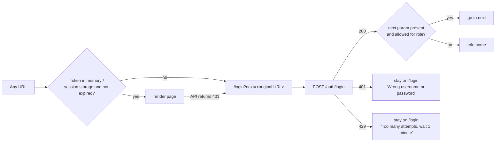
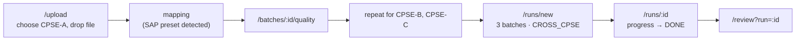

# 03 · App Flow: SpecID Prototype
## Navigation and user-journey map · PS SIH26099

| Field | Value |
|---|---|
| Document | 03 of 6 · App Flow (every page, every click, every navigation path) |
| Version | v1.1 draft · 3 Oct 2026 (v1.0 earlier the same day). v1.1: consent queue S18 and consent step in S6 (SF-11), rulebook impact preview in S10 is P0 (SF-6), change notices S19 (P1, SF-12), demo path updated |
| Source of truth above this | PRD v0.5 (screens S0–S19, user stories US-01–US-32, demo 15.1) · TRD v1.1 (TR-UI-01 points to this route table, API catalogue) |
| Next documents | 04 UI/UX Design Brief (how each screen looks) · 05 Backend Schema (where data lives) · 06 Implementation Plan (build order) |

**How an AI coding agent should use this file.** Build pages *only* from the route table in section 2. Every button listed in section 5 must exist and must go exactly where the redirect column says. Every list must implement the loading, empty and error states in section 8. Never invent a page that is not listed here; if one seems needed, add it here first.

---

## 1. Product shape in one paragraph

SpecID is an **internal, role-based web app** with no public pages and no self sign-up. Users are created by an ADMIN (or seeded for the demo). After login, everyone lands on a page that fits their role. A persistent **left sidebar** groups the screens by job: *Overview · Data · Review · Registry · Insight · Governance · Integration*. A **top bar** carries the run selector and the user menu. Two pieces of chrome are always visible: the **SYNTHETIC ribbon** (when the current data is synthetic) and the **air-gap footer** (`AIR-GAPPED · blocked attempts: n`).

---

## 2. Pages list (routes)

| Route | Screen | Purpose | Roles that see it | Pri | PRD |
|---|---|---|---|---|---|
| `/login` | S1 Login | Username + password | everyone (logged out) | P0 | FR-1301 |
| `/` | S0 Dashboard | Duplicates per CPSE, data quality, cross-CPSE clusters, review backlog, top clusters, demand aggregation | MAKER, CHECKER, ADMIN, AUDITOR | P0 | FR-1201, FR-1203 |
| `/upload` | S2 Upload & mapping | Upload a CPSE master file (and optional procurement history), map columns | MAKER, CHECKER, ADMIN | P0 | FR-101–107, FR-1005 |
| `/batches/:batchId/quality` | S3 Data-quality report | Completeness, parse rate per category, long-text counts, ambiguous UoM | MAKER, CHECKER, ADMIN | P0 | FR-103 |
| `/runs` | S4a Run list | All runs with status and verdict mix; "New run" | MAKER, CHECKER, ADMIN | P0 | FR-507 |
| `/runs/new` | S4b New run | Pick batches, mode, options | MAKER, CHECKER, ADMIN | P0 | FR-505 |
| `/runs/:runId` | S4c Run console | Live progress, stage timings, stats, cancel | MAKER, CHECKER, ADMIN | P0 | FR-507 |
| `/review` | S5 Review queue | Clusters sorted by priority with filters | MAKER, CHECKER | P0 | FR-801 |
| `/clusters/:clusterId` | S6 Cluster review | Records side by side, evidence card, actions | MAKER, CHECKER (AUDITOR, ADMIN read-only) | P0 | FR-802–803 |
| `/pairs/:pairId` | S7 Pair evidence | Full-page version of the pair modal (deep link) | MAKER, CHECKER, ADMIN, AUDITOR | P0 | FR-609 |
| `/registry` | S8a Registry list | CNMCs with search and filters | everyone except INTEGRATOR (API only) | P0 | FR-906 |
| `/registry/:cnmc` | S8b CNMC detail | Canonical spec, class path, members, crosswalk, substitutes (P1), history, unmerge (P1) | as above | P0 | FR-901–907, FR-1481–1482 |
| `/exports` | S8c Exports | Crosswalk (CSV / JSON / SAP-style) and migration packs per CPSE | MAKER, CHECKER, ADMIN | P0 | FR-905, FR-907 |
| `/search` | S9 Search-before-create | Free-text check against the registry | MAKER, CHECKER, ADMIN, INTEGRATOR | P0 | FR-1001–1003 |
| `/templates` | S10a Rulebook list | Categories, versions, status | everyone | P0 | FR-401 |
| `/templates/:templateId` | S10b Template detail | Core / extended / critical, rule texts, golden tests; **ADMIN: YAML draft → golden tests → impact preview → activate (P0)** | everyone; edit ADMIN | P0 | FR-401–405, FR-1451–1452 |
| `/evaluation` | S11a Evaluation list | Evaluation runs; "New evaluation" | MAKER, CHECKER, ADMIN, AUDITOR | P0 | FR-1101–1106 |
| `/evaluation/:evalId` | S11b Evaluation report | Safety headline, baseline scoreboard, honesty panel, tabs | as above | P0 | FR-1411–1413, FR-1441–1443 |
| `/lookalikes` | S13 Look-alike Guard | Look-alikes vetoed, hidden twins, chart | MAKER, CHECKER, ADMIN, AUDITOR | P0 | FR-1401–1403 |
| `/audit` | S12 Audit | Filterable log, verify chain | ADMIN, AUDITOR | P0 | FR-1302 |
| `/admin/users` | S16 Users | Create users, set roles, reset passwords, API keys (P1) | ADMIN | P0 | FR-1301, FR-1004 |
| `/erp-sim` | S14 Create material (mock ERP) | Live duplicate check while typing | MAKER, CHECKER, ADMIN, INTEGRATOR | P1 | FR-1471 |
| `/pooling` | S15 Pooling view | Full list of CNMCs held by ≥ 2 CPSEs | MAKER, CHECKER, ADMIN | P1 | FR-1491 |
| `/about` | S17 About & honesty | What the numbers mean, evidence ladder, versions, licences | everyone | P0 | FR-1442 |
| `/consents` | **S18 Consent queue** | Clusters waiting for my CPSE's consent; evidence card with my CPSE's records highlighted; Consent / Decline | CHECKER (own CPSE only) | P0 | FR-1501–1504 |
| `/notices` | S19 Change notices | My CPSE's inbox of registry and rule changes; acknowledge; delta migration file | MAKER, CHECKER, INTEGRATOR (read) | P1 | FR-1511–1513 |
| `*` | 404 | "Page not found" + link to the role's home | everyone | P0 | — |

S16 (users), S17 (about), S18 (consents) and S19 (change notices) are listed in PRD v0.5 section 11.1. S16 and S17 were added first by this document: the PRD needs a place for ADMIN to manage users (FR-1301, section 2 "Manage users") and a place to read the honesty text outside the evaluation page.

---

## 3. Navigation structure

### 3.1 Layout
```
┌ SYNTHETIC DATA: results are optimistic by construction ─────────────────────────── (ribbon, only if synthetic) ┐
├──────────────┬─────────────────────────────────────────────────────────────────────────────────────────────────┤
│ SpecID       │ Run: [ Run 4F2A · 3 CPSEs · DONE  ▾ ]                          [?]  Meera (MAKER) ▾            │ top bar
│              ├─────────────────────────────────────────────────────────────────────────────────────────────────┤
│ OVERVIEW     │                                                                                                 │
│  Dashboard   │                               page content                                                      │
│ DATA         │                                                                                                 │
│  Upload      │                                                                                                 │
│  Runs        │                                                                                                 │
│ REVIEW       │                                                                                                 │
│  Queue  (37) │                                                                                                 │
│ REGISTRY     │                                                                                                 │
│  CNMCs       │                                                                                                 │
│  Search      │                                                                                                 │
│  Exports     │                                                                                                 │
│ INSIGHT      │                                                                                                 │
│  Look-alikes │                                                                                                 │
│  Evaluation  │                                                                                                 │
│ GOVERNANCE   │                                                                                                 │
│  Consents (2)│                                                                                                 │
│  Notices (P1)│                                                                                                 │
│  Rulebook    │                                                                                                 │
│  Audit       │                                                                                                 │
│  Users       │                                                                                                 │
│ INTEGRATION  │                                                                                                 │
│  ERP sim (P1)│                                                                                                 │
├──────────────┴─────────────────────────────────────────────────────────────────────────────────────────────────┤
│ AIR-GAPPED · blocked attempts: 0 · v0.4 · commit 1a2b3c · About                                    (footer)    │
└────────────────────────────────────────────────────────────────────────────────────────────────────────────────┘
```

### 3.2 Sidebar visibility by role

| Item | MAKER | CHECKER | ADMIN | AUDITOR | INTEGRATOR |
|---|---|---|---|---|---|
| Dashboard | ✔ | ✔ | ✔ | ✔ | – |
| Upload, Runs | ✔ | ✔ | ✔ | – | – |
| Review queue | ✔ | ✔ | – | – | – |
| CNMCs | ✔ | ✔ | ✔ | ✔ | – |
| Search | ✔ | ✔ | ✔ | – | ✔ |
| Exports | ✔ | ✔ | ✔ | – | – |
| Look-alikes, Evaluation | ✔ | ✔ | ✔ | ✔ | – |
| Rulebook | ✔ (read) | ✔ (read) | ✔ (edit) | ✔ (read) | – |
| Audit | – | – | ✔ | ✔ | – |
| Users | – | – | ✔ | – | – |
| Consents (S18) | – | ✔ (own CPSE) | – | – | – |
| Notices (S19, P1) | ✔ | ✔ | – | – | ✔ (read) |
| ERP sim (P1) | ✔ | ✔ | ✔ | – | ✔ |

Hidden items are **not rendered**, and the server still returns 403 if their URL is opened directly (TRD TR-SEC-03).

### 3.3 Global elements and their behaviour

| Element | Behaviour |
|---|---|
| **Run selector** (top bar) | Lists the 20 most recent runs with status; default = latest `DONE` run. Changing it updates `?run=<id>` on run-scoped pages (S0, S5, S13) and keeps the selection in session storage. Disabled on pages that are not run-scoped |
| **Review badge** (sidebar "Queue (n)") | Count of clusters waiting for *this user's* action (maker: `OPEN`; checker: `MADE` by someone else). Refreshes every 30 s |
| **SYNTHETIC ribbon** | Shown whenever the page's data comes from a batch with `is_synthetic = true` (API field `is_synthetic`). Not dismissible |
| **Air-gap footer** | Polls `/system/airgap` every 10 s. Shows `AIR-GAPPED · blocked attempts: n`. If the guard is disabled or the dense channel is off, the footer adds a visible tag (`GUARD OFF`, `DENSE OFF`) |
| **Help `[?]`** | Opens the keyboard-shortcut overlay (P1) and a link to S17 About |
| **User menu** | Name, role, CPSE; "Change password"; "Logout" |
| **Breadcrumbs** | On detail pages: `Review queue › Cluster 4F2A`, `Registry › NMC-00000001974`, `Runs › Run 4F2A` |

### 3.4 Back behaviour
Browser Back always works (no history replacement except after login and logout). Detail pages keep the list's filters in the URL, so Back returns to the same filtered list. After an action on S6 (approve, reject…), the app moves to the **next** cluster in the queue (section 5.6), not back to the list.

---

## 4. Entry points, authentication and redirects

### 4.1 First screen
A brand-new visitor opening `http://127.0.0.1:8080` sees **`/login`**. There is no landing page, no sign-up and no "forgot password" e-mail flow (offline system; ADMIN resets passwords).

### 4.2 Auth flow


| Rule | Detail |
|---|---|
| Token storage | JWT kept in memory and mirrored in `sessionStorage` (survives refresh, cleared when the tab closes). Never `localStorage` |
| Expiry | 8 h. Ten minutes before expiry, a toast offers "Stay signed in" (re-login dialog without leaving the page) |
| First login of a seeded user | Forced "Change password" dialog before the role home (except demo users when `SEED_DEMO_USERS=true`) |
| Logout | Clears token → `/login` (no `next`) |
| Onboarding | None as a separate flow. Empty states on S0 and S5 guide the first actions (section 8) |

### 4.3 Role home (where login lands)

| Role | Home | Why |
|---|---|---|
| MAKER | `/review` if the queue has items, else `/` | Makers live in the queue |
| CHECKER | `/consents` if consents are waiting for my CPSE, else `/review?stage=to_check` if items are waiting, else `/` | Stewards answer for their CPSE first |
| ADMIN | `/` | Overview, then rulebook and users |
| AUDITOR | `/audit` | Read-only trail |
| INTEGRATOR | `/search` | The UI part of the API they integrate |

### 4.4 Redirect table

| Event | Goes to |
|---|---|
| Login success | `next` (if allowed for the role) else role home |
| Logout | `/login` |
| Any 401 from the API | `/login?next=<current URL>` |
| Any 403 page load | stays on URL, shows the "No access" panel with a link to role home |
| Upload saved (S2) | `/batches/:batchId/quality` |
| "Start run" on S3 | `/runs/new?batches=<id>` (batch pre-selected) |
| Run created (S4b) | `/runs/:runId` |
| Run `DONE` (S4c) | stays; shows "Open review queue" and "Open Look-alike Guard" buttons |
| Maker propose / checker overturn on S6 | next cluster in the filtered queue; if none → `/review` with "Queue empty" state |
| Checker confirm APPROVE on S6 | all participating CPSEs consented → toast "NMC-… issued" with link; otherwise toast "Confirmed. Waiting for consent from CPSE-C" → next cluster |
| Consent / Decline on S18 | last missing consent → toast "NMC-… issued for CPSE-A, B, C" (or "…for A, B; CPSE-C declined") → next item in S18; empty → S18 empty state |
| Activate template on S10 | toast "valve v2 active; 3 CNMCs sent back for review" → `/templates/valve` |
| CNMC link anywhere | `/registry/:cnmc` |
| "Use NMC-…" on S9 | `/registry/:cnmc` (and audit "used existing") |
| "Create new… (reason)" on S9 | confirmation toast; stays on S9 (prototype does not create ERP materials) |
| New evaluation (S11a) | `/evaluation/:evalId` with progress |
| Template DRAFT saved (P1) | `/templates/:id?version=<draft>` |
| Unknown route | 404 page |

---

## 5. Screen-by-screen flow

Each block lists what is on the screen, what every action does, and where it leads. Visual layout is in document 04.

### 5.1 S0 Dashboard `/`
- **Shows** (for the selected run): records per CPSE; duplicates within each CPSE (count, share); cross-CPSE clusters; verdict mix; data-quality score per CPSE; review backlog; top 10 clusters by annual value; demand-aggregation panel (CNMCs held by ≥ 2 CPSEs).
- **Actions**
  - Click a CPSE bar → `/review?cpse=<code>&run=<id>`
  - Click a verdict slice → `/runs/:runId?tab=pairs&verdict=<v>`
  - Click a top cluster → `/clusters/:id`
  - Click a demand row → `/registry/:cnmc`
  - "See all" on the demand panel → `/pooling` (P1) or `/exports` (P0 fallback, CSV)
- **Empty**: no runs yet → see 8.2 (CTA "Upload a CPSE file").

### 5.2 S2 Upload & mapping `/upload`
1. Choose **CPSE** (dropdown) and tick **"Synthetic data"** (checked by default in the demo build).
2. Drop a CSV/XLSX (≤ 50 MB). Client checks extension and size before upload.
3. `POST /batches` → columns detected → **mapping table** with suggestions (generic synonyms or the **SAP preset** if SAP field names are detected; a banner says "SAP material-master columns detected").
4. Required mappings: `legacy_code` + one of `short_text` / `long_text`. Save is disabled until they are set; the blocking field is highlighted.
5. Optional second drop zone: **Procurement history** (FR-107). Can also be added later from S3.
6. **Save & ingest** → `PUT mapping` → `POST ingest` (202) → progress bar → redirect `/batches/:batchId/quality`.
- **Errors**: unsupported file → inline; encoding fallback used → yellow note "Read as Windows-1252"; ingest failure → error panel with the problem `detail` and "Try again".

### 5.3 S3 Data-quality report `/batches/:batchId/quality`
- **Shows**: rows; completeness per field; empty short texts; short text > 40 chars; duplicate legacy codes; share per recognised category; core-attribute parse rate per category; ambiguous UoM count; records not classified (with up to 20 examples).
- **Actions**: "Add procurement history" (drawer, FR-107) · "Start run with this batch" → `/runs/new?batches=<id>` · "Upload another CPSE" → `/upload`.

### 5.4 S4 Runs `/runs`, `/runs/new`, `/runs/:runId`
- **S4a list**: table (id, batches, mode, status, started by, duration, verdict mix). "New run" → `/runs/new`.
- **S4b new run**: multi-select batches (≥ 1; for `CROSS_CPSE` ≥ 2 CPSEs required, otherwise the button is disabled with a hint), mode radio (`CROSS_CPSE` default / `WITHIN_CPSE` / `BOTH`), advanced options collapsed (dense channel, thresholds — defaults shown, editable by ADMIN only). "Start" → `POST /runs` → `/runs/:runId`.
- **S4c console**: stage stepper (extract → embed → candidates → decide → cluster → write) with progress, refreshed every 2 s; stats; "Cancel" (confirm modal) → status `CANCELLING` → `CANCELLED`. On `DONE`: buttons **Open review queue** (`/review?run=<id>`), **Open Look-alike Guard** (`/lookalikes?run=<id>`), **Dashboard** (`/?run=<id>`); tab "Pairs" lists pair decisions with filters → row click opens the **pair modal** (S7). On `FAILED`: error panel with stage and message, "Start again" (same config).

### 5.5 S5 Review queue `/review`
- **Filters** (kept in the URL): run, category, CPSE, verdict mix, flags, critical only, stage (`to_propose` for makers, `to_check` for checkers), search by text.
- **Columns**: priority, category, members, CPSEs, verdict summary, flags, critical badge, proposed CNMC text, state.
- **Actions**: row click → `/clusters/:id?from=queue&<filters>` · keyboard `J/K` move, `Enter` open (P1) · bulk approve (P1, CHECKER, `AUTO_ELIGIBLE` non-critical only) → confirm modal states the forced 10% sample.

### 5.6 S6 Cluster review `/clusters/:clusterId`
**Layout**: header (category, members, CPSEs, priority, verdict, route, flags) → records side by side → **evidence card** (one row per attribute with status, rule popover, conversion notes) → proposed CNMC text with character counter → actions.

**Maker actions** (cluster state `OPEN`)
| Button / key | Opens | Result |
|---|---|---|
| Approve (A) | optional comment | proposal saved → next cluster |
| Reject (R) | comment **required** | proposal saved (cannot-link on confirmation, P1) → next cluster |
| Split… (S) | **Split dialog**: drag records into groups | proposal saved → next cluster |
| Needs info (N) | dialog listing missing attributes from the evidence | proposal saved → next cluster |
| Supply value (P1) | **Supply drawer** on any `INSUFFICIENT_DATA` row | evidence refreshes in place; verdict may change |

**Checker actions** (cluster state `MADE` by another user)
| Button | Result |
|---|---|
| Confirm | APPROVE → if every participating CPSE has consented (the maker's and checker's CPSEs count), CNMC issued (toast with link); otherwise the cluster shows a **consent strip** "CPSE-A ✔ · CPSE-B ✔ · CPSE-C waiting" and moves to S18 of the CPSE-C steward → next cluster. REJECT / SPLIT / NEEDS_INFO → recorded → next cluster |
| Overturn | comment required → cluster back to `OPEN` → next cluster |

If the current user made the proposal, the checker buttons are replaced by "Waiting for another checker". Clusters spanning several CPSEs always show the **consent strip** in the header (one chip per CPSE: ✔ consented, ✖ declined with reason on hover, … waiting). Clicking any record code opens the **record drawer** (raw row, parsed spec, provenance). Clicking a pair link in the evidence opens the **pair modal**.

### 5.7 S7 Pair evidence `/pairs/:pairId` (and modal)
Evidence card for one pair, both raw texts, `text_sim`, look-alike class, baseline flags (B1, B2). Deep-linkable so a judge or auditor can be sent one URL.

### 5.8 S8 Registry `/registry`, `/registry/:cnmc`, `/exports`
- **List**: search by CNMC, text, legacy code, CPSE; filters by category, status. Row → detail.
- **Detail**: canonical spec (with provenance badges), class path and UNSPSC (or "not mapped"), short/long description, variants (make/MPN), **crosswalk table** (CPSE, legacy code, relation, UoM, factor, migration action), substitutes (P1, "may replace" / "may be replaced by"), **history** (issued, merges, unmerges, from the audit log). Actions: "Copy CNMC", "Download crosswalk (this CNMC)", **Unmerge record** (P1, CHECKER, reason required) → history updates.
- **Exports**: crosswalk CSV / JSON / SAP-style; migration pack per CPSE (dropdown) → file download; each export writes an audit event.

### 5.9 S9 Search-before-create `/search`
1. Type a description (+ optional UoM, MPN, manufacturer); press **Check** (or Enter).
2. Shows the parsed spec chips (category, attributes, `class_source` = rule or ML).
3. Result banner: `DUPLICATE RISK` (USE_EXISTING), `NEEDS DETAIL` (SUPPLY_ATTRIBUTES, lists attributes), or `NO MATCH` (CREATE_NEW_ALLOWED).
4. Ranked candidates with verdict and an "evidence ▸" expander.
5. Actions: **Use NMC-…** → `/registry/:cnmc` · **Create new… (reason required)** → modal → audit event → toast. If the category is not recognised: banner "Category not recognised; SpecID will not guess" with a link to S10 templates.

### 5.10 S10 Rulebook `/templates`, `/templates/:id`
- **List**: one card per category: version, status, core/extended counts, critical default, golden tests passed.
- **Detail**: tables for core, extended, tolerant, make; value domains; rule texts; aliases; golden tests with pass/fail. Arriving from a rule popover (`#rule=VALVE.size_dn`) scrolls to and highlights that rule.
- **ADMIN (P0):** "New draft" → YAML text editor with validation → "Run golden tests" → **"Preview impact on run…"** (choose run) → result: transition table (e.g. `EQUIVALENT → INSUFFICIENT_DATA: 12`), **affected CNMCs per CPSE**, first 50 changed decisions (each opens the pair modal) → "Activate" (enabled only when golden tests pass **and** the acknowledgement box is ticked) → confirm modal → new ACTIVE version; affected CNMCs go back to the review queue; (P1) change notices to affected CPSEs.
- Structured form editor instead of YAML: P1.

### 5.11 S11 Evaluation `/evaluation`, `/evaluation/:evalId`
- **List** + "New evaluation" (seed, config preset: default / adversarial / style D) → progress → report.
- **Report** order (fixed): safety headline → abstentions and coverage → baseline scoreboard + disagreement table → style-D and adversarial results → **honesty panel** → known weaknesses → unseen-category probe. Tabs: Ablations (P1) · Confusion matrix · Per category · Failures (top-20 with evidence links) · Export (MD / JSON).
- Clicking a disagreement count → `/lookalikes?run=<id>&filter=<type>`.

### 5.12 S13 Look-alike Guard `/lookalikes`
- Two lists: **Look-alikes vetoed** (sorted by `text_sim` desc) and **Hidden twins** (sorted asc), each row with both texts, similarity, verdict and the **decisive attribute** with rule ID; chart (x = similarity, y = verdict band).
- Thresholds shown from the run config (read-only).
- Row or dot click → pair modal; decisive rule → `/templates/:id#rule=…`; "Export CSV".

### 5.13 S12 Audit `/audit`
Filters: actor, action, object type, date range. Row expands to before/after JSON. **Verify chain** → progress → result banner: "Chain intact (n events)" or "Chain broken at event #k" with a link to that row.

### 5.14 S14 Create material, mock ERP `/erp-sim` (P1)
Looks like a simplified ERP form (material type, description, UoM, material group). As the user types the description (300 ms debounce), a side panel shows live search-before-create results; the description field shows `n / 40`; a yellow banner appears on `USE_EXISTING` with "Use NMC-…" and "Use SpecID description" (fills the 40-character text). "Save" is a mock: shows a toast "Would create material (simulation)".

### 5.14b S18 Consent queue `/consents` (P0)
- Shown to CHECKER users; lists only clusters in `AWAITING_CONSENT` that include **their own CPSE** and that their CPSE has not answered. Columns: category, CPSEs (consent chips), my CPSE's legacy codes, proposed CNMC text, who proposed and confirmed, waiting since.
- Row → consent view: the S6 layout read-only, **my CPSE's records highlighted**, evidence card, proposed canonical spec and short text; buttons **Consent** and **Decline (reason ≥ 5 characters)**.
- Consent → if last missing: CNMC issued (toast) → next item. Decline → dissent stored; CNMC issued for the remaining CPSEs if ≥ 2 records remain → next item.
- A steward cannot consent for another CPSE (button absent; API 403).

### 5.14c S19 Change notices `/notices` (P1)
Inbox for the user's CPSE: kind (issued, merged, unmerged, declined, rule activated), summary, affected legacy codes, date, acknowledged state. Row → detail with the delta migration rows; actions **Download delta CSV** and **Acknowledge**.

### 5.15 S15 Pooling `/pooling` (P1) · S16 Users `/admin/users` · S17 About `/about`
- **S15**: table of CNMCs held by ≥ 2 CPSEs, combined annual value and quantity, export CSV.
- **S16**: user list; "Add user" modal (username, role, CPSE, temporary password); "Reset password"; "Disable"; API keys (P1): create (shown once), revoke.
- **S17**: honesty text, evidence ladder, versions (app, templates, dictionary, models, commit), licences of bundled models and fonts.

---

## 6. Key user journeys

### J1 Load data and harmonise (Maker Meera) — US-01, 02, 03

Done when: the run is `DONE` and the queue shows clusters with priorities.

### J2 Review to national code (Maker Meera → Checker Arjun) — US-04–07, US-25
1. Meera opens `/review`, top cluster (valve, 3 CPSEs) → S6.
2. Reads the evidence: all core rows ✔, conversion notes visible, `design_standard` ⚠ unverified. Presses **A**, adds "checked vendor datasheet" → next cluster.
3. Arjun logs in → lands on `/review?stage=to_check` → opens the same cluster → **Confirm**.
4. Toast "NMC-00000001974 issued" → he clicks it → `/registry/NMC-00000001974`: crosswalk shows three CPSE codes.
5. Arjun opens `/exports` → downloads the migration pack for CPSE-B (one RETAIN, others BLOCK / PHASE OUT).
Edge: if Meera tries to confirm her own proposal, the button is absent; a direct API call returns 403 and the UI shows "Maker cannot also check".

### J3 Stop a duplicate at creation (Integrator / Maker) — US-12, US-28
`/search` (or `/erp-sim`) → type "gate valve 4 inch class 150 ASTM A216 WCB flanged RF" → DUPLICATE RISK → **Use NMC-…** → CNMC page. Alternative: user insists → **Create new…** → reason → audited.

### J4 See what text matching would get wrong (Judge, Auditor) — US-22, US-25
`/lookalikes` → top row "SCH40 vs SCH80, 0.97, ✖ schedule" → click → pair modal → click rule `PIPE.schedule` → `/templates/pipe#rule=PIPE.schedule` shows the rule text.

### J5 Ask, don't guess (Maker, P1) — US-24, US-08
S6 → row `end_connection: FLANGED-? vs FLANGED-RF` (? INSUFFICIENT) → **Supply value** drawer → choose `FLANGED-RF`, source note "datasheet D-123" → Save → evidence refreshes: ✔ MATCH with badge "supplied by user" → verdict becomes EQUIVALENT → maker proceeds normally.

### J6 Prove the numbers (Team, Judge) — US-17, 18, 23
`/evaluation` → New (seed 7) → report: false merges *k* of *n* with bound → baseline scoreboard → honesty panel → Export MD.

### J7 Verify nothing was tampered with (Auditor) — US-15
`/audit` → **Verify chain** → "Chain intact (1,043 events)".

### J8 Change a rule safely (Admin, **P0**) — US-26
`/templates/valve` → New draft (move `design_standard` to core in YAML) → Run golden tests → Preview impact on run 4F2A → "EQUIVALENT → INSUFFICIENT_DATA: 12 · 3 CNMCs affected in CPSE-A, CPSE-B" → tick acknowledgement → Activate → affected CNMCs back in the review queue → audit (P1: change notices to CPSE-A and CPSE-B).

### J9 Undo a wrong merge (Checker, P1) — US-29
`/registry/:cnmc` → crosswalk row → **Unmerge** → reason → row status REMOVED, history updated, the legacy code can be mapped again in a later run.

### J11 Consent for my CPSE (Steward Kavya, CPSE-C) — US-31
Kavya logs in → lands on `/consents` (badge "Consents (1)") → opens the valve cluster → sees CPSE-C's record `VLV-00918` highlighted, all core rows ✔ → **Consent** → toast "NMC-00000001974 issued for CPSE-A, B, C" → registry shows three crosswalk rows. Alternative: **Decline** "our item is for NACE service" → CNMC issued for A and B only; dashboard lists the dissent.

### J12 Act on a change (CPSE ERP team, P1) — US-32
`/notices` → "CNMC NMC-… issued: 1 legacy code affected" → Download delta CSV → Acknowledge.

### J10 Find joint-buying candidates (Procurement analyst) — US-14, US-30
`/` → demand panel → top CNMC held by 3 CPSEs → `/registry/:cnmc` → crosswalk with each CPSE's legacy code.

### Demo path (PRD 15.1) as a click sequence
`/` (dashboard, open cross-CPSE cluster) → `/lookalikes` → pair modal → rule popover → *(opt.)* hidden twin / S6 supply value → S6 approve as maker (Meera, CPSE-A) → switch to the checker profile (Arjun, CPSE-B) → Confirm → consent strip shows **CPSE-C waiting** → switch to the steward profile (Kavya, CPSE-C) → `/consents` → Consent → `/registry/:cnmc` → admin profile → `/templates/valve` → draft → **Preview impact** → `/evaluation/:id` → *(opt.)* `/search` → footer + Wi-Fi off → `/search` again.

**Demo tip:** keep **four browser profiles** open (maker A, checker B, steward C, admin) so nobody logs in or out on stage.

---

## 7. Modals, drawers and overlays

| Name | Trigger | Content | Closes to |
|---|---|---|---|
| Pair evidence modal | pair link anywhere | evidence card, texts, `text_sim`, look-alike class, B1/B2 flags, "Open full page" | same page |
| Rule popover | rule icon on an evidence row | rule ID, rule text, template version, link "Open in rulebook" | same page |
| Record drawer (right) | record code on S6, S8 | raw row, parsed spec, provenance, procurement aggregates (own CPSE only) | same page |
| Supply value drawer (P1) | "Supply value" on an INSUFFICIENT row | value picker from the value domain, source note (≥ 5 chars), Save | S6 refreshed |
| Split dialog | S (split) on S6 | drag records into 2+ groups; each group must be conflict-free (validated live) | next cluster |
| Needs-info dialog | N on S6 | checklist of missing attributes + comment | next cluster |
| Reject / overturn dialog | R / Overturn | required comment | next cluster |
| Create-anyway dialog | S9 "Create new…" | required reason | S9 |
| Cancel-run confirm | S4c Cancel | "Stop this run? Partial results are discarded." | S4c |
| Bulk-approve confirm (P1) | S5 | count, forced-sample rate | S5 |
| Unmerge dialog (P1) | S8b | record, required reason | S8b |
| Activate-template confirm (P1) | S10b | impact summary + acknowledgement | S10b |
| Procurement-history drawer | S3 / S2 | drop file, mapping, Save | S3 |
| Add-user modal | S16 | username, role, CPSE, temp password | S16 |
| Re-login dialog | token near expiry / 401 on a form | password field | same page, unsaved input kept |
| Shortcut overlay (P1) | `?` | key list | same page |

All dialogs close with `Esc` unless they hold unsaved input (then confirm "Discard changes?").

---

## 8. States: loading, empty, error

### 8.1 Loading
- Lists: skeleton rows (5) for up to 10 s, then "Still loading…" with Retry.
- Run console and evaluation: stage stepper with live counts; never a spinner alone.
- Buttons that call the API show an inline spinner and are disabled until the response.

### 8.2 Empty states (each has one primary action)

| Screen | Condition | Message | Primary action (role) |
|---|---|---|---|
| S0 | no runs | "No harmonisation run yet. Upload two or more CPSE files to start." | Upload a CPSE file (MAKER+) |
| S0 demand panel | no procurement history | "Upload procurement history to see combined demand across CPSEs." | Add procurement history |
| S4a | no runs | "No runs yet." | New run |
| S5 | queue empty for this user | "Nothing waiting for you." (checker: "No proposals waiting for a second check.") | Open dashboard |
| S8a | no CNMCs | "No national codes yet. Codes are issued when a checker confirms a cluster." | Open review queue |
| S9 | registry empty | "The registry is empty, so every description is new. Issue CNMCs first." | Open review queue |
| S11a | no evaluations | "No evaluation yet. Results will be labelled SYNTHETIC." | New evaluation |
| S18 | nothing waiting | "No national codes are waiting for CPSE-C's consent." | Open review queue |
| S19 | no notices | "No changes affect your CPSE yet." | — |
| S13 | no look-alikes | "No pairs above the look-alike threshold in this run." | Change run |
| S12 | no events | "No events recorded." | — |
| Filters give 0 rows | any list | "No results for these filters." | Clear filters |

### 8.3 Error states

| Situation | What the user sees | Where they can go |
|---|---|---|
| 400 / 422 validation | inline field errors from `errors[]`; form stays filled | fix and resubmit |
| 401 | redirect to `/login?next=…` (or re-login dialog if a form has input) | back to the same page after login |
| 403 | "No access" panel naming the required role | role home |
| 404 | "Not found" (cluster, CNMC, run) | list page of that object |
| 409 conflict | e.g. "Legacy code 100234 of CPSE-A is already mapped to NMC-…" with link | the conflicting CNMC |
| 429 | "Too many requests, wait n s" (retry-after) | stays |
| 5xx | "Something went wrong (request id …)" + Retry | stays |
| API unreachable | top banner "Server not reachable. Retrying…" (exponential retry up to 30 s); actions disabled | stays |
| Run `FAILED` | S4c error panel with stage and message | Start again / Runs list |
| Evaluation failed | same pattern on S11b | New evaluation |
| Audit chain broken | red banner with event id | that event row |
| Model missing at startup | footer tag `DENSE OFF`, banner on S4b "Dense channel unavailable; runs use blocking + BM25" | continue |

---

## 9. URL and state conventions

- List filters, sorting and pagination live in the query string (`/review?run=4F2A&category=VALVE&stage=to_check`), so links can be shared and Back works.
- Run-scoped pages take `?run=`; if missing, the run selector's value is used and written to the URL.
- Hash fragments for in-page targets: `/templates/valve#rule=VALVE.size_dn`.
- Never put tokens or personal data in URLs.

---

## 10. Traceability

| Journey / screen | User stories | Demo scene (PRD 15.1) |
|---|---|---|
| J1, S2–S4 | US-01–03 | setup (pre-run snapshot) |
| J2, S5–S6, S8 | US-04–07, US-13 | 1:50 |
| J3, S9, S14 | US-12, US-28 | 3:30 |
| J4, S13, S7, S10 | US-22, US-25 | 0:30, 1:05, 1:30 |
| J5 | US-08, US-24 | 1:30 (opt.) |
| J6, S11 | US-17, 18, 23 | 3:45 |
| J7, S12 | US-15 | — |
| J8 | US-10, 11, 26 | 2:45 |
| J11, S18 | US-31 | 1:50 |
| J12, S19 | US-32 | — |
| J9 | US-29 | — |
| J10, S0, S15 | US-14, US-30 | 0:00 |
| Footer | US-27 | 4:30 |

*End of App Flow.*
