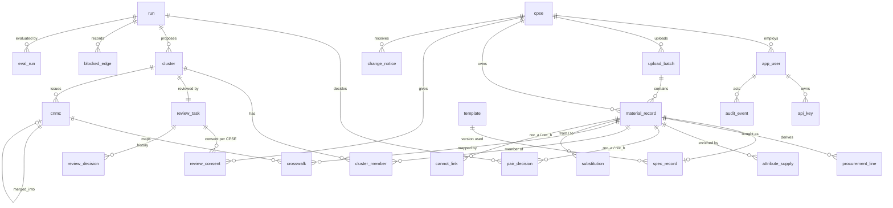

# 05 · Backend Schema: SpecID Prototype
## Data model, relationships, access control and events · PS SIH26099

| Field | Value |
|---|---|
| Document | 05 of 6 · Backend Schema (data structure, tables, auth, relationships) |
| Version | **schema v0.6 (unchanged)** · document **v1.2** · 3 Oct 2026. v1.2 records build decisions without any DDL change: audit action `PASSWORD_CHANGED` (DEC-15), seeding writes no audit rows (DEC-11), `dictionary.content` shapes and seed files (DEC-13), gasket seeded DRAFT. v1.1 / v1.0 earlier the same day |
| Source of truth above this | PRD v0.6 (section 7; PRD Appendix E points here) · TRD v1.2 (sections 7, 11) · 03 App Flow v1.3 |
| Database | PostgreSQL 16, no extensions required |
| Verified | The full DDL (Appendix A, 58 statements, 26 tables) was **executed on PostgreSQL 16**; constraint, trigger, consent, row-level-security and dashboard-query tests were run against it (section 15). The data dictionary in section 4 was **generated from that live database**, so it matches the DDL exactly |

**How an AI coding agent should use this file.** Appendix A is the only DDL. Generate the first Alembic migration from it verbatim. Do not add, rename or drop columns without updating this file first. Never put business rules only in the UI: if a rule is listed in section 10 as "DB", the database enforces it and the code must expect the error.

---

## 1. Conventions

| Topic | Rule |
|---|---|
| Keys | `uuid` primary keys (`gen_random_uuid()` default; bulk rows get UUIDs from Python, TRD TD-06). Exceptions: `audit_event` and `blocked_edge` use `bigserial` (order matters); `template` and `dictionary` use `(id/kind, version)`; `cnmc` uses its code |
| Time | `timestamptz`, stored UTC, displayed IST by the UI |
| Names | `snake_case`, singular table names |
| Enumerations | `text` + `CHECK (... IN (...))`, not PostgreSQL `ENUM` types: adding a value is a one-line migration |
| Flexible structure | `jsonb` only for data whose shape is defined per category or per run (attributes, evidence, configs, metrics). Contracts in section 6 |
| Deletion | Registry and audit data are never deleted. Run-scoped data cascades from `run`. Batch data cascades from `upload_batch` (used for purging real data, TRD 7.4) |
| Money | `numeric`, currency in `procurement_line.currency` (default INR) |

### 1.1 Changes from PRD v0.4 Appendix E (schema v0.4 → v0.5)

| Change | Why | Source |
|---|---|---|
| `run.status` adds `CANCELLING`, `CANCELLED`; `run.mode`, `run.error` added | Cancel flow and failure message | App Flow 5.4, TRD 8.2 |
| `upload_batch.status` adds `INGESTING`; `file_sha256` added | Progress state; duplicate-file detection | App Flow 5.2 |
| `material_record.content_hash` + unique `(cpse_id, legacy_code, content_hash)`; `uom_canonical`, `annual_qty` | Idempotent re-ingest (FR-105); UoM (FR-205); demand (FR-107) | PRD |
| `cpse.vendor_salt`, `cpse.sector` | Vendor hashing (TRD TR-MOD-21); PS sectors | TRD, PS |
| `app_user.is_active`, `must_change_password`, `display_name`, `last_login_at` | User admin and first-login flow | App Flow 4.2, S16 |
| New `api_key` | FR-1004 | PRD |
| New `dictionary` (abbreviations, UoM, header synonyms, UNSPSC map) | FR-203, FR-205, FR-405, FR-1005 were not stored anywhere | PRD |
| `spec_record.class_source`, `class_prob`, `class_path`, `spec_completeness`, `dictionary_version`, `updated_at` | ML classification and provenance | FR-402, FR-405 |
| `pair_decision.channels` | Which candidate channel found the pair (pair-completeness analysis) | TRD TR-ALG-01 |
| New `cannot_link`, `blocked_edge` | FR-805 and FR-703 had no table | PRD |
| `cluster.is_critical`, `flags_count` | Queue filters | App Flow 5.5 |
| `review_task.made_by`, `proposed_decision`, `checked_by`, unique `cluster_id`, **CHECK maker ≠ checker** | Separation of duties enforced in the database too | FR-803 |
| `review_decision.decision` adds `CONFIRM`, `OVERTURN` | Checker actions recorded explicitly | App Flow 5.6 |
| `cnmc.category`, `class_path`, `unspsc`, `base_uom`, `spec_completeness`, `variants`, `source_cluster`, `template_version`; CHECK "MERGED needs `merged_into`" | FR-405 required class path and UNSPSC on the CNMC | PRD |
| `crosswalk` CHECK: REMOVED rows need who, when, why | Reversible merges are always explained | FR-1481 |
| `substitution.run_id` + unique `(from, to, rule)` | Traceability | FR-612 |
| `eval_run.run_id`, `git_commit`, `report_path`, `created_by` | FR-1443 exports repeat the commit | PRD |
| `audit_event.ts` set by the app (no default), `hash` unique, **append-only triggers** | Recomputable hashes (TRD TR-ALG-09); tamper resistance | FR-1302 |
| New `idempotency_key` | TRD TR-API-09 | TRD |
| New indexes for blocking, MPN, queue, look-alikes, crosswalk by record | TRD TR-DAT-06 and query paths | TRD |

### 1.2 Changes in schema v0.6 (PRD v0.5)

| Change | Why | Source |
|---|---|---|
| New `review_consent` (one row per participating CPSE per task; decline needs a reason) | Multi-CPSE consent, the main differentiator (SF-11) | PRD FR-1501–1504 |
| `review_task.state` adds `AWAITING_CONSENT` | A confirmed cross-CPSE cluster waits for the remaining CPSEs | PRD FR-1501 |
| New `change_notice` (per-CPSE inbox with delta rows; acknowledged once) | Per-CPSE change notices (SF-12, P1) | PRD FR-1511–1513 |

PRD v0.5 Appendix E now points to Appendix A of this document, so there is one copy of the DDL.

---

## 2. Entity-relationship diagram



---

## 3. Relationships

| From | To | Cardinality | On delete | Meaning |
|---|---|---|---|---|
| `app_user.cpse_id` | `cpse.id` | many-to-one (optional) | restrict | user belongs to a CPSE (ADMIN, AUDITOR may have none) |
| `upload_batch.cpse_id` | `cpse.id` | many-to-one | restrict | every file belongs to one CPSE |
| `material_record.batch_id` | `upload_batch.id` | many-to-one | **cascade** | purging a batch removes its rows |
| `spec_record.record_id` | `material_record.id` | one-to-one | cascade | one derived spec per record |
| `procurement_line.record_id` | `material_record.id` | many-to-one | cascade | purchase history per record |
| `pair_decision.run_id` | `run.id` | many-to-one | cascade | decisions belong to a run |
| `pair_decision.rec_a / rec_b` | `material_record.id` | many-to-one ×2 | restrict | `rec_a < rec_b` |
| `cluster.run_id` | `run.id` | many-to-one | cascade | |
| `cluster_member` | `cluster`, `material_record` | many-to-many | cascade (cluster) | |
| `review_task.cluster_id` | `cluster.id` | **one-to-one** (unique) | cascade | one task per cluster |
| `review_decision.task_id` | `review_task.id` | many-to-one | cascade | |
| `review_consent.task_id` / `cpse_id` | `review_task.id`, `cpse.id` | one per (task, CPSE) | cascade (task) | consent or decline of one CPSE |
| `change_notice.cpse_id` | `cpse.id` | many-to-one | restrict | inbox of one CPSE |
| `cnmc.source_cluster` | `cluster.id` | many-to-one (optional) | restrict | where the code came from |
| `cnmc.merged_into` | `cnmc.cnmc` | many-to-one (self) | restrict | survivor pointer |
| `crosswalk.cnmc` | `cnmc.cnmc` | many-to-one | restrict | |
| `crosswalk.record_id` | `material_record.id` | many-to-one | restrict | a record keeps its history of mappings |
| `substitution.from_record / to_record` | `material_record.id` | many-to-one ×2 | restrict | one-way link |
| `eval_run.run_id` | `run.id` | many-to-one (optional) | set null | |
| `audit_event.actor_id` | `app_user.id` | many-to-one (optional) | restrict | system events have no actor |

Because registry rows reference `material_record` with *restrict*, a batch whose records are already in the registry cannot be purged until those mappings are removed (unmerge). This is deliberate: the registry must never lose its legacy-code trail silently.

---

## 4. Data dictionary (generated from the live schema)

### Organisations and access

#### `cpse`

One participating CPSE. `vendor_salt` is generated by the app (16 random bytes, hex) and used to hash vendor names (FR-107). *Implements:* FR-102, FR-107.

| Column | Type | Null | Default | References |
|---|---|---|---|---|
| `id` | uuid | no | `gen_random_uuid()` |  |
| `code` | text | no |  |  |
| `name` | text | no |  |  |
| `sector` | text | yes |  |  |
| `vendor_salt` | text | no |  |  |
| `created_at` | timestamp with time zone | no | `now()` |  |

*Indexes:* `(code)  · unique`

#### `app_user`

A person who logs in. Role drives every permission (section 5); `cpse_id` decides which CPSE a steward consents for (SF-11). `must_change_password` forces a change at first login. *Implements:* FR-1301, FR-1501.

| Column | Type | Null | Default | References |
|---|---|---|---|---|
| `id` | uuid | no | `gen_random_uuid()` |  |
| `username` | text | no |  |  |
| `display_name` | text | yes |  |  |
| `password_hash` | text | no |  |  |
| `role` | text | no |  |  |
| `cpse_id` | uuid | yes |  | → `cpse.id` |
| `is_active` | boolean | no | `true` |  |
| `must_change_password` | boolean | no | `true` |  |
| `last_login_at` | timestamp with time zone | yes |  |  |
| `created_at` | timestamp with time zone | no | `now()` |  |

*Indexes:* `(username)  · unique`

#### `api_key`

Machine credential for INTEGRATOR (P1). Only the SHA-256 of the key is stored; shown once at creation. *Implements:* FR-1004.

| Column | Type | Null | Default | References |
|---|---|---|---|---|
| `id` | uuid | no | `gen_random_uuid()` |  |
| `user_id` | uuid | no |  | → `app_user.id` |
| `key_hash` | text | no |  |  |
| `label` | text | no |  |  |
| `created_at` | timestamp with time zone | no | `now()` |  |
| `revoked_at` | timestamp with time zone | yes |  |  |

*Indexes:* `(key_hash)  · unique`

### Ingestion

#### `upload_batch`

One uploaded file of one CPSE. `is_synthetic` drives the SYNTHETIC ribbon; `quality` holds the data-quality report JSON. *Implements:* FR-101–106.

| Column | Type | Null | Default | References |
|---|---|---|---|---|
| `id` | uuid | no | `gen_random_uuid()` |  |
| `cpse_id` | uuid | no |  | → `cpse.id` |
| `filename` | text | no |  |  |
| `file_sha256` | text | no |  |  |
| `status` | text | no |  |  |
| `column_mapping` | jsonb | yes |  |  |
| `row_count` | integer | yes |  |  |
| `quality` | jsonb | yes |  |  |
| `is_synthetic` | boolean | no | `false` |  |
| `created_by` | uuid | yes |  | → `app_user.id` |
| `created_at` | timestamp with time zone | no | `now()` |  |

*Indexes:* `(cpse_id)`

#### `material_record`

One ERP row as received. `raw` keeps the original row. `content_hash` = SHA-256 of the canonical row and makes re-ingest idempotent. *Implements:* FR-101–105.

| Column | Type | Null | Default | References |
|---|---|---|---|---|
| `id` | uuid | no | `gen_random_uuid()` |  |
| `batch_id` | uuid | no |  | → `upload_batch.id` |
| `cpse_id` | uuid | no |  | → `cpse.id` |
| `legacy_code` | text | no |  |  |
| `short_text` | text | no |  |  |
| `long_text` | text | yes |  |  |
| `uom` | text | yes |  |  |
| `uom_canonical` | text | yes |  |  |
| `mat_group` | text | yes |  |  |
| `manufacturer` | text | yes |  |  |
| `mpn` | text | yes |  |  |
| `plant` | text | yes |  |  |
| `criticality` | text | yes |  |  |
| `annual_value` | numeric | yes |  |  |
| `annual_qty` | numeric | yes |  |  |
| `content_hash` | text | no |  |  |
| `raw` | jsonb | yes |  |  |
| `created_at` | timestamp with time zone | no | `now()` |  |

*Indexes:* `(batch_id)` · `(cpse_id, legacy_code, batch_id)  · unique` · `(cpse_id, legacy_code)` · `(cpse_id, legacy_code, content_hash)  · unique` · `(upper(manufacturer), upper(mpn)) WHERE (mpn IS NOT NULL)`

#### `procurement_line`

Optional purchase history line. Vendor stored only as a salted hash. *Implements:* FR-107.

| Column | Type | Null | Default | References |
|---|---|---|---|---|
| `id` | uuid | no | `gen_random_uuid()` |  |
| `record_id` | uuid | no |  | → `material_record.id` |
| `po_date` | date | no |  |  |
| `qty` | numeric | no |  |  |
| `uom` | text | yes |  |  |
| `unit_price` | numeric | yes |  |  |
| `currency` | text | no | `'INR'::text` |  |
| `vendor_hash` | text | yes |  |  |
| `plant` | text | yes |  |  |
| `created_at` | timestamp with time zone | no | `now()` |  |

*Indexes:* `(record_id, po_date)`

### Rulebook

#### `template`

Versioned category policy (YAML stored as JSON). At most one ACTIVE version per template id; DRAFT versions feed the impact preview (SF-6). *Implements:* FR-401–405, FR-1451–1452.

| Column | Type | Null | Default | References |
|---|---|---|---|---|
| `id` | text | no |  |  |
| `version` | integer | no |  |  |
| `category` | text | no |  |  |
| `definition` | jsonb | no |  |  |
| `status` | text | no |  |  |
| `golden_passed` | integer | yes |  |  |
| `golden_failed` | integer | yes |  |  |
| `created_by` | uuid | yes |  | → `app_user.id` |
| `created_at` | timestamp with time zone | no | `now()` |  |
| `activated_by` | uuid | yes |  | → `app_user.id` |
| `activated_at` | timestamp with time zone | yes |  |  |

*Indexes:* `(id) WHERE (status = 'ACTIVE'::text)  · unique`

#### `dictionary`

Versioned lookup tables: abbreviations, UoM aliases, header synonyms, UNSPSC map. At most one ACTIVE per kind. *Implements:* FR-203, FR-205, FR-405, FR-1005.

| Column | Type | Null | Default | References |
|---|---|---|---|---|
| `kind` | text | no |  |  |
| `version` | integer | no |  |  |
| `content` | jsonb | no |  |  |
| `status` | text | no |  |  |
| `created_by` | uuid | yes |  | → `app_user.id` |
| `created_at` | timestamp with time zone | no | `now()` |  |

*Indexes:* `(kind) WHERE (status = 'ACTIVE'::text)  · unique`

### Specifications

#### `spec_record`

Derived specification of one record (1:1): `attrs`, `attr_meta` (tier, confidence, note), residual tokens, class info, optional 384-d embedding. *Implements:* FR-301–307, FR-402, FR-503.

| Column | Type | Null | Default | References |
|---|---|---|---|---|
| `record_id` | uuid | no |  | → `material_record.id` |
| `template_id` | text | yes |  |  |
| `template_version` | integer | yes |  |  |
| `category` | text | yes |  |  |
| `class_source` | text | no | `'NONE'::text` |  |
| `class_prob` | numeric | yes |  |  |
| `class_path` | text[] | yes |  |  |
| `norm_text` | text | no |  |  |
| `attrs` | jsonb | no | `'{}'::jsonb` |  |
| `attr_meta` | jsonb | no | `'{}'::jsonb` |  |
| `residual` | text[] | no | `'{}'::text[]` |  |
| `spec_completeness` | numeric | yes |  |  |
| `embedding` | float4[] | yes |  |  |
| `dictionary_version` | integer | yes |  |  |
| `created_at` | timestamp with time zone | no | `now()` |  |
| `updated_at` | timestamp with time zone | no | `now()` |  |

*Indexes:* `(category, ((attrs ->> 'size_dn'::text)))` · `(category)`

#### `attribute_supply`

A value supplied by a reviewer with a mandatory source note (ask-don't-guess, P1). *Implements:* FR-1421–1423.

| Column | Type | Null | Default | References |
|---|---|---|---|---|
| `id` | uuid | no | `gen_random_uuid()` |  |
| `record_id` | uuid | no |  | → `material_record.id` |
| `attr` | text | no |  |  |
| `value` | text | no |  |  |
| `source_note` | text | no |  |  |
| `supplied_by` | uuid | no |  | → `app_user.id` |
| `supplied_at` | timestamp with time zone | no | `now()` |  |

*Indexes:* `(record_id)`

### Runs and decisions

#### `run`

One harmonisation run over one or more batches. *Implements:* FR-505–507.

| Column | Type | Null | Default | References |
|---|---|---|---|---|
| `id` | uuid | no | `gen_random_uuid()` |  |
| `batch_ids` | uuid[] | no |  |  |
| `mode` | text | no |  |  |
| `config` | jsonb | no | `'{}'::jsonb` |  |
| `status` | text | no |  |  |
| `stats` | jsonb | yes |  |  |
| `error` | text | yes |  |  |
| `started_by` | uuid | yes |  | → `app_user.id` |
| `started_at` | timestamp with time zone | no | `now()` |  |
| `finished_at` | timestamp with time zone | yes |  |  |

*Indexes:* `(status, started_at DESC)`

#### `pair_decision`

Verdict, route, evidence and look-alike / baseline fields for one candidate pair in one run. `rec_a < rec_b` always. *Implements:* FR-601–611, FR-1401, FR-1411.

| Column | Type | Null | Default | References |
|---|---|---|---|---|
| `id` | uuid | no | `gen_random_uuid()` |  |
| `run_id` | uuid | no |  | → `run.id` |
| `rec_a` | uuid | no |  | → `material_record.id` |
| `rec_b` | uuid | no |  | → `material_record.id` |
| `verdict` | text | no |  |  |
| `route` | text | no |  |  |
| `p_equiv` | numeric | yes |  |  |
| `text_sim` | numeric | yes |  |  |
| `baseline` | jsonb | yes |  |  |
| `lookalike` | text | yes |  |  |
| `channels` | smallint | no | `0` |  |
| `reasons` | text[] | no | `'{}'::text[]` |  |
| `evidence` | jsonb | no |  |  |
| `model_version` | text | yes |  |  |
| `template_version` | integer | yes |  |  |
| `created_at` | timestamp with time zone | no | `now()` |  |

*Indexes:* `(run_id, lookalike) WHERE (lookalike IS NOT NULL)` · `(run_id, rec_b)` · `(run_id, rec_a, rec_b)  · unique` · `(run_id, verdict)`

#### `cannot_link`

Pairs a checker rejected; later runs never propose them together (P1). *Implements:* FR-805.

| Column | Type | Null | Default | References |
|---|---|---|---|---|
| `rec_a` | uuid | no |  | → `material_record.id` |
| `rec_b` | uuid | no |  | → `material_record.id` |
| `reason` | text | no |  |  |
| `created_by` | uuid | no |  | → `app_user.id` |
| `created_at` | timestamp with time zone | no | `now()` |  |

#### `substitution`

One-way substitute link (functional equivalence); never used for clustering (P1). *Implements:* FR-612.

| Column | Type | Null | Default | References |
|---|---|---|---|---|
| `id` | uuid | no | `gen_random_uuid()` |  |
| `run_id` | uuid | yes |  | → `run.id` |
| `from_record` | uuid | no |  | → `material_record.id` |
| `to_record` | uuid | no |  | → `material_record.id` |
| `rule` | text | no |  |  |
| `status` | text | no |  |  |
| `approver_id` | uuid | yes |  | → `app_user.id` |
| `reason` | text | yes |  |  |
| `created_at` | timestamp with time zone | no | `now()` |  |

*Indexes:* `(from_record, to_record, rule)  · unique`

### Clusters, review and consent

#### `cluster`

Proposed group of equivalent records in a run. *Implements:* FR-701–702.

| Column | Type | Null | Default | References |
|---|---|---|---|---|
| `id` | uuid | no | `gen_random_uuid()` |  |
| `run_id` | uuid | no |  | → `run.id` |
| `category` | text | yes |  |  |
| `status` | text | no |  |  |
| `cohesion` | numeric | yes |  |  |
| `needs_review` | boolean | no | `true` |  |
| `is_critical` | boolean | no | `false` |  |
| `flags_count` | integer | no | `0` |  |
| `priority` | numeric | yes |  |  |
| `created_at` | timestamp with time zone | no | `now()` |  |

*Indexes:* `(run_id, status, priority DESC)`

#### `cluster_member`

Membership of a record in a cluster. *Implements:* FR-701.

| Column | Type | Null | Default | References |
|---|---|---|---|---|
| `cluster_id` | uuid | no |  | → `cluster.id` |
| `record_id` | uuid | no |  | → `material_record.id` |

*Indexes:* `(record_id)`

#### `blocked_edge`

Why two records were not merged: the conflicting pair that blocked it. *Implements:* FR-703.

| Column | Type | Null | Default | References |
|---|---|---|---|---|
| `id` | bigint | no | `nextval('blocked_edge_id_seq'::regclass)` |  |
| `run_id` | uuid | no |  | → `run.id` |
| `rec_a` | uuid | no |  | → `material_record.id` |
| `rec_b` | uuid | no |  | → `material_record.id` |
| `blocking_a` | uuid | no |  | → `material_record.id` |
| `blocking_b` | uuid | no |  | → `material_record.id` |
| `reason` | text | no |  |  |

*Indexes:* `(run_id)`

#### `review_task`

Maker–checker task, one per cluster. State `AWAITING_CONSENT` while other participating CPSEs have not consented. The database refuses a task whose checker equals its maker. *Implements:* FR-801–803, FR-1501.

| Column | Type | Null | Default | References |
|---|---|---|---|---|
| `id` | uuid | no | `gen_random_uuid()` |  |
| `cluster_id` | uuid | no |  | → `cluster.id` |
| `state` | text | no |  |  |
| `made_by` | uuid | yes |  | → `app_user.id` |
| `proposed_decision` | text | yes |  |  |
| `checked_by` | uuid | yes |  | → `app_user.id` |
| `created_at` | timestamp with time zone | no | `now()` |  |
| `updated_at` | timestamp with time zone | no | `now()` |  |

*Indexes:* `(cluster_id)  · unique` · `(state)`

#### `review_decision`

Every proposal, confirmation and overturn, in order. *Implements:* FR-803, FR-806.

| Column | Type | Null | Default | References |
|---|---|---|---|---|
| `id` | uuid | no | `gen_random_uuid()` |  |
| `task_id` | uuid | no |  | → `review_task.id` |
| `actor_id` | uuid | no |  | → `app_user.id` |
| `actor_role` | text | no |  |  |
| `decision` | text | no |  |  |
| `comment` | text | yes |  |  |
| `split_groups` | jsonb | yes |  |  |
| `created_at` | timestamp with time zone | no | `now()` |  |

*Indexes:* `(task_id)`

#### `review_consent`

**Multi-CPSE consent (SF-11):** one row per participating CPSE per task. `via` records whether the consent came from the maker's proposal, the checker's confirmation or a steward of that CPSE; a decline needs a reason. *Implements:* FR-1501–1504.

| Column | Type | Null | Default | References |
|---|---|---|---|---|
| `task_id` | uuid | no |  | → `review_task.id` |
| `cpse_id` | uuid | no |  | → `cpse.id` |
| `user_id` | uuid | no |  | → `app_user.id` |
| `decision` | text | no |  |  |
| `via` | text | no |  |  |
| `reason` | text | yes |  |  |
| `created_at` | timestamp with time zone | no | `now()` |  |

*Indexes:* `(cpse_id, decision)`

### Registry and change notices

#### `cnmc`

Common National Material Code with canonical spec, descriptions, class path, UNSPSC, base UoM. Never deleted; MERGED rows point to the survivor. *Implements:* FR-901–906.

| Column | Type | Null | Default | References |
|---|---|---|---|---|
| `cnmc` | text | no |  |  |
| `template_id` | text | yes |  |  |
| `template_version` | integer | yes |  |  |
| `category` | text | no |  |  |
| `class_path` | text[] | yes |  |  |
| `unspsc` | text | yes |  |  |
| `canonical_spec` | jsonb | no |  |  |
| `spec_completeness` | numeric | yes |  |  |
| `variants` | jsonb | no | `'[]'::jsonb` |  |
| `base_uom` | text | yes |  |  |
| `short_desc_40` | text | yes |  |  |
| `long_desc` | text | yes |  |  |
| `status` | text | no |  |  |
| `merged_into` | text | yes |  | → `cnmc.cnmc` |
| `source_cluster` | uuid | yes |  | → `cluster.id` |
| `version` | integer | no | `1` |  |
| `issued_by` | uuid | yes |  | → `app_user.id` |
| `issued_at` | timestamp with time zone | no | `now()` |  |

*Indexes:* `(category, status)`

#### `crosswalk`

Legacy code → CNMC. Exactly one ACTIVE mapping per (CPSE, legacy code); removal needs who, when and why. *Implements:* FR-903–907, FR-1481.

| Column | Type | Null | Default | References |
|---|---|---|---|---|
| `id` | uuid | no | `gen_random_uuid()` |  |
| `cnmc` | text | no |  | → `cnmc.cnmc` |
| `record_id` | uuid | no |  | → `material_record.id` |
| `cpse_id` | uuid | no |  | → `cpse.id` |
| `legacy_code` | text | no |  |  |
| `relation` | text | no |  |  |
| `status` | text | no | `'ACTIVE'::text` |  |
| `uom` | text | yes |  |  |
| `uom_factor` | numeric | yes |  |  |
| `migration_action` | text | yes |  |  |
| `cluster_id` | uuid | yes |  | → `cluster.id` |
| `approver_id` | uuid | yes |  | → `app_user.id` |
| `approved_at` | timestamp with time zone | no | `now()` |  |
| `removed_by` | uuid | yes |  | → `app_user.id` |
| `removed_at` | timestamp with time zone | yes |  |  |
| `remove_reason` | text | yes |  |  |

*Indexes:* `(cpse_id, legacy_code) WHERE (status = 'ACTIVE'::text)  · unique` · `(cnmc)` · `(record_id)`

#### `change_notice`

**Per-CPSE change notice (SF-12, P1):** what changed for this CPSE, with the delta migration rows; acknowledged once. *Implements:* FR-1511–1513.

| Column | Type | Null | Default | References |
|---|---|---|---|---|
| `id` | uuid | no | `gen_random_uuid()` |  |
| `cpse_id` | uuid | no |  | → `cpse.id` |
| `kind` | text | no |  |  |
| `object_type` | text | no |  |  |
| `object_id` | text | no |  |  |
| `summary` | text | no |  |  |
| `delta` | jsonb | no | `'[]'::jsonb` |  |
| `audit_event_id` | bigint | yes |  |  |
| `created_at` | timestamp with time zone | no | `now()` |  |
| `acknowledged_by` | uuid | yes |  | → `app_user.id` |
| `acknowledged_at` | timestamp with time zone | yes |  |  |

*Indexes:* `(cpse_id, acknowledged_at, created_at DESC)`

### Evaluation, audit, API

#### `eval_run`

Evaluation run with seed, config, metrics and report path. *Implements:* FR-1101–1106.

| Column | Type | Null | Default | References |
|---|---|---|---|---|
| `id` | uuid | no | `gen_random_uuid()` |  |
| `kind` | text | no |  |  |
| `run_id` | uuid | yes |  | → `run.id` |
| `seed` | integer | yes |  |  |
| `config` | jsonb | no | `'{}'::jsonb` |  |
| `status` | text | no |  |  |
| `metrics` | jsonb | yes |  |  |
| `git_commit` | text | yes |  |  |
| `report_path` | text | yes |  |  |
| `created_by` | uuid | yes |  | → `app_user.id` |
| `created_at` | timestamp with time zone | no | `now()` |  |

#### `audit_event`

Hash-chained, append-only log. Triggers block UPDATE, DELETE and TRUNCATE. *Implements:* FR-1302.

| Column | Type | Null | Default | References |
|---|---|---|---|---|
| `id` | bigint | no | `nextval('audit_event_id_seq'::regclass)` |  |
| `ts` | timestamp with time zone | no |  |  |
| `actor_id` | uuid | yes |  | → `app_user.id` |
| `action` | text | no |  |  |
| `object_type` | text | no |  |  |
| `object_id` | text | no |  |  |
| `before` | jsonb | yes |  |  |
| `after` | jsonb | yes |  |  |
| `prev_hash` | text | yes |  |  |
| `hash` | text | no |  |  |

*Indexes:* `(actor_id, ts)` · `(hash)  · unique` · `(object_type, object_id)`

#### `idempotency_key`

Stored responses for repeated POSTs with the same Idempotency-Key (P1). *Implements:* TRD TR-API-09.

| Column | Type | Null | Default | References |
|---|---|---|---|---|
| `key` | text | no |  |  |
| `user_id` | uuid | no |  | → `app_user.id` |
| `endpoint` | text | no |  |  |
| `response` | jsonb | no |  |  |
| `created_at` | timestamp with time zone | no | `now()` |  |

---

## 5. Authentication, roles and access control

### 5.1 Auth model
- **Provider:** local users in `app_user`; passwords hashed with **bcrypt** (cost 12, TRD TR-SEC-01); JWT HS256, 8 h (TRD TR-API-02). INTEGRATOR may use an API key (`api_key.key_hash` = SHA-256 of the key).
- **Enforcement layers:** (1) FastAPI role dependency on every endpoint; (2) service-layer checks (separation of duties, CPSE scope); (3) database constraints and grants for the rules that must never break (section 10).
- **No Supabase-style RLS by default.** The API is the only database client, so access is enforced in the service layer. Section 5.4 gives an **optional, tested** RLS policy for procurement data if the pilot requires defence in depth.

### 5.2 Roles
| Role | In short |
|---|---|
| MAKER | uploads, runs, proposes review decisions, supplies attributes (P1) |
| CHECKER | everything a maker reads; confirms or overturns; unmerges (P1) |
| ADMIN | users, templates, dictionaries, thresholds; **cannot review** |
| AUDITOR | read-only, audit log and chain verification |
| INTEGRATOR | API only: search-before-create, registry and crosswalk reads |

### 5.3 Table-level permissions (enforced in the service layer)

R = read, W = write (insert/update), – = none.

| Table | MAKER | CHECKER | ADMIN | AUDITOR | INTEGRATOR |
|---|---|---|---|---|---|
| `cpse` | R | R | RW | R | – |
| `app_user` | own row R | own row R | RW | R (no hashes) | – |
| `api_key` | – | – | RW | – | own key (via API) |
| `upload_batch`, `material_record` | RW | RW | RW | R | – |
| `procurement_line` | **own CPSE only** RW | own CPSE RW | R aggregates | R aggregates | – |
| `template`, `dictionary` | R | R | RW (DRAFT, activate) | R | – |
| `spec_record` | R (W via runs) | R | R | R | – |
| `attribute_supply` | W (P1) | W (P1) | R | R | – |
| `run`, `pair_decision`, `cluster*`, `blocked_edge` | RW (start runs) | RW | RW | R | – |
| `review_task`, `review_decision` | W propose | W confirm / overturn | – | R | – |
| `review_consent` | W (implicit, via own proposal) | W consent / decline **for own CPSE only** | – | R | – |
| `change_notice` | R own CPSE, acknowledge | R own CPSE, acknowledge | R | R | R own CPSE (API) |
| `cannot_link` | – | W (on confirmed reject) | R | R | – |
| `substitution` | R | W approve (P1) | R | R | – |
| `cnmc`, `crosswalk` | R | W (issuance, unmerge) | R | R | R (API) |
| `eval_run` | RW | RW | RW | R | – |
| `audit_event` | – (written by services) | – | R | R | – |
| `idempotency_key` | system | system | system | – | system |

"Own CPSE only" means the service filters `procurement_line` by the user's `cpse_id`; cross-CPSE screens use aggregates (FR-104, TRD TR-SEC-11).

### 5.4 Database roles and optional row-level security (tested, section 15)

| DB role | Used by | Rights |
|---|---|---|
| `specid_owner` | Alembic migrations only | owns all objects |
| `specid_app` | the API at runtime | SELECT, INSERT, UPDATE, DELETE on tables **except** UPDATE, DELETE, TRUNCATE on `audit_event`; sequence usage |

Optional RLS (P2, for the pilot): `procurement_line` visible only when `app.cpse_id` (set per request with `set_config`) equals the record's CPSE; aggregates across CPSEs come from a `SECURITY DEFINER` function owned by `specid_owner`. Script in Appendix B. Note: table owners and superusers bypass RLS, so the API must connect as `specid_app`, never as the owner.

---

## 6. JSONB contracts

| Column | Shape | Defined in |
|---|---|---|
| `upload_batch.column_mapping` | `{ "<source header>": "<target field>" }` | TRD 7.2 |
| `upload_batch.quality` | rows, empty_short_text, short_text_over_40, duplicate_legacy_codes, completeness{}, category_share{}, core_parse_rate{}, uom_ambiguous | TRD 7.2 |
| `material_record.raw` | original row as `{header: value}` | — |
| `template.definition` | the YAML template as JSON (core, extended, tolerant, make, critical_default, value_domains, aliases, rule_text, substitutes, class_path, unspsc) | PRD Appendix A, TRD TR-MOD-05 |
| `dictionary.content` | ABBREVIATION `{abbr: expansion}` (v2 adds whole phrases such as `RAISED FACE`→`RF`) · UOM `{"aliases": {alias: canonical}, "ambiguous": [...]}` · HEADER_SYNONYM `{target: [synonyms]}` · UNSPSC_MAP `{class_path: {code, source_note}}` | TRD Appendix H, I |
| `spec_record.attrs` / `attr_meta` | `{attr: value}` / `{attr: {tier, confidence, note}}` | TRD 7.2 |
| `run.config` / `run.stats` | see TRD 7.2 | TRD 7.2 |
| `pair_decision.baseline` | `{"b1": bool, "b2": bool, "tau1": num, "tau2": num}` | TRD TR-ALG-04 |
| `pair_decision.evidence` | array of evidence rows (attr, level, a, b, status, rule, rule_text, note_a, note_b), `MISSING_BOTH` omitted | PRD 9.10, TRD TD-07 |
| `review_decision.split_groups` | `[[record_id, …], …]` | TRD Appendix F |
| `cnmc.canonical_spec` | `{attr: value}` union of members | PRD 9.8 |
| `cnmc.variants` | `[{"manufacturer": "...", "mpn": "..."}]` | PRD 9.8 |
| `eval_run.config` / `metrics` | PRD section 8 example; metrics computed at run time | PRD 10.2 |
| `audit_event.before` / `after` | the changed fields only, never secrets | TRD TR-ALG-09 |
| `idempotency_key.response` | status code + body | TRD TR-API-09 |

Every JSON contract gets a Pydantic model in `app/schemas/`; services validate before writing.

---

## 7. Sensitive fields

| Field | Sensitivity | Protection |
|---|---|---|
| `app_user.password_hash` | secret | bcrypt cost 12; never returned by any API; excluded from audit `before/after` |
| `api_key.key_hash` | secret | SHA-256; key shown once |
| `procurement_line.unit_price` | commercially confidential | own-CPSE visibility only; aggregates cross-CPSE (optional RLS, 5.4) |
| `procurement_line.vendor_hash` | confidential | raw vendor never stored; salted with `cpse.vendor_salt` |
| `cpse.vendor_salt` | secret | never returned by the API |
| `material_record.raw`, `short_text`, `long_text` | confidential CPSE data | real data never in repo, logs (except DEBUG), or screenshots (PRD NFR-10) |
| JWT secret, DB password | secret | environment only (TRD Appendix C) |

Encryption at rest is delegated to the host (disk encryption on the laptop / server); no column-level encryption in the prototype.

---

## 8. File storage

| Path (inside `api` container) | Content | Lifetime |
|---|---|---|
| `/app/data/uploads/{batch_id}/{original_name}` | uploaded file while parsing | deleted after ingest succeeds or fails |
| `/app/data/synthetic/seed-{seed}/` | generator output (CSV per CPSE, truth files, `manifest.json`) | regenerable; git-ignored |
| `/app/data/reports/{eval_run_id}.md` and `.json` | evaluation reports (`eval_run.report_path`) | kept |
| `/app/data/exports/` | none: exports are streamed, not stored | — |
| `/app/data/snapshots/specid-{tag}.dump` | `pg_dump -Fc` demo snapshots | kept, copied to USB |
| `/models/` (read-only) | MiniLM, category classifier, `manifest.json` | versioned by hash |
| `/app/templates/` (read-only) | template and dictionary YAML | versioned in git |

No object storage service is used. File names from users are never used as paths without sanitising (UUID directory + basename only).

---

## 9. Events and triggers

### 9.1 Database triggers
| Trigger | Table | Effect |
|---|---|---|
| `audit_event_no_update_delete` | `audit_event` | any UPDATE or DELETE raises "audit_event is append-only" |
| `audit_event_no_truncate` | `audit_event` | TRUNCATE raises the same error |

No other triggers: business logic stays in services so it is testable without a database.

### 9.2 Audit action catalogue
Every state change writes one `audit_event` in the same transaction (PRD invariant 4).

| Action | Object type | Written when |
|---|---|---|
| `USER_CREATED`, `USER_ROLE_CHANGED`, `USER_DISABLED`, `PASSWORD_RESET` (by an ADMIN; sets `must_change_password`), `LOGIN_SUCCEEDED`, `LOGIN_FAILED` | `app_user` | S16, login |
| `PASSWORD_CHANGED` (self-service or forced change; `after = {username, was_forced}`, never the password) | `app_user` | user menu, forced change at login (DEC-15) |
| `API_KEY_CREATED`, `API_KEY_REVOKED` | `api_key` | S16 (P1) |
| `BATCH_UPLOADED`, `BATCH_MAPPED`, `BATCH_INGESTED`, `BATCH_PURGED` | `upload_batch` | S2, `make purge-real` |
| `PROCUREMENT_UPLOADED` | `upload_batch` | FR-107 |
| `RUN_STARTED`, `RUN_CANCELLED`, `RUN_DONE`, `RUN_FAILED` | `run` | S4 |
| `REVIEW_PROPOSED`, `REVIEW_CONFIRMED`, `REVIEW_OVERTURNED` | `review_task` | S6 |
| `CONSENT_GIVEN`, `CONSENT_DECLINED` | `review_consent` | S18 (SF-11) |
| `CHANGE_NOTICE_CREATED`, `CHANGE_NOTICE_ACKNOWLEDGED` | `change_notice` | S19 (SF-12, P1) |
| `CNMC_ISSUED`, `CNMC_MERGED`, `CROSSWALK_REMOVED` (unmerge) | `cnmc` / `crosswalk` | issuance, P1 |
| `MIGRATION_ACTIONS_SET`, `EXPORT_DOWNLOADED` | `crosswalk` / `export` | S8c |
| `ATTRIBUTE_SUPPLIED` | `material_record` | S6 (P1) |
| `SUBSTITUTE_APPROVED`, `SUBSTITUTE_REJECTED` | `substitution` | P1 |
| `SEARCH_CREATE_OVERRIDE` | `search` | S9 "Create new… (reason)" |
| `TEMPLATE_DRAFTED`, `TEMPLATE_IMPACT_PREVIEWED`, `TEMPLATE_ACTIVATED`, `DICTIONARY_ACTIVATED` | `template` / `dictionary` | S10 (P1) |
| `EVAL_STARTED`, `EVAL_DONE` | `eval_run` | S11 |
| `AUDIT_VERIFIED` | `audit_event` | S12 |

### 9.3 Webhooks and external events
None. The system is air-gapped; integrators **pull** through the API (search-before-create, crosswalk, exports). Background jobs report progress by updating `run.stats.progress` and `run.status`, which the UI polls.

---

## 10. Invariants and where they are enforced

| # | Invariant | DB | Service | Test |
|---|---|---|---|---|
| 1 | A legacy code maps to at most one **active** CNMC | ✔ partial unique index `crosswalk_active_uq` | ✔ friendly 409 | TRD TR-TST-06 |
| 2 | A cluster never contains an identity-critical conflict | – | ✔ constrained clustering | PRD T-P2 |
| 3 | No CNMC without crosswalk rows | – (cannot express) | ✔ one issuance transaction | integration test |
| 4 | Every state change has an audit event in the same transaction | – | ✔ | per-endpoint test |
| 5 | Audit log cannot be edited | ✔ triggers + grants | ✔ hash chain verify | TR-TST-09 |
| 6 | Maker ≠ checker on a cluster | ✔ CHECK on `review_task` | ✔ 403 | TR-TST-05 |
| 7 | Pair stored once, ordered | ✔ `rec_a < rec_b`, unique per run | ✔ | unit |
| 8 | CNMC format and check digit | ✔ format regex | ✔ Luhn | PRD T-C |
| 9 | Short description ≤ 40 characters | ✔ CHECK | ✔ returns none if longer | PRD T-P5 |
| 10 | MERGED CNMC points to a survivor | ✔ CHECK | ✔ | unit |
| 11 | Removed mapping has who, when, why | ✔ CHECK | ✔ | unit |
| 12 | One ACTIVE version per template and per dictionary kind | ✔ partial unique indexes | ✔ | unit |
| 13 | Supplied attribute has a source note ≥ 5 characters | ✔ CHECK | ✔ 422 | PRD T-S3 |
| 14 | Re-ingesting the same row creates nothing | ✔ unique `(cpse_id, legacy_code, content_hash)` | ✔ `ON CONFLICT DO NOTHING` | PRD T-P6 |
| 15 | A cross-CPSE CNMC exists only if every participating CPSE consented | one consent row per (task, CPSE) | ✔ issuance only when all present (FR-1501) | PRD T-S7 |
| 16 | A decline always has a reason | ✔ CHECK on `review_consent` | ✔ 422 | PRD T-S7 |

---

## 11. Enumerations

| Column | Values |
|---|---|
| `app_user.role` | MAKER, CHECKER, ADMIN, AUDITOR, INTEGRATOR |
| `upload_batch.status` | UPLOADED, MAPPED, INGESTING, INGESTED, FAILED |
| `template.status`, `dictionary.status` | DRAFT, ACTIVE, RETIRED |
| `dictionary.kind` | ABBREVIATION, UOM, HEADER_SYNONYM, UNSPSC_MAP |
| `spec_record.class_source` | RULE, ML, NONE |
| `run.mode` | CROSS_CPSE, WITHIN_CPSE, BOTH |
| `run.status` | QUEUED, RUNNING, CANCELLING, CANCELLED, DONE, FAILED |
| `pair_decision.verdict` | IDENTICAL, EQUIVALENT, NOT_EQUIVALENT, INSUFFICIENT_DATA |
| `pair_decision.route` | AUTO_ELIGIBLE, REVIEW, NONE |
| `pair_decision.lookalike` | LOOKALIKE_VETOED, HIDDEN_TWIN |
| `pair_decision.channels` (bitmask) | 1 blocking · 2 BM25 · 4 dense · 8 MPN |
| `cluster.status` | PROPOSED, APPROVED, REJECTED, SPLIT |
| `review_task.state` | OPEN, MADE, AWAITING_CONSENT, DONE |
| `review_consent.decision` / `via` | CONSENT, DECLINE / MAKER_PROPOSAL, CHECKER_CONFIRMATION, STEWARD |
| `change_notice.kind` | CNMC_ISSUED, CNMC_MERGED, CROSSWALK_REMOVED, CONSENT_DECLINED, TEMPLATE_ACTIVATED |
| `review_decision.decision` | APPROVE, REJECT, SPLIT, NEEDS_INFO, CONFIRM, OVERTURN |
| `review_decision.actor_role` | MAKER, CHECKER |
| `cnmc.status` | ACTIVE, MERGED, DEPRECATED |
| `crosswalk.relation` | IDENTICAL, EQUIVALENT |
| `crosswalk.status` | ACTIVE, REMOVED |
| `crosswalk.migration_action` | RETAIN, BLOCK_FOR_NEW_PROCUREMENT, PHASE_OUT_WHEN_STOCK_ZERO |
| `substitution.status` | PROPOSED, APPROVED, REJECTED |
| `eval_run.kind` | SYNTHETIC, PUBLIC, PILOT |
| `eval_run.status` | QUEUED, RUNNING, DONE, FAILED |

---

## 12. Seed data (`make seed`)

| Table | Rows |
|---|---|
| `cpse` | CPSE-A, CPSE-B, CPSE-C (synthetic names; sector "Oil & Gas"), random `vendor_salt` each |
| `app_user` | `meera` (MAKER, CPSE-A), `arjun` (CHECKER, CPSE-B), **`kavya` (CHECKER, CPSE-C — gives the CPSE-C consent in the demo)**, `admin` (ADMIN), `auditor` (AUDITOR), `erp` (INTEGRATOR). Passwords from `DEMO_PASSWORD`; `must_change_password = false` only when `SEED_DEMO_USERS=true` |
| `template` | valve, pipe, flange, fastener, motor (v1 ACTIVE); gasket v1 **DRAFT** until the P1 gasket work is done (its extractor exists for the golden pairs; DEC-13, DEC-20) |
| `dictionary` | ABBREVIATION v1, HEADER_SYNONYM v1 (TRD Appendix H) and UNSPSC_MAP v1 from `templates/dictionary.yaml`; UOM v1 from `templates/uom.yaml` (TRD Appendix I). UNSPSC_MAP v1 is **empty** until a code is verified with a source note |
| Data | seed-7 synthetic batches for the three CPSEs, flagged `is_synthetic = true`, plus synthetic procurement history |
| Demo snapshot | after seeding: one DONE run, a few issued CNMCs, an evaluation run (`make snapshot`) |

**Seeding writes no `audit_event` rows** (DEC-11). It is a bootstrap outside the app; the hash chain starts with the first real action (usually a login). Tested by `test_seed_writes_no_audit_events`.

---

## 13. Migrations

1. `0001_initial` = Appendix A verbatim (generated once at T+0; reviewed by R1).
2. Every later change is a new Alembic revision with a one-line reason and the requirement ID in its message.
3. Migrations run at API start (TRD TR-DAT-01). Down-migrations are written for every revision after `0001` but are never run on a database holding registry data.
4. Changing an enumeration = drop and recreate the CHECK constraint in one revision.
5. Never edit a migration that has been applied on any teammate's laptop; add a new one.

---

## 14. API endpoints and the tables they touch

| API (PRD 8) | Reads | Writes |
|---|---|---|
| API-01/02 auth | `app_user` | `app_user.last_login_at`, `audit_event` |
| API-03–06, 33 batches | `upload_batch`, `material_record` | `upload_batch`, `material_record`, `procurement_line`, `audit_event` |
| API-07–10 runs, pairs | `run`, `pair_decision`, `spec_record` | `run`, `spec_record`, `pair_decision`, `cluster*`, `blocked_edge`, `review_task`, `audit_event` |
| API-11–14 review | `cluster*`, `pair_decision`, `review_*` | `review_task`, `review_decision`, `review_consent`, `cannot_link`, `cnmc`, `crosswalk`, `audit_event` |
| API-37 consent | `review_task`, `review_consent`, `cluster*` | `review_consent`, `review_task`, `cnmc`, `crosswalk`, `change_notice`, `audit_event` |
| API-38 change notices (P1) | `change_notice` | `change_notice` (acknowledge), `audit_event` |
| API-15–18, 30, 35 registry, exports | `cnmc`, `crosswalk`, `material_record` | `crosswalk` (unmerge, migration actions), `audit_event` |
| API-19 search | in-memory index built from `cnmc` | `audit_event` only on override |
| API-20, 21, 29 templates | `template`, `pair_decision`, `spec_record` | `template`, `audit_event` |
| API-22, 27 evaluation | `eval_run`, `pair_decision` | `eval_run`, `audit_event` |
| API-23 audit | `audit_event` | `audit_event` (`AUDIT_VERIFIED`) |
| API-25, 26 radar | `pair_decision` | – |
| API-28 supply attribute | `spec_record`, `template` | `attribute_supply`, `spec_record`, `pair_decision`, `cluster*`, `audit_event` |
| API-31, 34 pooling, dashboard | `cluster*`, `crosswalk`, `cnmc`, `material_record`, `procurement_line` (aggregates) | – |
| API-32 air-gap, API-24 health | – | – |
| API-36 substitutes | `substitution` | `substitution`, `audit_event` (P1) |

---

## 15. Verification performed while writing this document

| Check | Result |
|---|---|
| Appendix A executed on PostgreSQL 16 (fresh database, `ON_ERROR_STOP`) | 58 statements applied, 26 tables |
| Task in `AWAITING_CONSENT` with consents from the maker's and checker's CPSEs | accepted |
| Decline without a reason; second consent row for the same CPSE | rejected (CHECK; primary key) |
| Change notice with `acknowledged_by` but no time | rejected by CHECK |
| Audit log UPDATE and DELETE | rejected by trigger ("audit_event is append-only") |
| CNMC with a bad format | rejected by CHECK |
| Second active mapping of the same legacy code | rejected by `crosswalk_active_uq` |
| Removing a mapping without who / when / why | rejected by CHECK; with them, the code can be mapped again |
| Review task with checker = maker | rejected by CHECK |
| Pair stored in the wrong order | rejected by `rec_a < rec_b` |
| CNMC set to MERGED without a survivor | rejected by CHECK |
| TRD Appendix J dashboard queries | all four ran successfully on this schema |
| Appendix B hardening as `specid_app` | own-CPSE rows visible, other CPSE's rows hidden, aggregate function returns totals, DELETE on `audit_event` → permission denied |

These are schema self-checks, not performance or accuracy results.

---

## Appendix A: DDL (schema v0.6, authoritative)

```sql
-- SpecID schema v0.6 (PostgreSQL 16). v0.5 consolidated PRD v0.4 Appendix E + TRD + App Flow;
-- v0.6 adds multi-CPSE consent (review_consent, AWAITING_CONSENT) and change notices (change_notice).
-- gen_random_uuid() is built in since PG 13. No extensions required.

-- ===== Organisations and access =====
CREATE TABLE cpse (
  id uuid PRIMARY KEY DEFAULT gen_random_uuid(),
  code text NOT NULL UNIQUE,
  name text NOT NULL,
  sector text,
  vendor_salt text NOT NULL,
  created_at timestamptz NOT NULL DEFAULT now()
);

CREATE TABLE app_user (
  id uuid PRIMARY KEY DEFAULT gen_random_uuid(),
  username text NOT NULL UNIQUE,
  display_name text,
  password_hash text NOT NULL,
  role text NOT NULL CHECK (role IN ('MAKER','CHECKER','ADMIN','AUDITOR','INTEGRATOR')),
  cpse_id uuid REFERENCES cpse(id),
  is_active boolean NOT NULL DEFAULT true,
  must_change_password boolean NOT NULL DEFAULT true,
  last_login_at timestamptz,
  created_at timestamptz NOT NULL DEFAULT now()
);

CREATE TABLE api_key (
  id uuid PRIMARY KEY DEFAULT gen_random_uuid(),
  user_id uuid NOT NULL REFERENCES app_user(id),
  key_hash text NOT NULL UNIQUE,
  label text NOT NULL,
  created_at timestamptz NOT NULL DEFAULT now(),
  revoked_at timestamptz
);

-- ===== Ingestion =====
CREATE TABLE upload_batch (
  id uuid PRIMARY KEY DEFAULT gen_random_uuid(),
  cpse_id uuid NOT NULL REFERENCES cpse(id),
  filename text NOT NULL,
  file_sha256 text NOT NULL,
  status text NOT NULL CHECK (status IN ('UPLOADED','MAPPED','INGESTING','INGESTED','FAILED')),
  column_mapping jsonb,
  row_count integer,
  quality jsonb,
  is_synthetic boolean NOT NULL DEFAULT false,
  created_by uuid REFERENCES app_user(id),
  created_at timestamptz NOT NULL DEFAULT now()
);
CREATE INDEX upload_batch_cpse_idx ON upload_batch (cpse_id);

CREATE TABLE material_record (
  id uuid PRIMARY KEY DEFAULT gen_random_uuid(),
  batch_id uuid NOT NULL REFERENCES upload_batch(id) ON DELETE CASCADE,
  cpse_id uuid NOT NULL REFERENCES cpse(id),
  legacy_code text NOT NULL,
  short_text text NOT NULL,
  long_text text,
  uom text,
  uom_canonical text,
  mat_group text,
  manufacturer text,
  mpn text,
  plant text,
  criticality text,
  annual_value numeric CHECK (annual_value IS NULL OR annual_value >= 0),
  annual_qty numeric CHECK (annual_qty IS NULL OR annual_qty >= 0),
  content_hash text NOT NULL,
  raw jsonb,
  created_at timestamptz NOT NULL DEFAULT now(),
  UNIQUE (cpse_id, legacy_code, batch_id)
);
CREATE INDEX material_record_cpse_idx ON material_record (cpse_id, legacy_code);
CREATE INDEX material_record_batch_idx ON material_record (batch_id);
CREATE UNIQUE INDEX material_record_idem_uq ON material_record (cpse_id, legacy_code, content_hash);
CREATE INDEX material_record_mpn_idx ON material_record (upper(manufacturer), upper(mpn)) WHERE mpn IS NOT NULL;

CREATE TABLE procurement_line (
  id uuid PRIMARY KEY DEFAULT gen_random_uuid(),
  record_id uuid NOT NULL REFERENCES material_record(id) ON DELETE CASCADE,
  po_date date NOT NULL,
  qty numeric NOT NULL CHECK (qty >= 0),
  uom text,
  unit_price numeric CHECK (unit_price IS NULL OR unit_price >= 0),
  currency text NOT NULL DEFAULT 'INR',
  vendor_hash text,
  plant text,
  created_at timestamptz NOT NULL DEFAULT now()
);
CREATE INDEX procurement_line_record_idx ON procurement_line (record_id, po_date);

-- ===== Rulebook =====
CREATE TABLE template (
  id text NOT NULL,
  version integer NOT NULL CHECK (version >= 1),
  category text NOT NULL,
  definition jsonb NOT NULL,
  status text NOT NULL CHECK (status IN ('DRAFT','ACTIVE','RETIRED')),
  golden_passed integer,
  golden_failed integer,
  created_by uuid REFERENCES app_user(id),
  created_at timestamptz NOT NULL DEFAULT now(),
  activated_by uuid REFERENCES app_user(id),
  activated_at timestamptz,
  PRIMARY KEY (id, version)
);
CREATE UNIQUE INDEX template_one_active_uq ON template (id) WHERE status = 'ACTIVE';

CREATE TABLE dictionary (
  kind text NOT NULL CHECK (kind IN ('ABBREVIATION','UOM','HEADER_SYNONYM','UNSPSC_MAP')),
  version integer NOT NULL CHECK (version >= 1),
  content jsonb NOT NULL,
  status text NOT NULL CHECK (status IN ('DRAFT','ACTIVE','RETIRED')),
  created_by uuid REFERENCES app_user(id),
  created_at timestamptz NOT NULL DEFAULT now(),
  PRIMARY KEY (kind, version)
);
CREATE UNIQUE INDEX dictionary_one_active_uq ON dictionary (kind) WHERE status = 'ACTIVE';

-- ===== Specifications =====
CREATE TABLE spec_record (
  record_id uuid PRIMARY KEY REFERENCES material_record(id) ON DELETE CASCADE,
  template_id text,
  template_version integer,
  category text,
  class_source text NOT NULL DEFAULT 'NONE' CHECK (class_source IN ('RULE','ML','NONE')),
  class_prob numeric CHECK (class_prob IS NULL OR (class_prob >= 0 AND class_prob <= 1)),
  class_path text[],
  norm_text text NOT NULL,
  attrs jsonb NOT NULL DEFAULT '{}',
  attr_meta jsonb NOT NULL DEFAULT '{}',
  residual text[] NOT NULL DEFAULT '{}',
  spec_completeness numeric,
  embedding real[],
  dictionary_version integer,
  created_at timestamptz NOT NULL DEFAULT now(),
  updated_at timestamptz NOT NULL DEFAULT now()
);
CREATE INDEX spec_record_category_idx ON spec_record (category);
CREATE INDEX spec_record_block_idx ON spec_record (category, ((attrs->>'size_dn')));

CREATE TABLE attribute_supply (
  id uuid PRIMARY KEY DEFAULT gen_random_uuid(),
  record_id uuid NOT NULL REFERENCES material_record(id) ON DELETE CASCADE,
  attr text NOT NULL,
  value text NOT NULL,
  source_note text NOT NULL CHECK (char_length(source_note) >= 5),
  supplied_by uuid NOT NULL REFERENCES app_user(id),
  supplied_at timestamptz NOT NULL DEFAULT now()
);
CREATE INDEX attribute_supply_record_idx ON attribute_supply (record_id);

-- ===== Runs and decisions =====
CREATE TABLE run (
  id uuid PRIMARY KEY DEFAULT gen_random_uuid(),
  batch_ids uuid[] NOT NULL,
  mode text NOT NULL CHECK (mode IN ('CROSS_CPSE','WITHIN_CPSE','BOTH')),
  config jsonb NOT NULL DEFAULT '{}',
  status text NOT NULL CHECK (status IN ('QUEUED','RUNNING','CANCELLING','CANCELLED','DONE','FAILED')),
  stats jsonb,
  error text,
  started_by uuid REFERENCES app_user(id),
  started_at timestamptz NOT NULL DEFAULT now(),
  finished_at timestamptz
);
CREATE INDEX run_status_idx ON run (status, started_at DESC);

CREATE TABLE pair_decision (
  id uuid PRIMARY KEY DEFAULT gen_random_uuid(),
  run_id uuid NOT NULL REFERENCES run(id) ON DELETE CASCADE,
  rec_a uuid NOT NULL REFERENCES material_record(id),
  rec_b uuid NOT NULL REFERENCES material_record(id),
  verdict text NOT NULL CHECK (verdict IN ('IDENTICAL','EQUIVALENT','NOT_EQUIVALENT','INSUFFICIENT_DATA')),
  route text NOT NULL CHECK (route IN ('AUTO_ELIGIBLE','REVIEW','NONE')),
  p_equiv numeric,
  text_sim numeric CHECK (text_sim IS NULL OR (text_sim >= 0 AND text_sim <= 1)),
  baseline jsonb,
  lookalike text CHECK (lookalike IN ('LOOKALIKE_VETOED','HIDDEN_TWIN')),
  channels smallint NOT NULL DEFAULT 0,
  reasons text[] NOT NULL DEFAULT '{}',
  evidence jsonb NOT NULL,
  model_version text,
  template_version integer,
  created_at timestamptz NOT NULL DEFAULT now(),
  CHECK (rec_a < rec_b),
  UNIQUE (run_id, rec_a, rec_b)
);
CREATE INDEX pair_decision_run_verdict_idx ON pair_decision (run_id, verdict);
CREATE INDEX pair_decision_lookalike_idx ON pair_decision (run_id, lookalike) WHERE lookalike IS NOT NULL;
CREATE INDEX pair_decision_rec_b_idx ON pair_decision (run_id, rec_b);

CREATE TABLE cannot_link (
  rec_a uuid NOT NULL REFERENCES material_record(id) ON DELETE CASCADE,
  rec_b uuid NOT NULL REFERENCES material_record(id) ON DELETE CASCADE,
  reason text NOT NULL,
  created_by uuid NOT NULL REFERENCES app_user(id),
  created_at timestamptz NOT NULL DEFAULT now(),
  CHECK (rec_a < rec_b),
  PRIMARY KEY (rec_a, rec_b)
);

CREATE TABLE substitution (
  id uuid PRIMARY KEY DEFAULT gen_random_uuid(),
  run_id uuid REFERENCES run(id) ON DELETE SET NULL,
  from_record uuid NOT NULL REFERENCES material_record(id),
  to_record uuid NOT NULL REFERENCES material_record(id),
  rule text NOT NULL,
  status text NOT NULL CHECK (status IN ('PROPOSED','APPROVED','REJECTED')),
  approver_id uuid REFERENCES app_user(id),
  reason text,
  created_at timestamptz NOT NULL DEFAULT now(),
  CHECK (from_record <> to_record),
  UNIQUE (from_record, to_record, rule)
);

-- ===== Clusters and review =====
CREATE TABLE cluster (
  id uuid PRIMARY KEY DEFAULT gen_random_uuid(),
  run_id uuid NOT NULL REFERENCES run(id) ON DELETE CASCADE,
  category text,
  status text NOT NULL CHECK (status IN ('PROPOSED','APPROVED','REJECTED','SPLIT')),
  cohesion numeric,
  needs_review boolean NOT NULL DEFAULT true,
  is_critical boolean NOT NULL DEFAULT false,
  flags_count integer NOT NULL DEFAULT 0,
  priority numeric,
  created_at timestamptz NOT NULL DEFAULT now()
);
CREATE INDEX cluster_run_status_idx ON cluster (run_id, status, priority DESC);

CREATE TABLE cluster_member (
  cluster_id uuid NOT NULL REFERENCES cluster(id) ON DELETE CASCADE,
  record_id uuid NOT NULL REFERENCES material_record(id),
  PRIMARY KEY (cluster_id, record_id)
);
CREATE INDEX cluster_member_record_idx ON cluster_member (record_id);

CREATE TABLE blocked_edge (
  id bigserial PRIMARY KEY,
  run_id uuid NOT NULL REFERENCES run(id) ON DELETE CASCADE,
  rec_a uuid NOT NULL REFERENCES material_record(id),
  rec_b uuid NOT NULL REFERENCES material_record(id),
  blocking_a uuid NOT NULL REFERENCES material_record(id),
  blocking_b uuid NOT NULL REFERENCES material_record(id),
  reason text NOT NULL
);
CREATE INDEX blocked_edge_run_idx ON blocked_edge (run_id);

CREATE TABLE review_task (
  id uuid PRIMARY KEY DEFAULT gen_random_uuid(),
  cluster_id uuid NOT NULL UNIQUE REFERENCES cluster(id) ON DELETE CASCADE,
  state text NOT NULL CHECK (state IN ('OPEN','MADE','AWAITING_CONSENT','DONE')),
  made_by uuid REFERENCES app_user(id),
  proposed_decision text CHECK (proposed_decision IN ('APPROVE','REJECT','SPLIT','NEEDS_INFO')),
  checked_by uuid REFERENCES app_user(id),
  created_at timestamptz NOT NULL DEFAULT now(),
  updated_at timestamptz NOT NULL DEFAULT now(),
  CHECK (checked_by IS NULL OR made_by IS NULL OR checked_by <> made_by)
);
CREATE INDEX review_task_state_idx ON review_task (state);

CREATE TABLE review_decision (
  id uuid PRIMARY KEY DEFAULT gen_random_uuid(),
  task_id uuid NOT NULL REFERENCES review_task(id) ON DELETE CASCADE,
  actor_id uuid NOT NULL REFERENCES app_user(id),
  actor_role text NOT NULL CHECK (actor_role IN ('MAKER','CHECKER')),
  decision text NOT NULL CHECK (decision IN ('APPROVE','REJECT','SPLIT','NEEDS_INFO','CONFIRM','OVERTURN')),
  comment text,
  split_groups jsonb,
  created_at timestamptz NOT NULL DEFAULT now()
);
CREATE INDEX review_decision_task_idx ON review_decision (task_id);

-- Multi-CPSE consent (SF-11): one row per participating CPSE per task
CREATE TABLE review_consent (
  task_id uuid NOT NULL REFERENCES review_task(id) ON DELETE CASCADE,
  cpse_id uuid NOT NULL REFERENCES cpse(id),
  user_id uuid NOT NULL REFERENCES app_user(id),
  decision text NOT NULL CHECK (decision IN ('CONSENT','DECLINE')),
  via text NOT NULL CHECK (via IN ('MAKER_PROPOSAL','CHECKER_CONFIRMATION','STEWARD')),
  reason text,
  created_at timestamptz NOT NULL DEFAULT now(),
  PRIMARY KEY (task_id, cpse_id),
  CHECK (decision = 'CONSENT' OR char_length(coalesce(reason, '')) >= 5)
);
CREATE INDEX review_consent_cpse_idx ON review_consent (cpse_id, decision);

-- ===== Registry =====
CREATE SEQUENCE cnmc_seq START 1;

CREATE TABLE cnmc (
  cnmc text PRIMARY KEY CHECK (cnmc ~ '^NMC-[0-9]{11}$'),
  template_id text,
  template_version integer,
  category text NOT NULL,
  class_path text[],
  unspsc text,
  canonical_spec jsonb NOT NULL,
  spec_completeness numeric,
  variants jsonb NOT NULL DEFAULT '[]',
  base_uom text,
  short_desc_40 text CHECK (char_length(short_desc_40) <= 40),
  long_desc text,
  status text NOT NULL CHECK (status IN ('ACTIVE','MERGED','DEPRECATED')),
  merged_into text REFERENCES cnmc(cnmc),
  source_cluster uuid REFERENCES cluster(id),
  version integer NOT NULL DEFAULT 1,
  issued_by uuid REFERENCES app_user(id),
  issued_at timestamptz NOT NULL DEFAULT now(),
  CHECK (status <> 'MERGED' OR merged_into IS NOT NULL)
);
CREATE INDEX cnmc_category_idx ON cnmc (category, status);

CREATE TABLE crosswalk (
  id uuid PRIMARY KEY DEFAULT gen_random_uuid(),
  cnmc text NOT NULL REFERENCES cnmc(cnmc),
  record_id uuid NOT NULL REFERENCES material_record(id),
  cpse_id uuid NOT NULL REFERENCES cpse(id),
  legacy_code text NOT NULL,
  relation text NOT NULL CHECK (relation IN ('IDENTICAL','EQUIVALENT')),
  status text NOT NULL DEFAULT 'ACTIVE' CHECK (status IN ('ACTIVE','REMOVED')),
  uom text,
  uom_factor numeric CHECK (uom_factor IS NULL OR uom_factor > 0),
  migration_action text CHECK (migration_action IN ('RETAIN','BLOCK_FOR_NEW_PROCUREMENT','PHASE_OUT_WHEN_STOCK_ZERO')),
  cluster_id uuid REFERENCES cluster(id),
  approver_id uuid REFERENCES app_user(id),
  approved_at timestamptz NOT NULL DEFAULT now(),
  removed_by uuid REFERENCES app_user(id),
  removed_at timestamptz,
  remove_reason text,
  CHECK (status = 'ACTIVE' OR (removed_by IS NOT NULL AND removed_at IS NOT NULL AND remove_reason IS NOT NULL))
);
CREATE UNIQUE INDEX crosswalk_active_uq ON crosswalk (cpse_id, legacy_code) WHERE status = 'ACTIVE';
CREATE INDEX crosswalk_cnmc_idx ON crosswalk (cnmc);
CREATE INDEX crosswalk_record_idx ON crosswalk (record_id);

-- ===== Change notices per CPSE (SF-12, P1) =====
CREATE TABLE change_notice (
  id uuid PRIMARY KEY DEFAULT gen_random_uuid(),
  cpse_id uuid NOT NULL REFERENCES cpse(id),
  kind text NOT NULL CHECK (kind IN ('CNMC_ISSUED','CNMC_MERGED','CROSSWALK_REMOVED','CONSENT_DECLINED','TEMPLATE_ACTIVATED')),
  object_type text NOT NULL,
  object_id text NOT NULL,
  summary text NOT NULL,
  delta jsonb NOT NULL DEFAULT '[]',
  audit_event_id bigint,
  created_at timestamptz NOT NULL DEFAULT now(),
  acknowledged_by uuid REFERENCES app_user(id),
  acknowledged_at timestamptz,
  CHECK ((acknowledged_by IS NULL) = (acknowledged_at IS NULL))
);
CREATE INDEX change_notice_inbox_idx ON change_notice (cpse_id, acknowledged_at, created_at DESC);

-- ===== Evaluation =====
CREATE TABLE eval_run (
  id uuid PRIMARY KEY DEFAULT gen_random_uuid(),
  kind text NOT NULL CHECK (kind IN ('SYNTHETIC','PUBLIC','PILOT')),
  run_id uuid REFERENCES run(id) ON DELETE SET NULL,
  seed integer,
  config jsonb NOT NULL DEFAULT '{}',
  status text NOT NULL CHECK (status IN ('QUEUED','RUNNING','DONE','FAILED')),
  metrics jsonb,
  git_commit text,
  report_path text,
  created_by uuid REFERENCES app_user(id),
  created_at timestamptz NOT NULL DEFAULT now()
);

-- ===== Audit (append-only) =====
CREATE TABLE audit_event (
  id bigserial PRIMARY KEY,
  ts timestamptz NOT NULL,
  actor_id uuid REFERENCES app_user(id),
  action text NOT NULL,
  object_type text NOT NULL,
  object_id text NOT NULL,
  before jsonb,
  after jsonb,
  prev_hash text,
  hash text NOT NULL UNIQUE
);
CREATE INDEX audit_event_object_idx ON audit_event (object_type, object_id);
CREATE INDEX audit_event_actor_idx ON audit_event (actor_id, ts);

CREATE FUNCTION audit_event_append_only() RETURNS trigger LANGUAGE plpgsql AS $$
BEGIN
  RAISE EXCEPTION 'audit_event is append-only';
END;
$$;
CREATE TRIGGER audit_event_no_update_delete BEFORE UPDATE OR DELETE ON audit_event
  FOR EACH ROW EXECUTE FUNCTION audit_event_append_only();
CREATE TRIGGER audit_event_no_truncate BEFORE TRUNCATE ON audit_event
  FOR EACH STATEMENT EXECUTE FUNCTION audit_event_append_only();

-- ===== API idempotency (P1) =====
CREATE TABLE idempotency_key (
  key text NOT NULL,
  user_id uuid NOT NULL REFERENCES app_user(id),
  endpoint text NOT NULL,
  response jsonb NOT NULL,
  created_at timestamptz NOT NULL DEFAULT now(),
  PRIMARY KEY (key, user_id, endpoint)
);
```

## Appendix B: Optional hardening (database role and row-level security)

Run after Appendix A, as the owner. Tested as described in section 15.

```sql
-- Runtime role for the API (connect as this role, never as the owner)
CREATE ROLE specid_app LOGIN PASSWORD 'set-from-env';
GRANT SELECT, INSERT, UPDATE, DELETE ON ALL TABLES IN SCHEMA public TO specid_app;
REVOKE UPDATE, DELETE, TRUNCATE ON audit_event FROM specid_app;
GRANT USAGE, SELECT ON ALL SEQUENCES IN SCHEMA public TO specid_app;

-- Optional RLS: procurement rows visible only to the owning CPSE (set app.cpse_id per request)
ALTER TABLE procurement_line ENABLE ROW LEVEL SECURITY;
CREATE POLICY procurement_own_cpse ON procurement_line
  USING (EXISTS (SELECT 1 FROM material_record m
                 WHERE m.id = procurement_line.record_id
                   AND m.cpse_id = nullif(current_setting('app.cpse_id', true), '')::uuid));

-- Cross-CPSE aggregates for the demand panel (owner bypasses RLS)
CREATE FUNCTION demand_qty_12m() RETURNS TABLE (record_id uuid, qty_12m numeric)
LANGUAGE sql STABLE SECURITY DEFINER SET search_path = public AS $$
  SELECT record_id, sum(qty) FROM procurement_line
  WHERE po_date > (SELECT max(po_date) FROM procurement_line) - interval '12 months'
  GROUP BY record_id
$$;
REVOKE ALL ON FUNCTION demand_qty_12m() FROM PUBLIC;
GRANT EXECUTE ON FUNCTION demand_qty_12m() TO specid_app;
```

*End of Backend Schema.*
